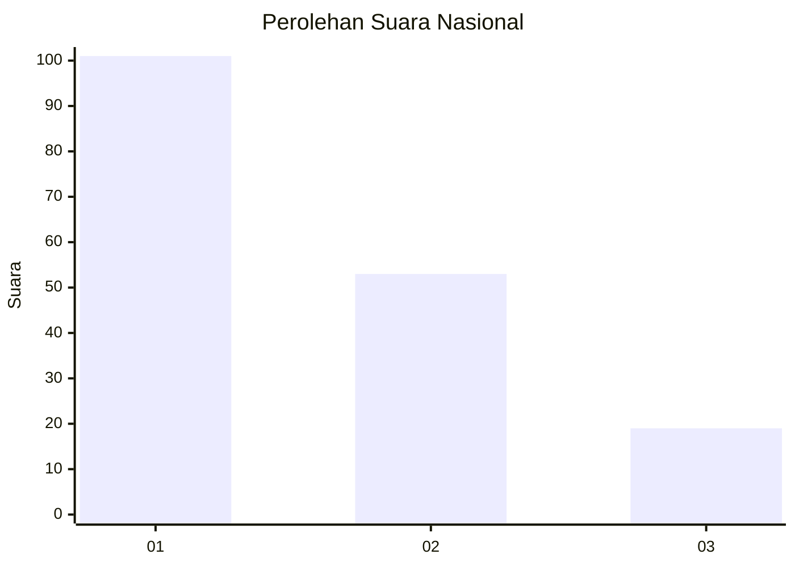
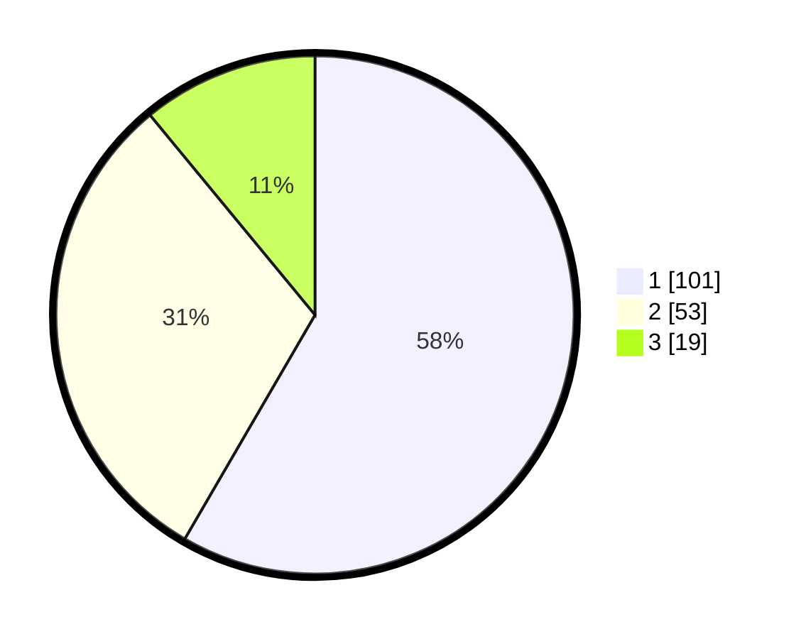

# Hasil

## Grafik

## Tabel

| No.    | Nama Paslon    | Suara | Suara (raw) | Persentase |
|:------ |:-------------- | -----:| -----------:| ----------:|
| 100025 | ANIES MUHAIMIN | 101   | [101][p-1]  | 58,38      |
| 100026 | PRABOWO GIBRAN | 53    | [53][p-2]   | 30,64      |
| 100027 | GANJAR MAHFUD  | 19    | [19][p-3]   | 10,98      |

[p-1]: https://github.com/gigit-pemilu/pemilu-2024/blob/main/pilpres/hitung-suara/sub/31-dki-jakarta/sub/74-jakarta-selatan/sub/08-pancoran/sub/1006-cikoko/sub/009-tps/sub/paslon-1.txt
[p-2]: https://github.com/gigit-pemilu/pemilu-2024/blob/main/pilpres/hitung-suara/sub/31-dki-jakarta/sub/74-jakarta-selatan/sub/08-pancoran/sub/1006-cikoko/sub/009-tps/sub/paslon-2.txt
[p-3]: https://github.com/gigit-pemilu/pemilu-2024/blob/main/pilpres/hitung-suara/sub/31-dki-jakarta/sub/74-jakarta-selatan/sub/08-pancoran/sub/1006-cikoko/sub/009-tps/sub/paslon-3.txt

## Foto C Plano

https://sirekap-obj-formc.kpu.go.id/8603/pemilu/ppwp/31/74/08/10/06/3174081006009-20240215-003846--09c11bac-afa6-4d78-b677-4ea162f20ae0.jpg

https://sirekap-obj-formc.kpu.go.id/8603/pemilu/ppwp/31/74/08/10/06/3174081006009-20240215-003915--c12931b4-0176-47f2-ba01-9d18a54f7863.jpg

https://sirekap-obj-formc.kpu.go.id/8603/pemilu/ppwp/31/74/08/10/06/3174081006009-20240215-003933--0af54651-806f-44fd-ae76-1722d9031b46.jpg

## Metadata

| Key        | Value               |
| ---------- | ------------------- |
| Time Stamp | 2024-02-25 00:00:00 |

