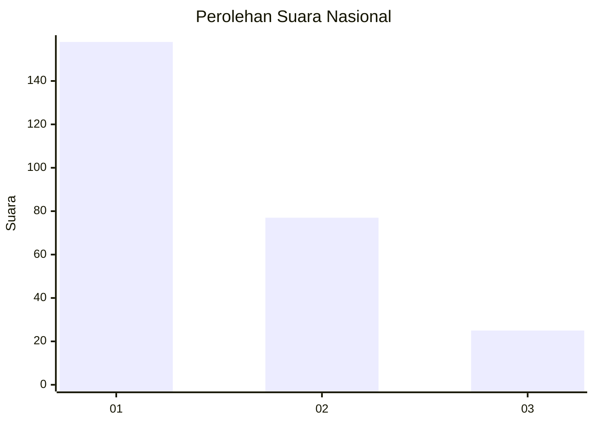
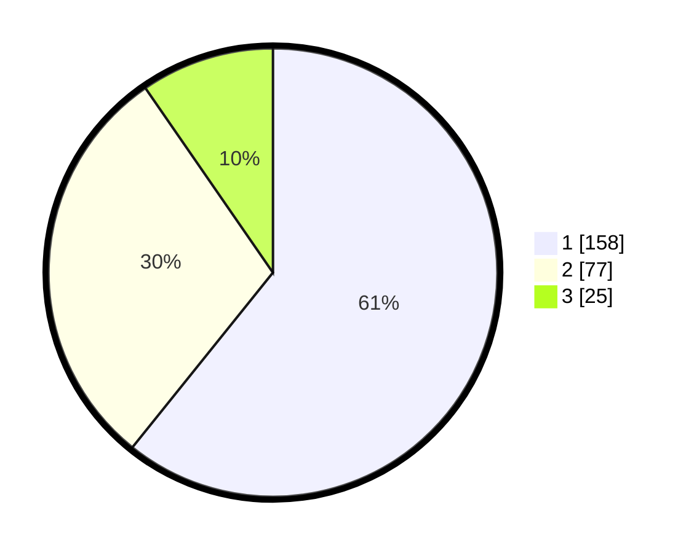

# Hasil

## Grafik

## Tabel

| No.    | Nama Paslon    | Suara | Suara (raw) | Persentase |
|:------ |:-------------- | -----:| -----------:| ----------:|
| 100025 | ANIES MUHAIMIN | 158   | [158][p-1]  | 60,77      |
| 100026 | PRABOWO GIBRAN | 77    | [77][p-2]   | 29,62      |
| 100027 | GANJAR MAHFUD  | 25    | [25][p-3]   | 9,62       |

[p-1]: https://github.com/gigit-pemilu/pemilu-2024/blob/main/pilpres/hitung-suara/sub/31-dki-jakarta/sub/74-jakarta-selatan/sub/08-pancoran/sub/1006-cikoko/sub/015-tps/sub/paslon-1.txt
[p-2]: https://github.com/gigit-pemilu/pemilu-2024/blob/main/pilpres/hitung-suara/sub/31-dki-jakarta/sub/74-jakarta-selatan/sub/08-pancoran/sub/1006-cikoko/sub/015-tps/sub/paslon-2.txt
[p-3]: https://github.com/gigit-pemilu/pemilu-2024/blob/main/pilpres/hitung-suara/sub/31-dki-jakarta/sub/74-jakarta-selatan/sub/08-pancoran/sub/1006-cikoko/sub/015-tps/sub/paslon-3.txt

## Foto C Plano

https://sirekap-obj-formc.kpu.go.id/5fba/pemilu/ppwp/31/74/08/10/06/3174081006015-20240214-212929--b9d3b607-7ebe-454f-a7c7-018b45bfb2c3.jpg

https://sirekap-obj-formc.kpu.go.id/5fba/pemilu/ppwp/31/74/08/10/06/3174081006015-20240214-212633--a48ae828-bc3d-441f-bf90-d348bcade73c.jpg

https://sirekap-obj-formc.kpu.go.id/5fba/pemilu/ppwp/31/74/08/10/06/3174081006015-20240214-212644--147de431-2870-4b9a-9aff-975b011b7169.jpg

## Metadata

| Key        | Value               |
| ---------- | ------------------- |
| Time Stamp | 2024-02-24 22:31:28 |

