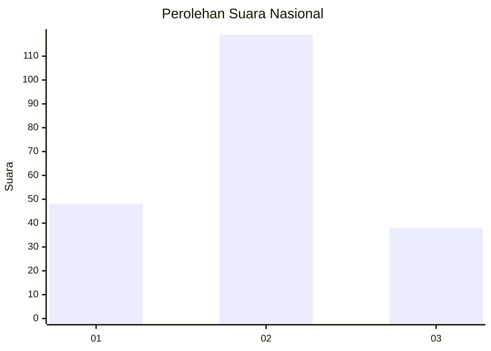
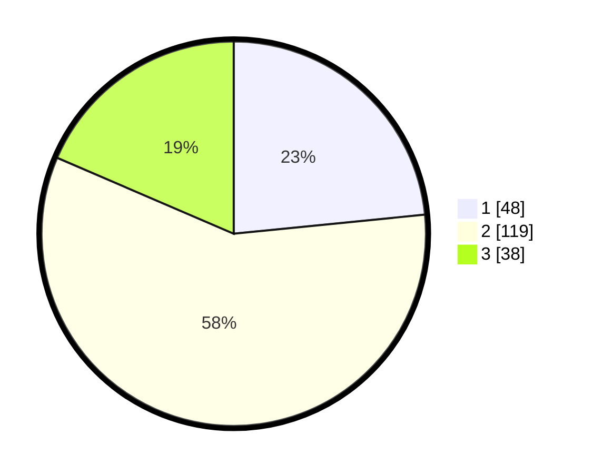

# Hasil

## Grafik

## Tabel

| No. | Nama Paslon    | Suara | Suara (raw) | Persentase |
|:--- |:-------------- | -----:| -----------:| ----------:|
| 1   | ANIES MUHAIMIN | 48    | [48][p-1]   | 23,41      |
| 2   | PRABOWO GIBRAN | 119   | [119][p-2]  | 58,05      |
| 3   | GANJAR MAHFUD  | 38    | [38][p-3]   | 18,54      |

[p-1]: https://github.com/gigit-pemilu/pemilu-2024/blob/main/pilpres/hitung-suara/sub/31-dki-jakarta/sub/74-jakarta-selatan/sub/09-jagakarsa/sub/1001-jagakarsa/sub/001-tps/sub/paslon-1.txt
[p-2]: https://github.com/gigit-pemilu/pemilu-2024/blob/main/pilpres/hitung-suara/sub/31-dki-jakarta/sub/74-jakarta-selatan/sub/09-jagakarsa/sub/1001-jagakarsa/sub/001-tps/sub/paslon-2.txt
[p-3]: https://github.com/gigit-pemilu/pemilu-2024/blob/main/pilpres/hitung-suara/sub/31-dki-jakarta/sub/74-jakarta-selatan/sub/09-jagakarsa/sub/1001-jagakarsa/sub/001-tps/sub/paslon-3.txt

## Foto C Plano

https://sirekap-obj-formc.kpu.go.id/ade6/pemilu/ppwp/31/74/09/10/01/3174091001001-20240215-000709--545199e7-f996-47cc-9fac-70e730537be7.jpg

https://sirekap-obj-formc.kpu.go.id/ade6/pemilu/ppwp/31/74/09/10/01/3174091001001-20240215-000815--c63e26f6-2f1e-4ac9-aa38-b05fb195c548.jpg

https://sirekap-obj-formc.kpu.go.id/ade6/pemilu/ppwp/31/74/09/10/01/3174091001001-20240215-000934--ece7dbf7-bf49-4923-aafc-ea377929eadd.jpg

## Metadata

| Key        | Value               |
| ---------- | ------------------- |
| Time Stamp | 2024-02-16 11:00:29 |

