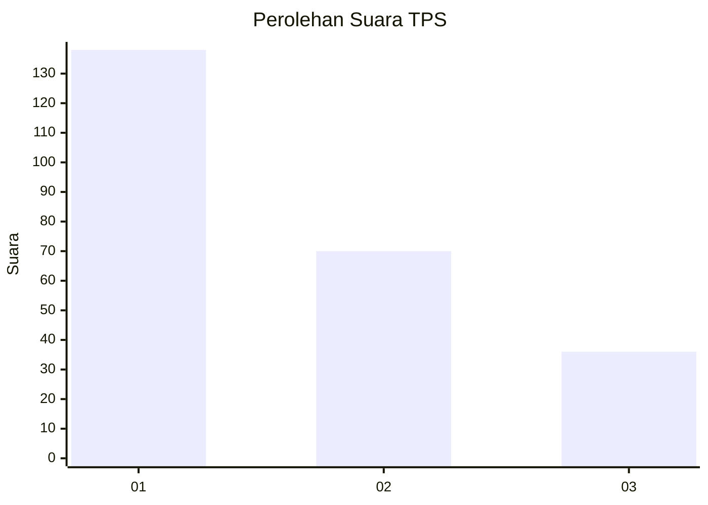
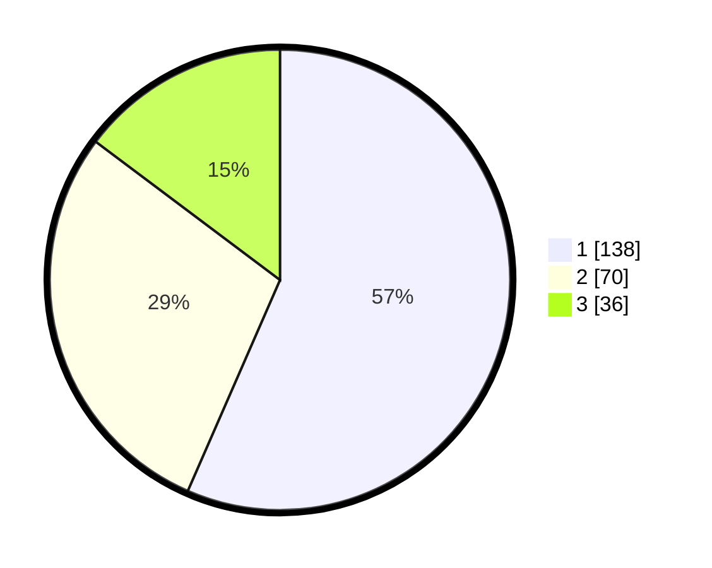

# Hasil

## Grafik

## Tabel

| No. | Nama Paslon    | Suara | Suara (raw) | Persentase |
|:--- |:-------------- | -----:| -----------:| ----------:|
| 1   | ANIES MUHAIMIN | 138   | [138][p-1]  | 56,56      |
| 2   | PRABOWO GIBRAN | 70    | [70][p-2]   | 28,69      |
| 3   | GANJAR MAHFUD  | 36    | [36][p-3]   | 14,75      |

[p-1]: https://github.com/gigit-pemilu/pemilu-2024-31-dki-jakarta/blob/main/pilpres/hitung-suara/sub/31-dki-jakarta/sub/74-jakarta-selatan/sub/09-jagakarsa/sub/1001-jagakarsa/sub/008-tps/sub/paslon-1.txt
[p-2]: https://github.com/gigit-pemilu/pemilu-2024-31-dki-jakarta/blob/main/pilpres/hitung-suara/sub/31-dki-jakarta/sub/74-jakarta-selatan/sub/09-jagakarsa/sub/1001-jagakarsa/sub/008-tps/sub/paslon-2.txt
[p-3]: https://github.com/gigit-pemilu/pemilu-2024-31-dki-jakarta/blob/main/pilpres/hitung-suara/sub/31-dki-jakarta/sub/74-jakarta-selatan/sub/09-jagakarsa/sub/1001-jagakarsa/sub/008-tps/sub/paslon-3.txt

## Foto C Plano

https://sirekap-obj-formc.kpu.go.id/0935/pemilu/ppwp/31/74/09/10/01/3174091001008-20240214-232953--b3588960-74a1-47f5-adff-91e2d1f479e2.jpg

https://sirekap-obj-formc.kpu.go.id/0935/pemilu/ppwp/31/74/09/10/01/3174091001008-20240214-233044--cf737879-acf0-4651-8eb4-1040c1aecd2f.jpg

https://sirekap-obj-formc.kpu.go.id/0935/pemilu/ppwp/31/74/09/10/01/3174091001008-20240214-233141--4ed3ad10-d664-4563-9241-2b0bea87c5ca.jpg

## Metadata

| Key        | Value               |
| ---------- | ------------------- |
| Time Stamp | 2024-02-25 14:00:00 |

