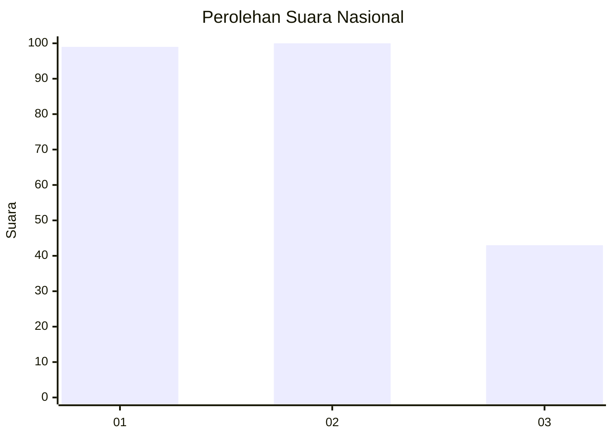
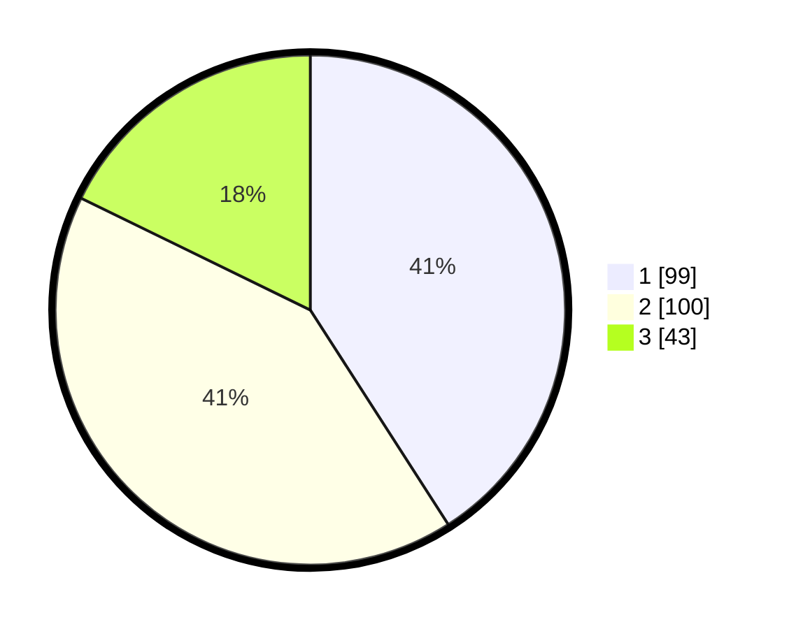

# Hasil

## Grafik

## Tabel

| No.    | Nama Paslon    | Suara | Suara (raw) | Persentase |
|:------ |:-------------- | -----:| -----------:| ----------:|
| 100025 | ANIES MUHAIMIN | 99    | [99][p-1]   | 40,91      |
| 100026 | PRABOWO GIBRAN | 100   | [100][p-2]  | 41,32      |
| 100027 | GANJAR MAHFUD  | 43    | [43][p-3]   | 17,77      |

[p-1]: https://github.com/gigit-pemilu/pemilu-2024/blob/main/pilpres/hitung-suara/sub/31-dki-jakarta/sub/74-jakarta-selatan/sub/09-jagakarsa/sub/1001-jagakarsa/sub/036-tps/sub/paslon-1.txt
[p-2]: https://github.com/gigit-pemilu/pemilu-2024/blob/main/pilpres/hitung-suara/sub/31-dki-jakarta/sub/74-jakarta-selatan/sub/09-jagakarsa/sub/1001-jagakarsa/sub/036-tps/sub/paslon-2.txt
[p-3]: https://github.com/gigit-pemilu/pemilu-2024/blob/main/pilpres/hitung-suara/sub/31-dki-jakarta/sub/74-jakarta-selatan/sub/09-jagakarsa/sub/1001-jagakarsa/sub/036-tps/sub/paslon-3.txt

## Foto C Plano

https://sirekap-obj-formc.kpu.go.id/5fe4/pemilu/ppwp/31/74/09/10/01/3174091001036-20240215-130815--1d663304-c930-4be0-b7fc-1be0c55aa054.jpg

https://sirekap-obj-formc.kpu.go.id/5fe4/pemilu/ppwp/31/74/09/10/01/3174091001036-20240215-194332--6731eb5a-f35a-4155-a4a0-5c867f977b81.jpg

https://sirekap-obj-formc.kpu.go.id/5fe4/pemilu/ppwp/31/74/09/10/01/3174091001036-20240215-194616--2b7df9da-ad36-499e-ac67-51dc4c68f4f4.jpg

## Metadata

| Key        | Value               |
| ---------- | ------------------- |
| Time Stamp | 2024-02-24 22:31:28 |

