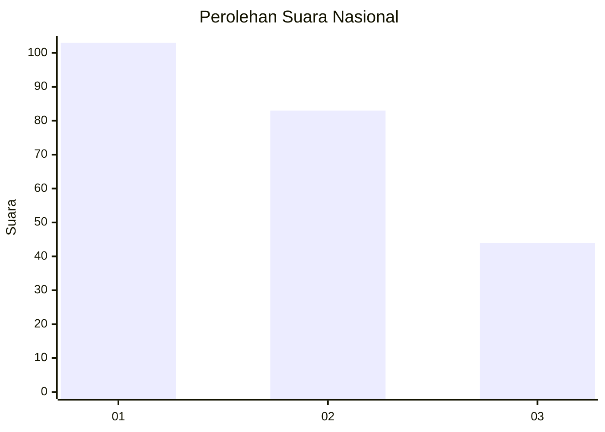
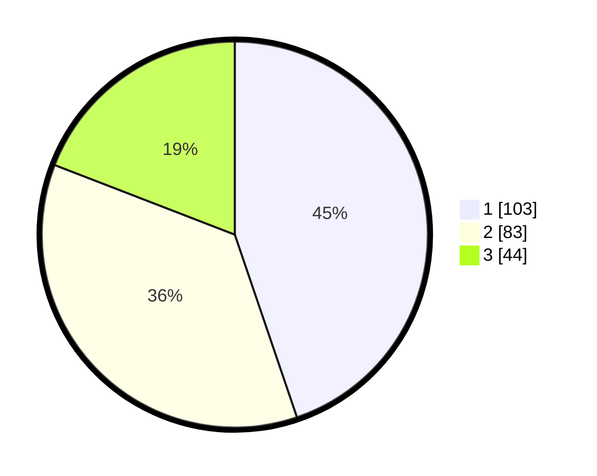

# Hasil

## Grafik

## Tabel

| No.    | Nama Paslon    | Suara | Suara (raw) | Persentase |
|:------ |:-------------- | -----:| -----------:| ----------:|
| 100025 | ANIES MUHAIMIN | 103   | [103][p-1]  | 44,78      |
| 100026 | PRABOWO GIBRAN | 83    | [83][p-2]   | 36,09      |
| 100027 | GANJAR MAHFUD  | 44    | [44][p-3]   | 19,13      |

[p-1]: https://github.com/gigit-pemilu/pemilu-2024/blob/main/pilpres/hitung-suara/sub/31-dki-jakarta/sub/74-jakarta-selatan/sub/09-jagakarsa/sub/1001-jagakarsa/sub/063-tps/sub/paslon-1.txt
[p-2]: https://github.com/gigit-pemilu/pemilu-2024/blob/main/pilpres/hitung-suara/sub/31-dki-jakarta/sub/74-jakarta-selatan/sub/09-jagakarsa/sub/1001-jagakarsa/sub/063-tps/sub/paslon-2.txt
[p-3]: https://github.com/gigit-pemilu/pemilu-2024/blob/main/pilpres/hitung-suara/sub/31-dki-jakarta/sub/74-jakarta-selatan/sub/09-jagakarsa/sub/1001-jagakarsa/sub/063-tps/sub/paslon-3.txt

## Foto C Plano

https://sirekap-obj-formc.kpu.go.id/d27b/pemilu/ppwp/31/74/09/10/01/3174091001063-20240214-204045--13fc93d3-90b3-4a06-922b-b4adc7dde852.jpg

https://sirekap-obj-formc.kpu.go.id/d27b/pemilu/ppwp/31/74/09/10/01/3174091001063-20240214-204054--65a2df0d-de98-4f23-8026-05886ded78e6.jpg

https://sirekap-obj-formc.kpu.go.id/d27b/pemilu/ppwp/31/74/09/10/01/3174091001063-20240214-204101--94c61d14-4f34-4f9a-a7d4-2adb3a2b0cf6.jpg

## Metadata

| Key        | Value               |
| ---------- | ------------------- |
| Time Stamp | 2024-02-24 22:31:28 |

