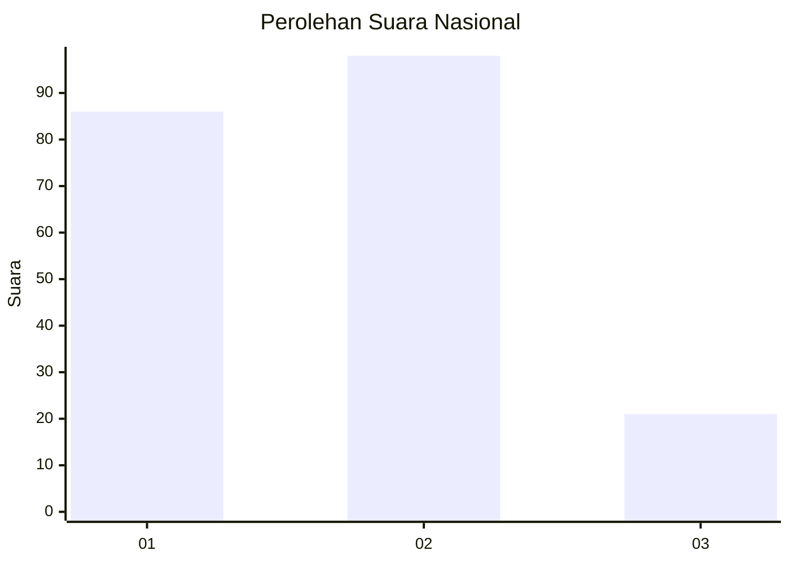
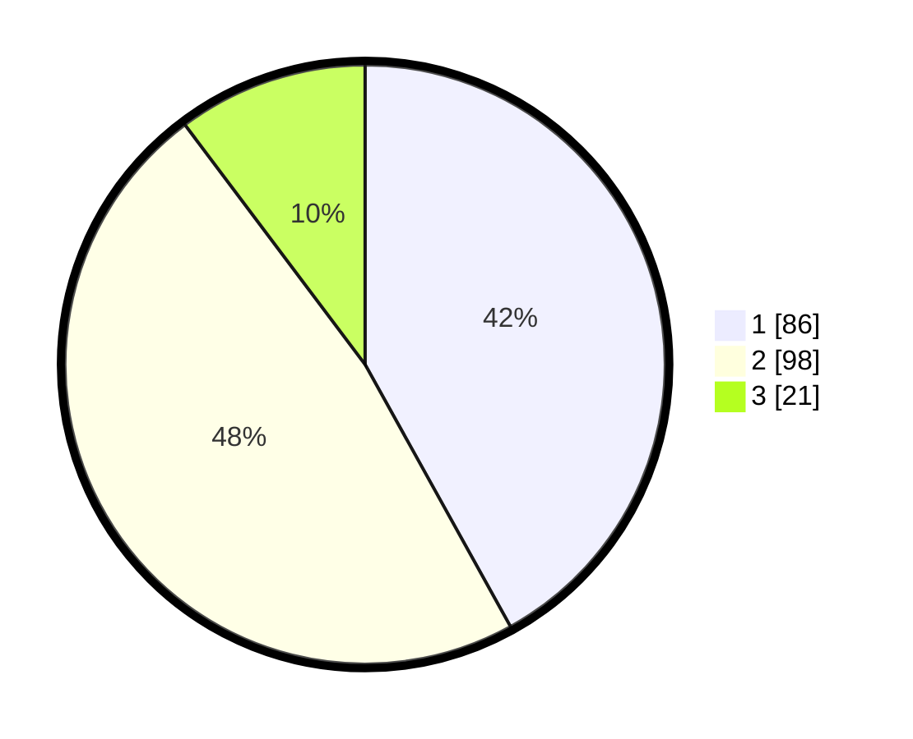

# Hasil

## Grafik

## Tabel

| No.    | Nama Paslon    | Suara | Suara (raw) | Persentase |
|:------ |:-------------- | -----:| -----------:| ----------:|
| 100025 | ANIES MUHAIMIN | 86    | [86][p-1]   | 41,95      |
| 100026 | PRABOWO GIBRAN | 98    | [98][p-2]   | 47,80      |
| 100027 | GANJAR MAHFUD  | 21    | [21][p-3]   | 10,24      |

[p-1]: https://github.com/gigit-pemilu/pemilu-2024/blob/main/pilpres/hitung-suara/sub/31-dki-jakarta/sub/74-jakarta-selatan/sub/09-jagakarsa/sub/1001-jagakarsa/sub/073-tps/sub/paslon-1.txt
[p-2]: https://github.com/gigit-pemilu/pemilu-2024/blob/main/pilpres/hitung-suara/sub/31-dki-jakarta/sub/74-jakarta-selatan/sub/09-jagakarsa/sub/1001-jagakarsa/sub/073-tps/sub/paslon-2.txt
[p-3]: https://github.com/gigit-pemilu/pemilu-2024/blob/main/pilpres/hitung-suara/sub/31-dki-jakarta/sub/74-jakarta-selatan/sub/09-jagakarsa/sub/1001-jagakarsa/sub/073-tps/sub/paslon-3.txt

## Foto C Plano

https://sirekap-obj-formc.kpu.go.id/dc9a/pemilu/ppwp/31/74/09/10/01/3174091001073-20240214-232644--898a0243-ff76-4281-9fba-3f8bb99865dd.jpg

https://sirekap-obj-formc.kpu.go.id/dc9a/pemilu/ppwp/31/74/09/10/01/3174091001073-20240214-214519--743232e6-5e64-45ee-91b6-388d6f58e4e4.jpg

https://sirekap-obj-formc.kpu.go.id/dc9a/pemilu/ppwp/31/74/09/10/01/3174091001073-20240214-232914--82b83974-31d3-42c1-959a-5b1fb011f227.jpg

## Metadata

| Key        | Value               |
| ---------- | ------------------- |
| Time Stamp | 2024-02-24 22:31:28 |

