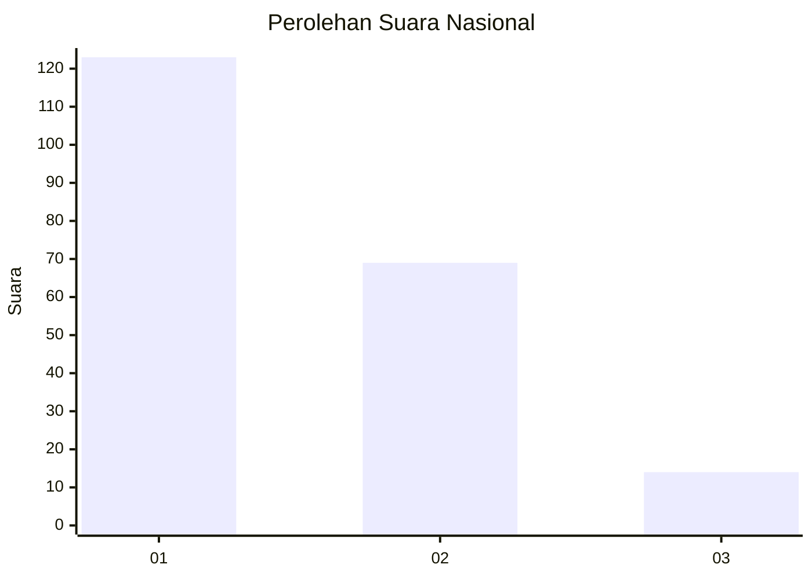
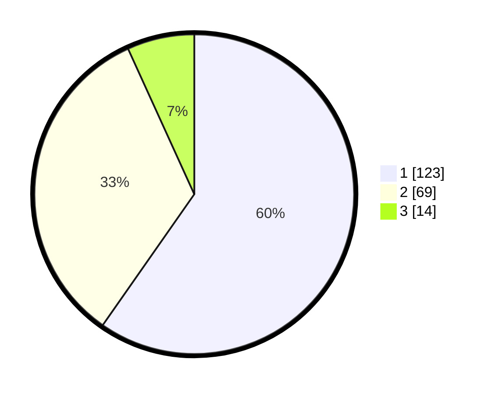

# Hasil

## Grafik

## Tabel

| No.    | Nama Paslon    | Suara | Suara (raw) | Persentase |
|:------ |:-------------- | -----:| -----------:| ----------:|
| 100025 | ANIES MUHAIMIN | 123   | [123][p-1]  | 59,71      |
| 100026 | PRABOWO GIBRAN | 69    | [69][p-2]   | 33,50      |
| 100027 | GANJAR MAHFUD  | 14    | [14][p-3]   | 6,80       |

[p-1]: https://github.com/gigit-pemilu/pemilu-2024/blob/main/pilpres/hitung-suara/sub/31-dki-jakarta/sub/74-jakarta-selatan/sub/09-jagakarsa/sub/1001-jagakarsa/sub/074-tps/sub/paslon-1.txt
[p-2]: https://github.com/gigit-pemilu/pemilu-2024/blob/main/pilpres/hitung-suara/sub/31-dki-jakarta/sub/74-jakarta-selatan/sub/09-jagakarsa/sub/1001-jagakarsa/sub/074-tps/sub/paslon-2.txt
[p-3]: https://github.com/gigit-pemilu/pemilu-2024/blob/main/pilpres/hitung-suara/sub/31-dki-jakarta/sub/74-jakarta-selatan/sub/09-jagakarsa/sub/1001-jagakarsa/sub/074-tps/sub/paslon-3.txt

## Foto C Plano

https://sirekap-obj-formc.kpu.go.id/9396/pemilu/ppwp/31/74/09/10/01/3174091001074-20240214-155836--8cfe76b8-87f4-443f-ae1a-a9eb7fbb0371.jpg

https://sirekap-obj-formc.kpu.go.id/9396/pemilu/ppwp/31/74/09/10/01/3174091001074-20240214-160104--0bab0e61-0990-4ac1-9aa1-3fc029b71c66.jpg

https://sirekap-obj-formc.kpu.go.id/9396/pemilu/ppwp/31/74/09/10/01/3174091001074-20240214-155926--c67a661a-dd71-4055-838b-9f1bc498fe60.jpg

## Metadata

| Key        | Value               |
| ---------- | ------------------- |
| Time Stamp | 2024-02-24 22:31:28 |

