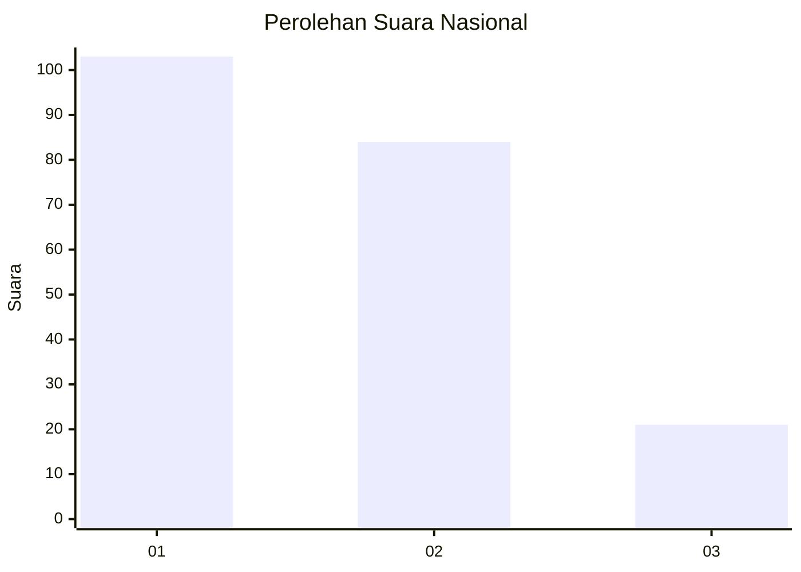
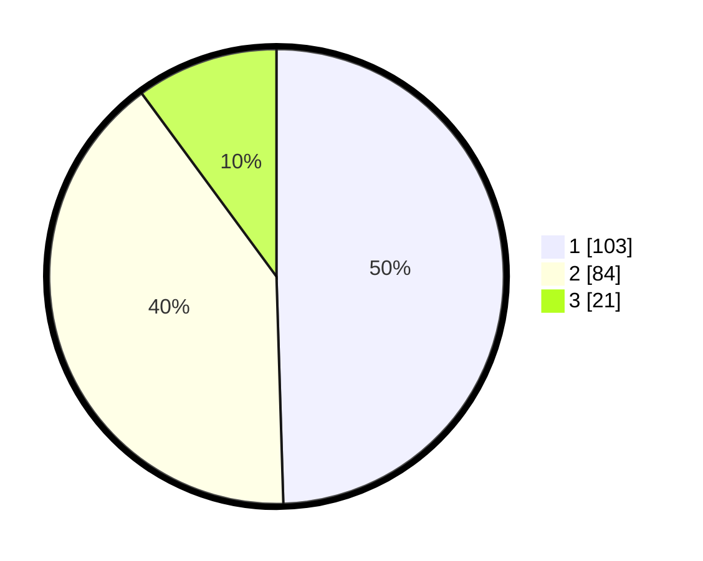

# Hasil

## Grafik

## Tabel

| No.    | Nama Paslon    | Suara | Suara (raw) | Persentase |
|:------ |:-------------- | -----:| -----------:| ----------:|
| 100025 | ANIES MUHAIMIN | 103   | [103][p-1]  | 49,52      |
| 100026 | PRABOWO GIBRAN | 84    | [84][p-2]   | 40,38      |
| 100027 | GANJAR MAHFUD  | 21    | [21][p-3]   | 10,10      |

[p-1]: https://github.com/gigit-pemilu/pemilu-2024/blob/main/pilpres/hitung-suara/sub/31-dki-jakarta/sub/74-jakarta-selatan/sub/09-jagakarsa/sub/1001-jagakarsa/sub/075-tps/sub/paslon-1.txt
[p-2]: https://github.com/gigit-pemilu/pemilu-2024/blob/main/pilpres/hitung-suara/sub/31-dki-jakarta/sub/74-jakarta-selatan/sub/09-jagakarsa/sub/1001-jagakarsa/sub/075-tps/sub/paslon-2.txt
[p-3]: https://github.com/gigit-pemilu/pemilu-2024/blob/main/pilpres/hitung-suara/sub/31-dki-jakarta/sub/74-jakarta-selatan/sub/09-jagakarsa/sub/1001-jagakarsa/sub/075-tps/sub/paslon-3.txt

## Foto C Plano

https://sirekap-obj-formc.kpu.go.id/d43f/pemilu/ppwp/31/74/09/10/01/3174091001075-20240214-221650--2357cc0e-ec67-4afd-abee-4bc61124d0f2.jpg

https://sirekap-obj-formc.kpu.go.id/d43f/pemilu/ppwp/31/74/09/10/01/3174091001075-20240214-221738--eab32ec4-faa2-4c4b-b3f4-4a6c344f7a7a.jpg

https://sirekap-obj-formc.kpu.go.id/d43f/pemilu/ppwp/31/74/09/10/01/3174091001075-20240214-221904--c473b88d-bb63-4223-bafe-848ae2f0a290.jpg

## Metadata

| Key        | Value               |
| ---------- | ------------------- |
| Time Stamp | 2024-02-24 22:31:28 |

