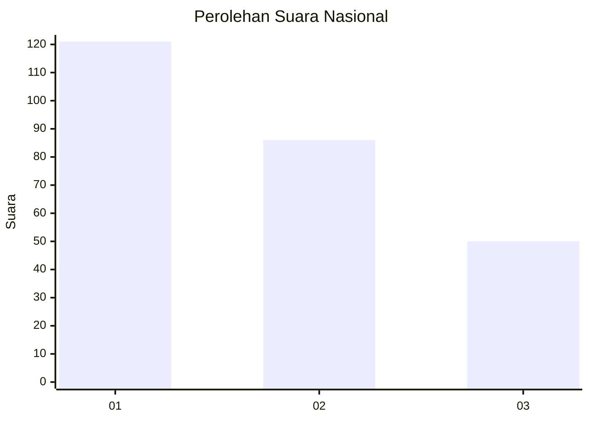
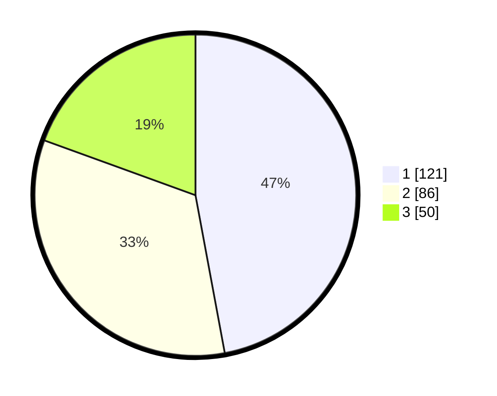

# Hasil

## Grafik

## Tabel

| No.    | Nama Paslon    | Suara | Suara (raw) | Persentase |
|:------ |:-------------- | -----:| -----------:| ----------:|
| 100025 | ANIES MUHAIMIN | 121   | [121][p-1]  | 47,08      |
| 100026 | PRABOWO GIBRAN | 86    | [86][p-2]   | 33,46      |
| 100027 | GANJAR MAHFUD  | 50    | [50][p-3]   | 19,46      |

[p-1]: https://github.com/gigit-pemilu/pemilu-2024/blob/main/pilpres/hitung-suara/sub/31-dki-jakarta/sub/74-jakarta-selatan/sub/09-jagakarsa/sub/1001-jagakarsa/sub/085-tps/sub/paslon-1.txt
[p-2]: https://github.com/gigit-pemilu/pemilu-2024/blob/main/pilpres/hitung-suara/sub/31-dki-jakarta/sub/74-jakarta-selatan/sub/09-jagakarsa/sub/1001-jagakarsa/sub/085-tps/sub/paslon-2.txt
[p-3]: https://github.com/gigit-pemilu/pemilu-2024/blob/main/pilpres/hitung-suara/sub/31-dki-jakarta/sub/74-jakarta-selatan/sub/09-jagakarsa/sub/1001-jagakarsa/sub/085-tps/sub/paslon-3.txt

## Foto C Plano

https://sirekap-obj-formc.kpu.go.id/83e1/pemilu/ppwp/31/74/09/10/01/3174091001085-20240214-214309--413575d3-1264-495f-be44-44a4d7de108f.jpg

https://sirekap-obj-formc.kpu.go.id/83e1/pemilu/ppwp/31/74/09/10/01/3174091001085-20240214-214319--92c0fbb5-10bd-4c16-89ff-7cb66181f1e4.jpg

https://sirekap-obj-formc.kpu.go.id/83e1/pemilu/ppwp/31/74/09/10/01/3174091001085-20240214-214322--eead1d82-375c-40f6-ad40-6f3f8628fe3e.jpg

## Metadata

| Key        | Value               |
| ---------- | ------------------- |
| Time Stamp | 2024-02-17 00:00:00 |

