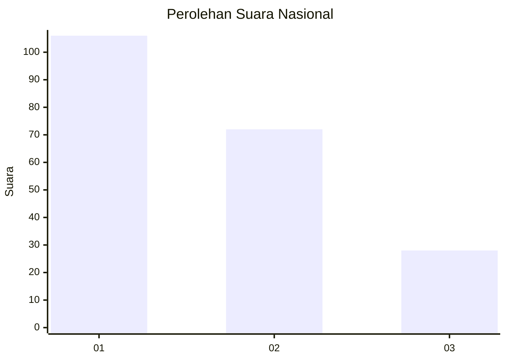
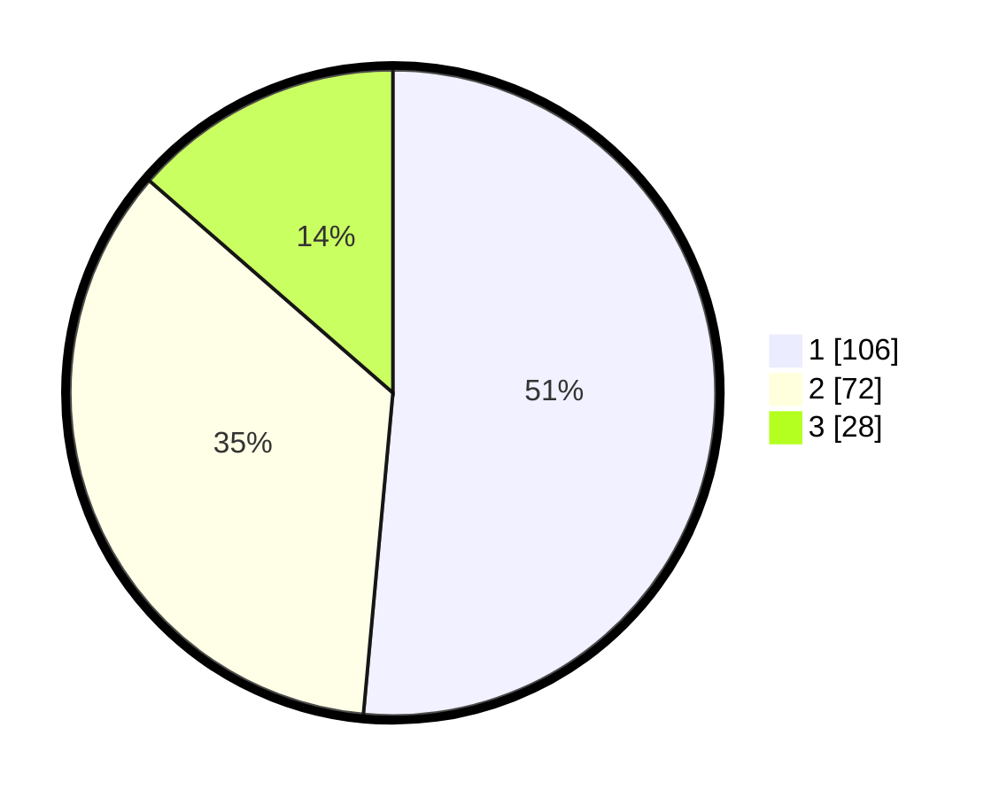

# Hasil

## Grafik

## Tabel

| No.    | Nama Paslon    | Suara | Suara (raw) | Persentase |
|:------ |:-------------- | -----:| -----------:| ----------:|
| 100025 | ANIES MUHAIMIN | 106   | [106][p-1]  | 51,46      |
| 100026 | PRABOWO GIBRAN | 72    | [72][p-2]   | 34,95      |
| 100027 | GANJAR MAHFUD  | 28    | [28][p-3]   | 13,59      |

[p-1]: https://github.com/gigit-pemilu/pemilu-2024/blob/main/pilpres/hitung-suara/sub/31-dki-jakarta/sub/74-jakarta-selatan/sub/09-jagakarsa/sub/1001-jagakarsa/sub/105-tps/sub/paslon-1.txt
[p-2]: https://github.com/gigit-pemilu/pemilu-2024/blob/main/pilpres/hitung-suara/sub/31-dki-jakarta/sub/74-jakarta-selatan/sub/09-jagakarsa/sub/1001-jagakarsa/sub/105-tps/sub/paslon-2.txt
[p-3]: https://github.com/gigit-pemilu/pemilu-2024/blob/main/pilpres/hitung-suara/sub/31-dki-jakarta/sub/74-jakarta-selatan/sub/09-jagakarsa/sub/1001-jagakarsa/sub/105-tps/sub/paslon-3.txt

## Foto C Plano

https://sirekap-obj-formc.kpu.go.id/0a8e/pemilu/ppwp/31/74/09/10/01/3174091001105-20240214-221610--adc477e7-866c-48de-9c25-2a7a2b95f05c.jpg

https://sirekap-obj-formc.kpu.go.id/0a8e/pemilu/ppwp/31/74/09/10/01/3174091001105-20240214-221751--0ac16ef9-f365-4216-8d27-5c6153172e6f.jpg

https://sirekap-obj-formc.kpu.go.id/0a8e/pemilu/ppwp/31/74/09/10/01/3174091001105-20240214-221923--8cc24957-e60b-45ac-8928-a449e0f78e49.jpg

## Metadata

| Key        | Value               |
| ---------- | ------------------- |
| Time Stamp | 2024-02-24 22:31:28 |

