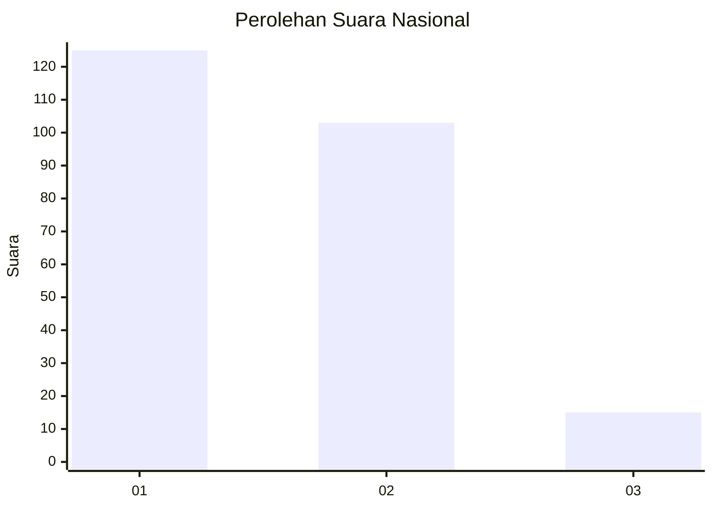
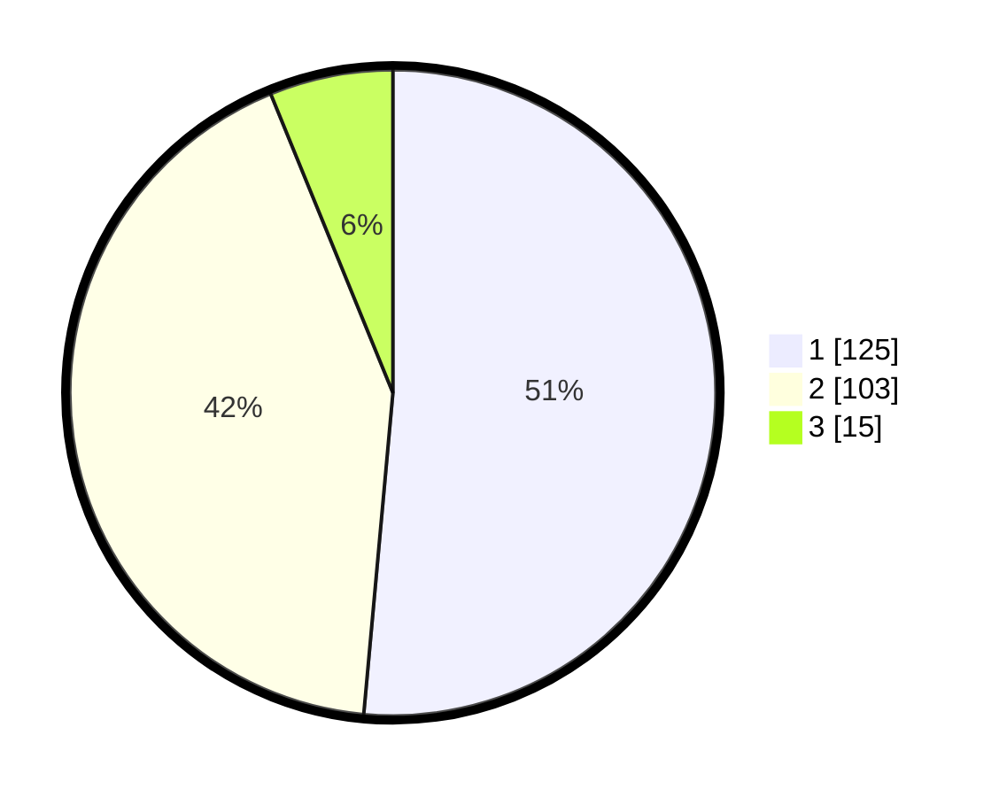

# Hasil

## Grafik

## Tabel

| No.    | Nama Paslon    | Suara | Suara (raw) | Persentase |
|:------ |:-------------- | -----:| -----------:| ----------:|
| 100025 | ANIES MUHAIMIN | 125   | [125][p-1]  | 51,44      |
| 100026 | PRABOWO GIBRAN | 103   | [103][p-2]  | 42,39      |
| 100027 | GANJAR MAHFUD  | 15    | [15][p-3]   | 6,17       |

[p-1]: https://github.com/gigit-pemilu/pemilu-2024/blob/main/pilpres/hitung-suara/sub/31-dki-jakarta/sub/74-jakarta-selatan/sub/09-jagakarsa/sub/1001-jagakarsa/sub/109-tps/sub/paslon-1.txt
[p-2]: https://github.com/gigit-pemilu/pemilu-2024/blob/main/pilpres/hitung-suara/sub/31-dki-jakarta/sub/74-jakarta-selatan/sub/09-jagakarsa/sub/1001-jagakarsa/sub/109-tps/sub/paslon-2.txt
[p-3]: https://github.com/gigit-pemilu/pemilu-2024/blob/main/pilpres/hitung-suara/sub/31-dki-jakarta/sub/74-jakarta-selatan/sub/09-jagakarsa/sub/1001-jagakarsa/sub/109-tps/sub/paslon-3.txt

## Foto C Plano

https://sirekap-obj-formc.kpu.go.id/acdc/pemilu/ppwp/31/74/09/10/01/3174091001109-20240214-225246--91cd48ea-2390-47f1-b2f0-031bb64bb692.jpg

https://sirekap-obj-formc.kpu.go.id/acdc/pemilu/ppwp/31/74/09/10/01/3174091001109-20240214-225556--d30ef914-08b8-4bbc-962c-becd81e10e9f.jpg

https://sirekap-obj-formc.kpu.go.id/acdc/pemilu/ppwp/31/74/09/10/01/3174091001109-20240214-225701--829434a2-255d-401d-b81d-e8ecb49a3de6.jpg

## Metadata

| Key        | Value               |
| ---------- | ------------------- |
| Time Stamp | 2024-02-24 22:31:28 |

