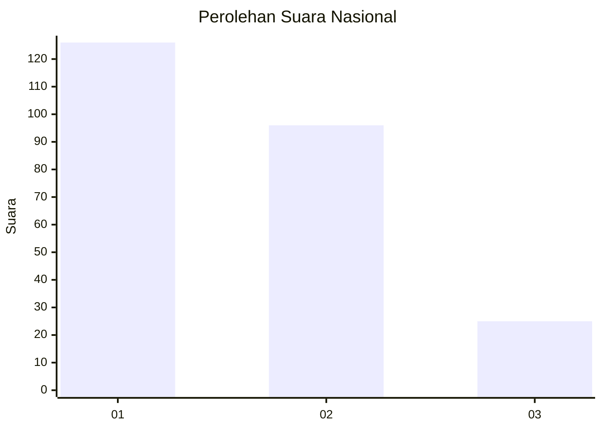
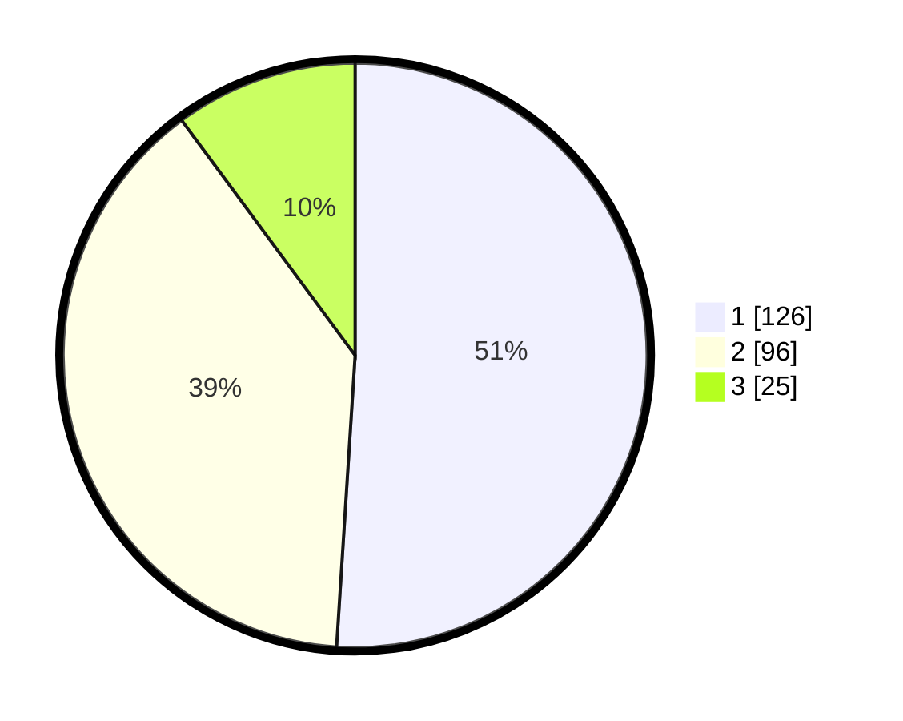

# Hasil

## Grafik

## Tabel

| No.    | Nama Paslon    | Suara | Suara (raw) | Persentase |
|:------ |:-------------- | -----:| -----------:| ----------:|
| 100025 | ANIES MUHAIMIN | 126   | [126][p-1]  | 51,01      |
| 100026 | PRABOWO GIBRAN | 96    | [96][p-2]   | 38,87      |
| 100027 | GANJAR MAHFUD  | 25    | [25][p-3]   | 10,12      |

[p-1]: https://github.com/gigit-pemilu/pemilu-2024/blob/main/pilpres/hitung-suara/sub/31-dki-jakarta/sub/74-jakarta-selatan/sub/09-jagakarsa/sub/1001-jagakarsa/sub/110-tps/sub/paslon-1.txt
[p-2]: https://github.com/gigit-pemilu/pemilu-2024/blob/main/pilpres/hitung-suara/sub/31-dki-jakarta/sub/74-jakarta-selatan/sub/09-jagakarsa/sub/1001-jagakarsa/sub/110-tps/sub/paslon-2.txt
[p-3]: https://github.com/gigit-pemilu/pemilu-2024/blob/main/pilpres/hitung-suara/sub/31-dki-jakarta/sub/74-jakarta-selatan/sub/09-jagakarsa/sub/1001-jagakarsa/sub/110-tps/sub/paslon-3.txt

## Foto C Plano

https://sirekap-obj-formc.kpu.go.id/9bd4/pemilu/ppwp/31/74/09/10/01/3174091001110-20240214-192125--76aadb3e-0b1a-4ccf-b2be-d15d9096b8f6.jpg

https://sirekap-obj-formc.kpu.go.id/9bd4/pemilu/ppwp/31/74/09/10/01/3174091001110-20240214-192136--fbf06022-6f5b-49dc-a884-44f4b0c63777.jpg

https://sirekap-obj-formc.kpu.go.id/9bd4/pemilu/ppwp/31/74/09/10/01/3174091001110-20240214-220933--212a570a-be23-41f3-a536-3edec3690fca.jpg

## Metadata

| Key        | Value               |
| ---------- | ------------------- |
| Time Stamp | 2024-02-24 22:31:28 |

