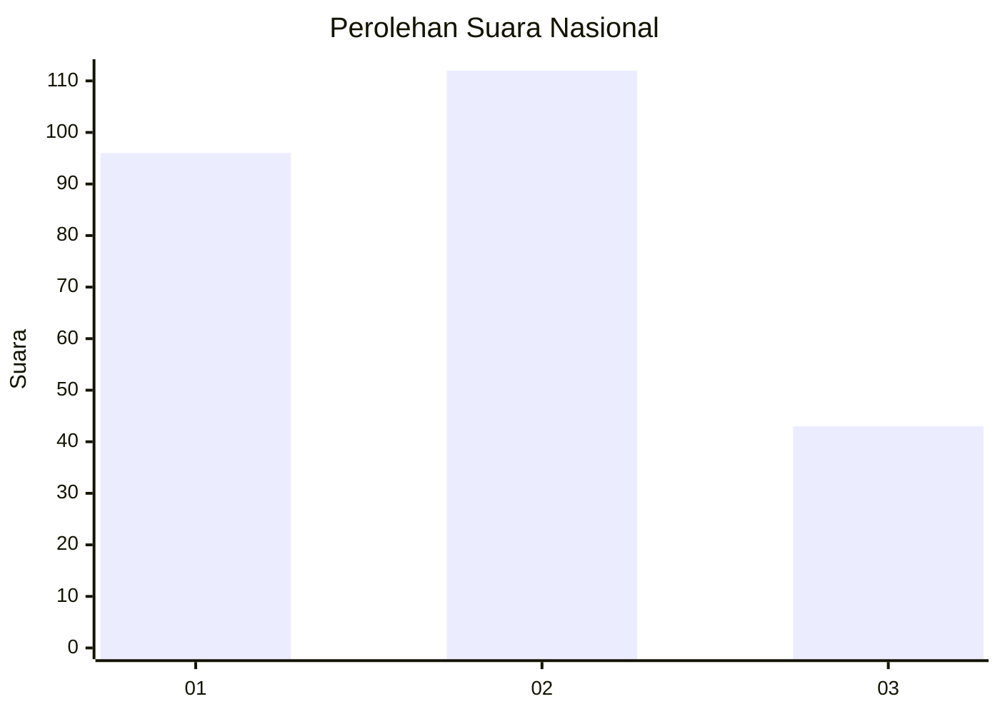
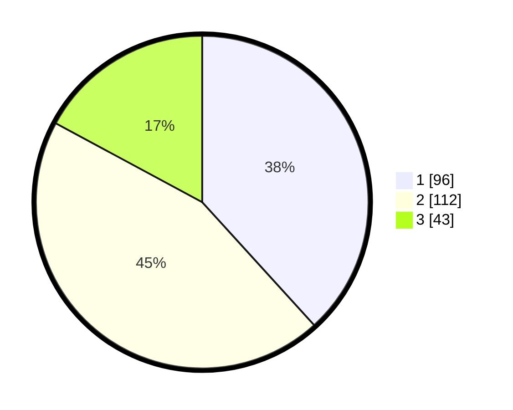

# Hasil

## Grafik

## Tabel

| No.    | Nama Paslon    | Suara | Suara (raw) | Persentase |
|:------ |:-------------- | -----:| -----------:| ----------:|
| 100025 | ANIES MUHAIMIN | 96    | [96][p-1]   | 38,25      |
| 100026 | PRABOWO GIBRAN | 112   | [112][p-2]  | 44,62      |
| 100027 | GANJAR MAHFUD  | 43    | [43][p-3]   | 17,13      |

[p-1]: https://github.com/gigit-pemilu/pemilu-2024/blob/main/pilpres/hitung-suara/sub/31-dki-jakarta/sub/74-jakarta-selatan/sub/09-jagakarsa/sub/1001-jagakarsa/sub/116-tps/sub/paslon-1.txt
[p-2]: https://github.com/gigit-pemilu/pemilu-2024/blob/main/pilpres/hitung-suara/sub/31-dki-jakarta/sub/74-jakarta-selatan/sub/09-jagakarsa/sub/1001-jagakarsa/sub/116-tps/sub/paslon-2.txt
[p-3]: https://github.com/gigit-pemilu/pemilu-2024/blob/main/pilpres/hitung-suara/sub/31-dki-jakarta/sub/74-jakarta-selatan/sub/09-jagakarsa/sub/1001-jagakarsa/sub/116-tps/sub/paslon-3.txt

## Foto C Plano

https://sirekap-obj-formc.kpu.go.id/3cb4/pemilu/ppwp/31/74/09/10/01/3174091001116-20240215-194028--8c6c8050-edf9-4a51-9860-5504e185a64f.jpg

https://sirekap-obj-formc.kpu.go.id/3cb4/pemilu/ppwp/31/74/09/10/01/3174091001116-20240215-193611--f5d6f075-8bcf-4638-8127-569122aa6b4e.jpg

https://sirekap-obj-formc.kpu.go.id/3cb4/pemilu/ppwp/31/74/09/10/01/3174091001116-20240215-194349--f6784792-b6ef-48a4-b4c4-eb4d127c3162.jpg

## Metadata

| Key        | Value               |
| ---------- | ------------------- |
| Time Stamp | 2024-02-24 22:31:28 |

