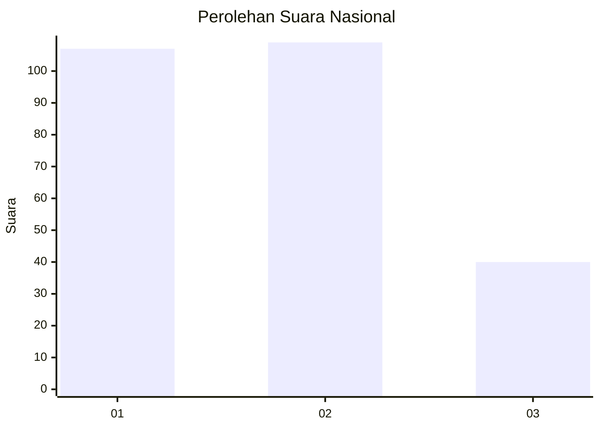
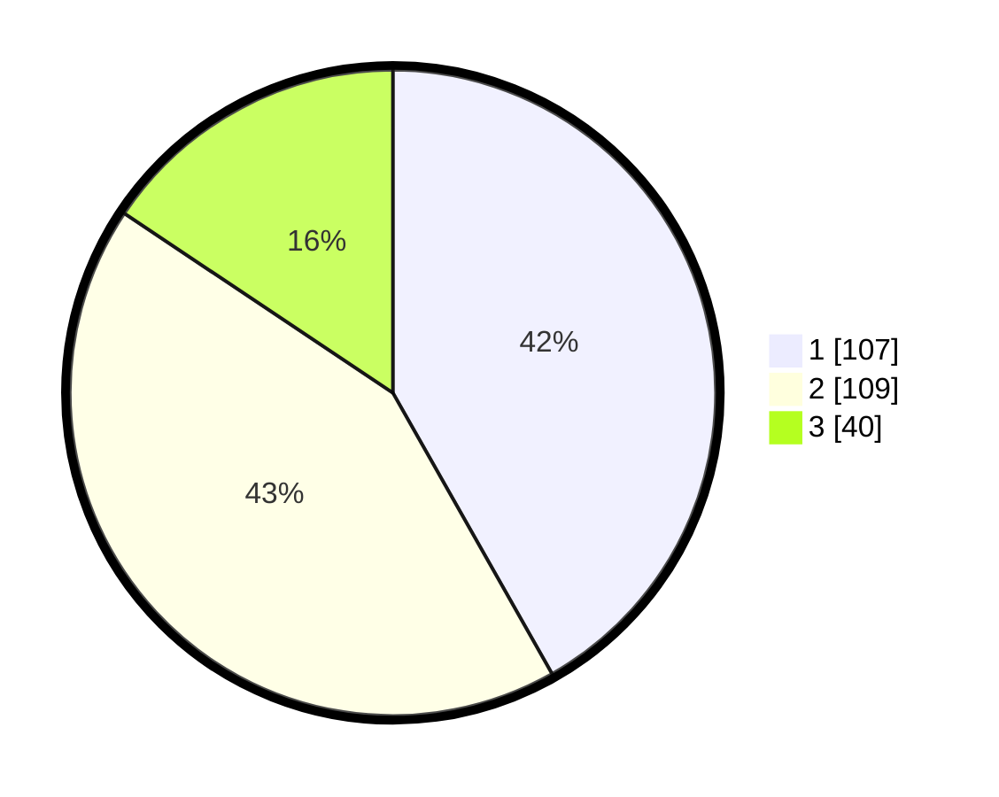

# Hasil

## Grafik

## Tabel

| No.    | Nama Paslon    | Suara | Suara (raw) | Persentase |
|:------ |:-------------- | -----:| -----------:| ----------:|
| 100025 | ANIES MUHAIMIN | 107   | [107][p-1]  | 41,80      |
| 100026 | PRABOWO GIBRAN | 109   | [109][p-2]  | 42,58      |
| 100027 | GANJAR MAHFUD  | 40    | [40][p-3]   | 15,63      |

[p-1]: https://github.com/gigit-pemilu/pemilu-2024/blob/main/pilpres/hitung-suara/sub/31-dki-jakarta/sub/74-jakarta-selatan/sub/09-jagakarsa/sub/1001-jagakarsa/sub/118-tps/sub/paslon-1.txt
[p-2]: https://github.com/gigit-pemilu/pemilu-2024/blob/main/pilpres/hitung-suara/sub/31-dki-jakarta/sub/74-jakarta-selatan/sub/09-jagakarsa/sub/1001-jagakarsa/sub/118-tps/sub/paslon-2.txt
[p-3]: https://github.com/gigit-pemilu/pemilu-2024/blob/main/pilpres/hitung-suara/sub/31-dki-jakarta/sub/74-jakarta-selatan/sub/09-jagakarsa/sub/1001-jagakarsa/sub/118-tps/sub/paslon-3.txt

## Foto C Plano

https://sirekap-obj-formc.kpu.go.id/1f7f/pemilu/ppwp/31/74/09/10/01/3174091001118-20240215-001730--e4be9c9a-408e-4e94-9f6f-204f82a260ca.jpg

https://sirekap-obj-formc.kpu.go.id/1f7f/pemilu/ppwp/31/74/09/10/01/3174091001118-20240215-001831--81e511bd-3800-4338-a63c-84d846185526.jpg

https://sirekap-obj-formc.kpu.go.id/1f7f/pemilu/ppwp/31/74/09/10/01/3174091001118-20240215-002023--9c80c393-ad95-4ef8-9c3d-581bed159fb5.jpg

## Metadata

| Key        | Value               |
| ---------- | ------------------- |
| Time Stamp | 2024-02-24 22:31:28 |

