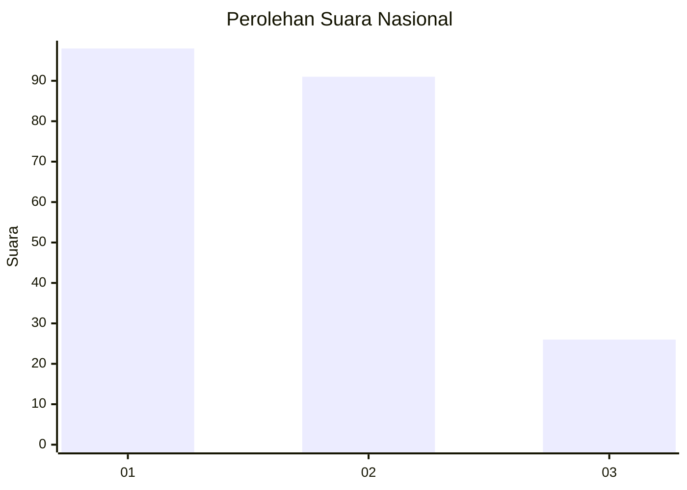
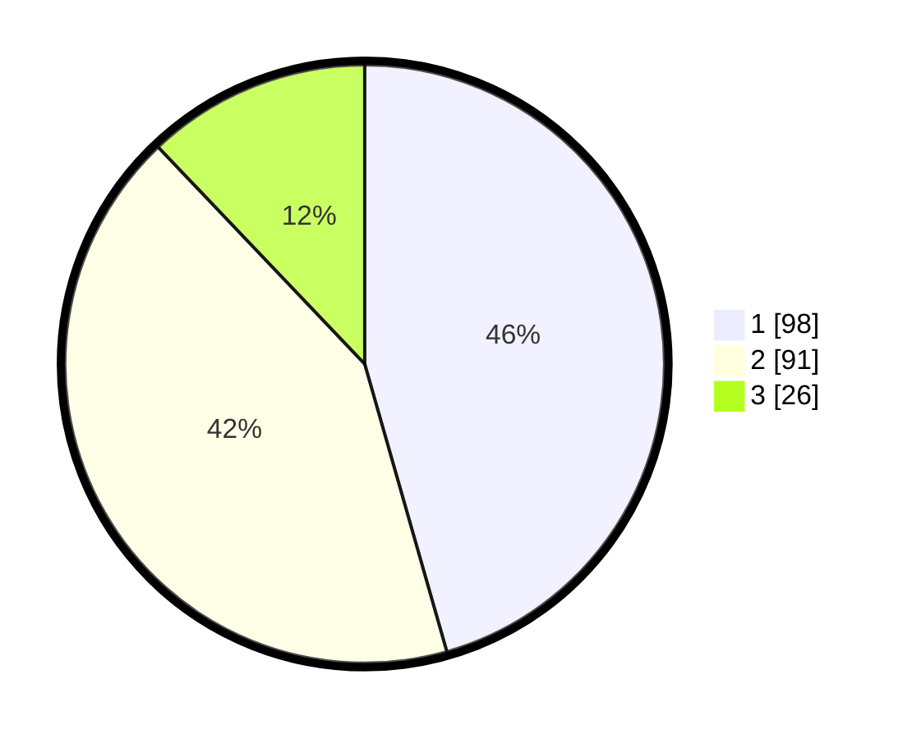

# Hasil

## Grafik

## Tabel

| No.    | Nama Paslon    | Suara | Suara (raw) | Persentase |
|:------ |:-------------- | -----:| -----------:| ----------:|
| 100025 | ANIES MUHAIMIN | 98    | [98][p-1]   | 45,58      |
| 100026 | PRABOWO GIBRAN | 91    | [91][p-2]   | 42,33      |
| 100027 | GANJAR MAHFUD  | 26    | [26][p-3]   | 12,09      |

[p-1]: https://github.com/gigit-pemilu/pemilu-2024/blob/main/pilpres/hitung-suara/sub/31-dki-jakarta/sub/74-jakarta-selatan/sub/09-jagakarsa/sub/1001-jagakarsa/sub/123-tps/sub/paslon-1.txt
[p-2]: https://github.com/gigit-pemilu/pemilu-2024/blob/main/pilpres/hitung-suara/sub/31-dki-jakarta/sub/74-jakarta-selatan/sub/09-jagakarsa/sub/1001-jagakarsa/sub/123-tps/sub/paslon-2.txt
[p-3]: https://github.com/gigit-pemilu/pemilu-2024/blob/main/pilpres/hitung-suara/sub/31-dki-jakarta/sub/74-jakarta-selatan/sub/09-jagakarsa/sub/1001-jagakarsa/sub/123-tps/sub/paslon-3.txt

## Foto C Plano

https://sirekap-obj-formc.kpu.go.id/a0ff/pemilu/ppwp/31/74/09/10/01/3174091001123-20240214-233836--9751b83a-6cdc-47e7-8f01-c48c7952402b.jpg

https://sirekap-obj-formc.kpu.go.id/a0ff/pemilu/ppwp/31/74/09/10/01/3174091001123-20240214-233637--5edddac1-9035-4b94-9623-c0777f8d21c5.jpg

https://sirekap-obj-formc.kpu.go.id/a0ff/pemilu/ppwp/31/74/09/10/01/3174091001123-20240214-234134--10afdb80-bb71-452c-874d-31caf0703ab9.jpg

## Metadata

| Key        | Value               |
| ---------- | ------------------- |
| Time Stamp | 2024-02-24 22:31:28 |

