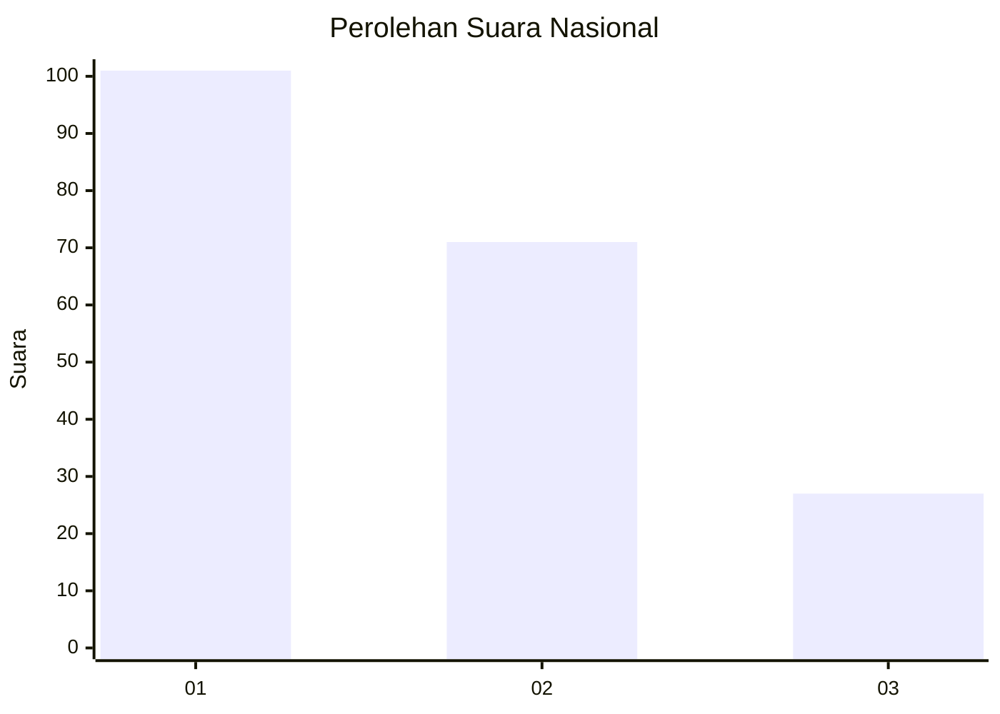
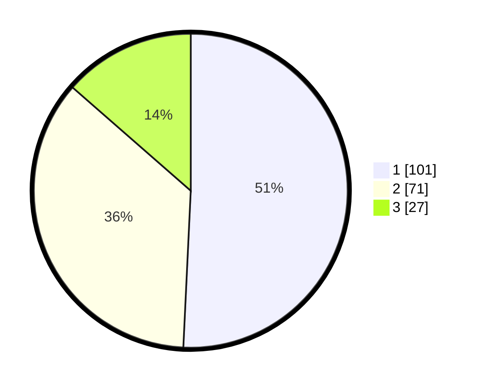

# Hasil

## Grafik

## Tabel

| No.    | Nama Paslon    | Suara | Suara (raw) | Persentase |
|:------ |:-------------- | -----:| -----------:| ----------:|
| 100025 | ANIES MUHAIMIN | 101   | [101][p-1]  | 50,75      |
| 100026 | PRABOWO GIBRAN | 71    | [71][p-2]   | 35,68      |
| 100027 | GANJAR MAHFUD  | 27    | [27][p-3]   | 13,57      |

[p-1]: https://github.com/gigit-pemilu/pemilu-2024/blob/main/pilpres/hitung-suara/sub/31-dki-jakarta/sub/74-jakarta-selatan/sub/09-jagakarsa/sub/1001-jagakarsa/sub/124-tps/sub/paslon-1.txt
[p-2]: https://github.com/gigit-pemilu/pemilu-2024/blob/main/pilpres/hitung-suara/sub/31-dki-jakarta/sub/74-jakarta-selatan/sub/09-jagakarsa/sub/1001-jagakarsa/sub/124-tps/sub/paslon-2.txt
[p-3]: https://github.com/gigit-pemilu/pemilu-2024/blob/main/pilpres/hitung-suara/sub/31-dki-jakarta/sub/74-jakarta-selatan/sub/09-jagakarsa/sub/1001-jagakarsa/sub/124-tps/sub/paslon-3.txt

## Foto C Plano

https://sirekap-obj-formc.kpu.go.id/403a/pemilu/ppwp/31/74/09/10/01/3174091001124-20240215-005916--dd27a799-f0cd-437f-b380-3d3b23488098.jpg

https://sirekap-obj-formc.kpu.go.id/403a/pemilu/ppwp/31/74/09/10/01/3174091001124-20240215-003907--960ec021-3ed5-4fb3-96e6-4d14b9eb4772.jpg

https://sirekap-obj-formc.kpu.go.id/403a/pemilu/ppwp/31/74/09/10/01/3174091001124-20240215-010024--f18f3199-603f-4704-87a2-51435f1f7c6e.jpg

## Metadata

| Key        | Value               |
| ---------- | ------------------- |
| Time Stamp | 2024-02-25 12:00:00 |

