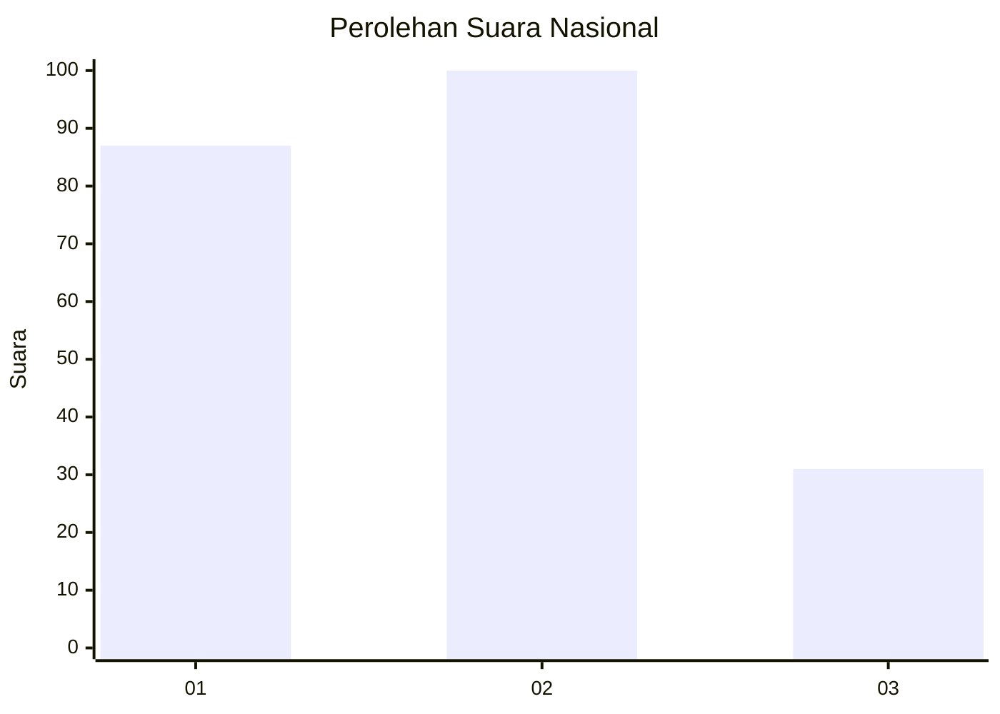
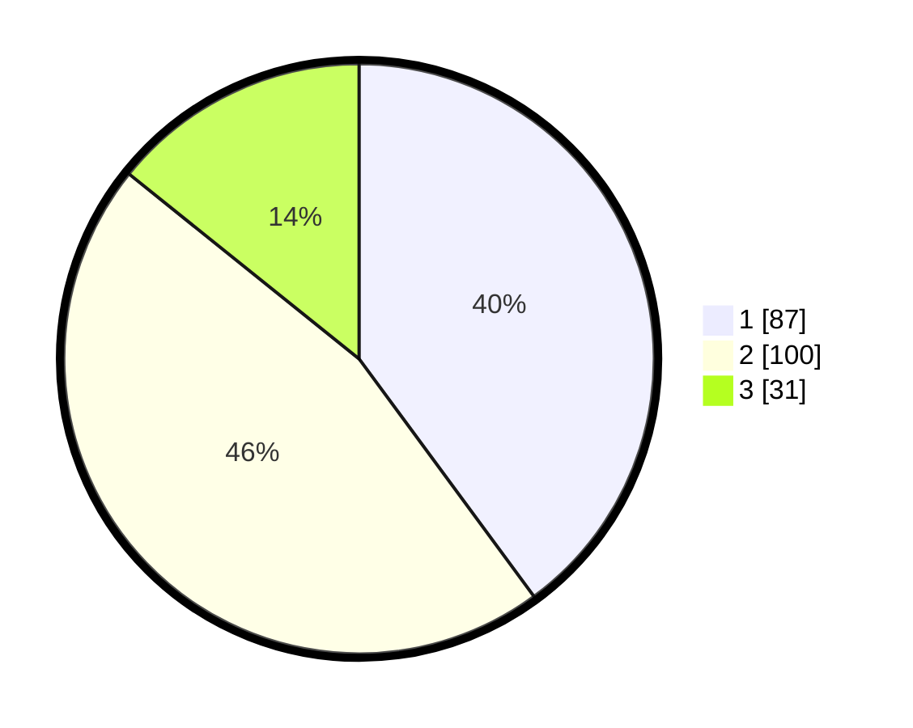

# Hasil

## Grafik

## Tabel

| No.    | Nama Paslon    | Suara | Suara (raw) | Persentase |
|:------ |:-------------- | -----:| -----------:| ----------:|
| 100025 | ANIES MUHAIMIN | 87    | [87][p-1]   | 39,91      |
| 100026 | PRABOWO GIBRAN | 100   | [100][p-2]  | 45,87      |
| 100027 | GANJAR MAHFUD  | 31    | [31][p-3]   | 14,22      |

[p-1]: https://github.com/gigit-pemilu/pemilu-2024/blob/main/pilpres/hitung-suara/sub/31-dki-jakarta/sub/74-jakarta-selatan/sub/09-jagakarsa/sub/1001-jagakarsa/sub/125-tps/sub/paslon-1.txt
[p-2]: https://github.com/gigit-pemilu/pemilu-2024/blob/main/pilpres/hitung-suara/sub/31-dki-jakarta/sub/74-jakarta-selatan/sub/09-jagakarsa/sub/1001-jagakarsa/sub/125-tps/sub/paslon-2.txt
[p-3]: https://github.com/gigit-pemilu/pemilu-2024/blob/main/pilpres/hitung-suara/sub/31-dki-jakarta/sub/74-jakarta-selatan/sub/09-jagakarsa/sub/1001-jagakarsa/sub/125-tps/sub/paslon-3.txt

## Foto C Plano

https://sirekap-obj-formc.kpu.go.id/6029/pemilu/ppwp/31/74/09/10/01/3174091001125-20240216-152635--de9140e3-8f37-4966-a1de-453ae6eb8f51.jpg

https://sirekap-obj-formc.kpu.go.id/6029/pemilu/ppwp/31/74/09/10/01/3174091001125-20240215-024049--7050ddc8-a590-48ec-b904-f679f35fb550.jpg

https://sirekap-obj-formc.kpu.go.id/6029/pemilu/ppwp/31/74/09/10/01/3174091001125-20240215-024143--05c9bb3a-b761-4890-af42-0a7d49d19ed2.jpg

## Metadata

| Key        | Value               |
| ---------- | ------------------- |
| Time Stamp | 2024-02-16 16:25:10 |

