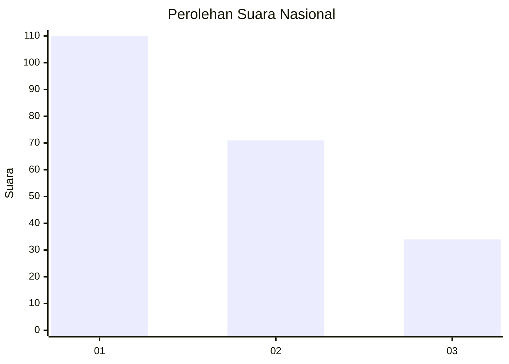
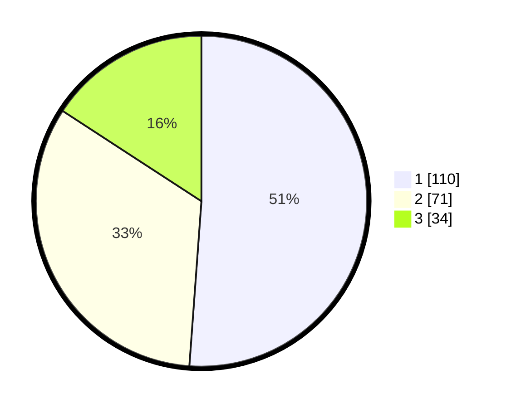

# Hasil

## Grafik

## Tabel

| No.    | Nama Paslon    | Suara | Suara (raw) | Persentase |
|:------ |:-------------- | -----:| -----------:| ----------:|
| 100025 | ANIES MUHAIMIN | 110   | [110][p-1]  | 51,16      |
| 100026 | PRABOWO GIBRAN | 71    | [71][p-2]   | 33,02      |
| 100027 | GANJAR MAHFUD  | 34    | [34][p-3]   | 15,81      |

[p-1]: https://github.com/gigit-pemilu/pemilu-2024/blob/main/pilpres/hitung-suara/sub/31-dki-jakarta/sub/74-jakarta-selatan/sub/09-jagakarsa/sub/1001-jagakarsa/sub/135-tps/sub/paslon-1.txt
[p-2]: https://github.com/gigit-pemilu/pemilu-2024/blob/main/pilpres/hitung-suara/sub/31-dki-jakarta/sub/74-jakarta-selatan/sub/09-jagakarsa/sub/1001-jagakarsa/sub/135-tps/sub/paslon-2.txt
[p-3]: https://github.com/gigit-pemilu/pemilu-2024/blob/main/pilpres/hitung-suara/sub/31-dki-jakarta/sub/74-jakarta-selatan/sub/09-jagakarsa/sub/1001-jagakarsa/sub/135-tps/sub/paslon-3.txt

## Foto C Plano

https://sirekap-obj-formc.kpu.go.id/b3ab/pemilu/ppwp/31/74/09/10/01/3174091001135-20240214-214452--8fbee4b8-d43b-4afd-b909-13fd301f2c31.jpg

https://sirekap-obj-formc.kpu.go.id/b3ab/pemilu/ppwp/31/74/09/10/01/3174091001135-20240214-215212--bb3aaee7-a95c-4a70-b40c-a5ca4a1b524d.jpg

https://sirekap-obj-formc.kpu.go.id/b3ab/pemilu/ppwp/31/74/09/10/01/3174091001135-20240214-215634--10bcfd88-d4bd-4bbe-a8e4-c24c21fb20cd.jpg

## Metadata

| Key        | Value               |
| ---------- | ------------------- |
| Time Stamp | 2024-02-24 22:31:28 |

