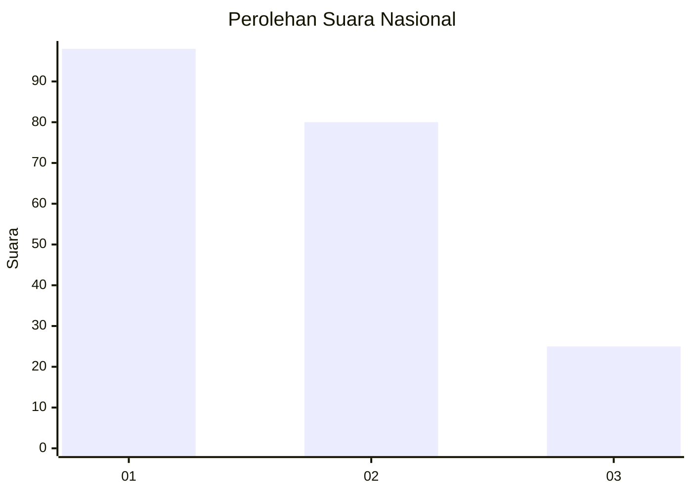
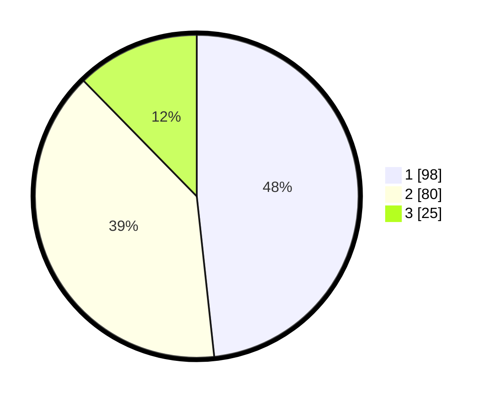

# Hasil

## Grafik

## Tabel

| No.    | Nama Paslon    | Suara | Suara (raw) | Persentase |
|:------ |:-------------- | -----:| -----------:| ----------:|
| 100025 | ANIES MUHAIMIN | 98    | [98][p-1]   | 48,28      |
| 100026 | PRABOWO GIBRAN | 80    | [80][p-2]   | 39,41      |
| 100027 | GANJAR MAHFUD  | 25    | [25][p-3]   | 12,32      |

[p-1]: https://github.com/gigit-pemilu/pemilu-2024/blob/main/pilpres/hitung-suara/sub/31-dki-jakarta/sub/74-jakarta-selatan/sub/09-jagakarsa/sub/1001-jagakarsa/sub/139-tps/sub/paslon-1.txt
[p-2]: https://github.com/gigit-pemilu/pemilu-2024/blob/main/pilpres/hitung-suara/sub/31-dki-jakarta/sub/74-jakarta-selatan/sub/09-jagakarsa/sub/1001-jagakarsa/sub/139-tps/sub/paslon-2.txt
[p-3]: https://github.com/gigit-pemilu/pemilu-2024/blob/main/pilpres/hitung-suara/sub/31-dki-jakarta/sub/74-jakarta-selatan/sub/09-jagakarsa/sub/1001-jagakarsa/sub/139-tps/sub/paslon-3.txt

## Foto C Plano

https://sirekap-obj-formc.kpu.go.id/a211/pemilu/ppwp/31/74/09/10/01/3174091001139-20240214-224024--f57fdd1e-b1aa-48aa-90d1-0f89dee4c3a6.jpg

https://sirekap-obj-formc.kpu.go.id/a211/pemilu/ppwp/31/74/09/10/01/3174091001139-20240214-195136--a1f72d89-f283-4503-9422-201551a71bfb.jpg

https://sirekap-obj-formc.kpu.go.id/a211/pemilu/ppwp/31/74/09/10/01/3174091001139-20240214-195426--d431ab9a-df47-4742-bb3d-073690a1f890.jpg

## Metadata

| Key        | Value               |
| ---------- | ------------------- |
| Time Stamp | 2024-02-15 18:30:25 |

