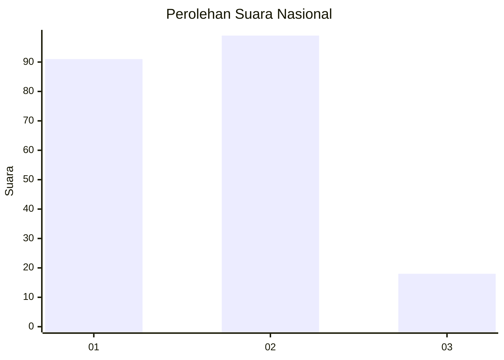
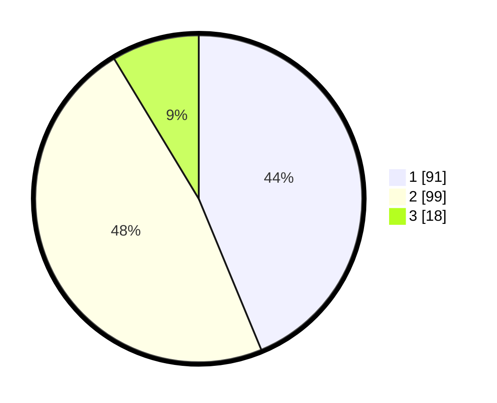

# Hasil

## Grafik

## Tabel

| No.    | Nama Paslon    | Suara | Suara (raw) | Persentase |
|:------ |:-------------- | -----:| -----------:| ----------:|
| 100025 | ANIES MUHAIMIN | 91    | [91][p-1]   | 43,75      |
| 100026 | PRABOWO GIBRAN | 99    | [99][p-2]   | 47,60      |
| 100027 | GANJAR MAHFUD  | 18    | [18][p-3]   | 8,65       |

[p-1]: https://github.com/gigit-pemilu/pemilu-2024/blob/main/pilpres/hitung-suara/sub/31-dki-jakarta/sub/74-jakarta-selatan/sub/09-jagakarsa/sub/1001-jagakarsa/sub/142-tps/sub/paslon-1.txt
[p-2]: https://github.com/gigit-pemilu/pemilu-2024/blob/main/pilpres/hitung-suara/sub/31-dki-jakarta/sub/74-jakarta-selatan/sub/09-jagakarsa/sub/1001-jagakarsa/sub/142-tps/sub/paslon-2.txt
[p-3]: https://github.com/gigit-pemilu/pemilu-2024/blob/main/pilpres/hitung-suara/sub/31-dki-jakarta/sub/74-jakarta-selatan/sub/09-jagakarsa/sub/1001-jagakarsa/sub/142-tps/sub/paslon-3.txt

## Foto C Plano

https://sirekap-obj-formc.kpu.go.id/df1d/pemilu/ppwp/31/74/09/10/01/3174091001142-20240214-160114--a294a2c8-f400-4dcd-9f4f-5c09710be25a.jpg

https://sirekap-obj-formc.kpu.go.id/df1d/pemilu/ppwp/31/74/09/10/01/3174091001142-20240214-155454--e4eb9060-7d84-48b9-9a7a-e78c03c839e9.jpg

https://sirekap-obj-formc.kpu.go.id/df1d/pemilu/ppwp/31/74/09/10/01/3174091001142-20240214-195055--a9f62307-2e28-4eb1-91c3-d920a4124932.jpg

## Metadata

| Key        | Value               |
| ---------- | ------------------- |
| Time Stamp | 2024-02-25 18:00:00 |

