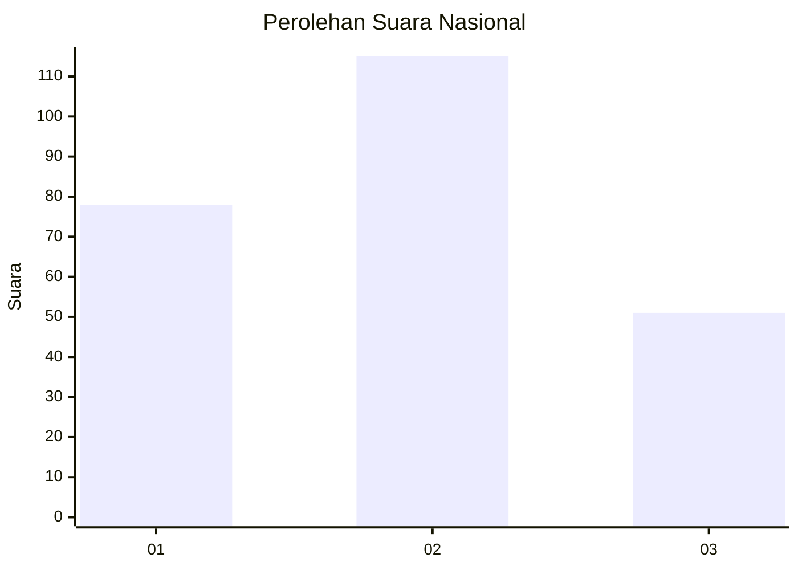
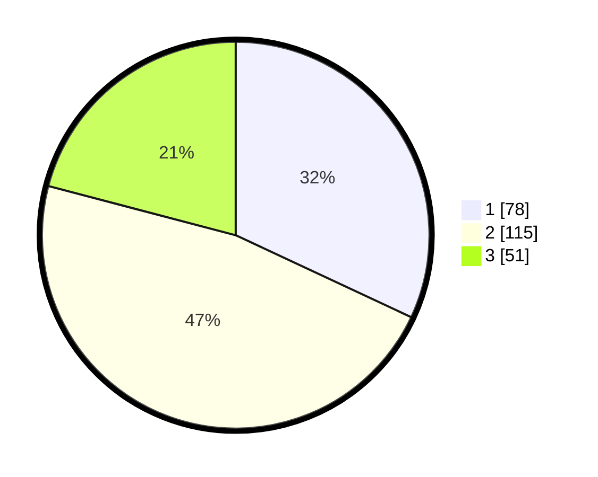

# Hasil

## Grafik

## Tabel

| No.    | Nama Paslon    | Suara | Suara (raw) | Persentase |
|:------ |:-------------- | -----:| -----------:| ----------:|
| 100025 | ANIES MUHAIMIN | 78    | [78][p-1]   | 31,97      |
| 100026 | PRABOWO GIBRAN | 115   | [115][p-2]  | 47,13      |
| 100027 | GANJAR MAHFUD  | 51    | [51][p-3]   | 20,90      |

[p-1]: https://github.com/gigit-pemilu/pemilu-2024/blob/main/pilpres/hitung-suara/sub/31-dki-jakarta/sub/74-jakarta-selatan/sub/09-jagakarsa/sub/1001-jagakarsa/sub/154-tps/sub/paslon-1.txt
[p-2]: https://github.com/gigit-pemilu/pemilu-2024/blob/main/pilpres/hitung-suara/sub/31-dki-jakarta/sub/74-jakarta-selatan/sub/09-jagakarsa/sub/1001-jagakarsa/sub/154-tps/sub/paslon-2.txt
[p-3]: https://github.com/gigit-pemilu/pemilu-2024/blob/main/pilpres/hitung-suara/sub/31-dki-jakarta/sub/74-jakarta-selatan/sub/09-jagakarsa/sub/1001-jagakarsa/sub/154-tps/sub/paslon-3.txt

## Foto C Plano

https://sirekap-obj-formc.kpu.go.id/11a6/pemilu/ppwp/31/74/09/10/01/3174091001154-20240214-210947--b6db81f3-825a-4f58-86f4-27f6674e62e3.jpg

https://sirekap-obj-formc.kpu.go.id/11a6/pemilu/ppwp/31/74/09/10/01/3174091001154-20240214-221309--b0382d3d-c17a-4d2f-8917-1c1744ec44eb.jpg

https://sirekap-obj-formc.kpu.go.id/11a6/pemilu/ppwp/31/74/09/10/01/3174091001154-20240214-211237--a2fb85a2-2e76-43fb-9445-ccfe4c57555d.jpg

## Metadata

| Key        | Value               |
| ---------- | ------------------- |
| Time Stamp | 2024-02-15 21:01:18 |

