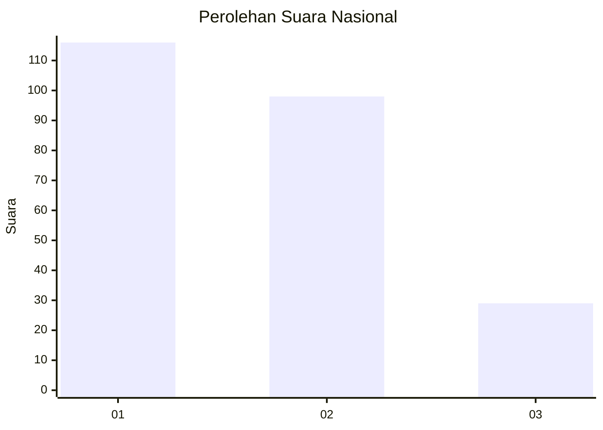
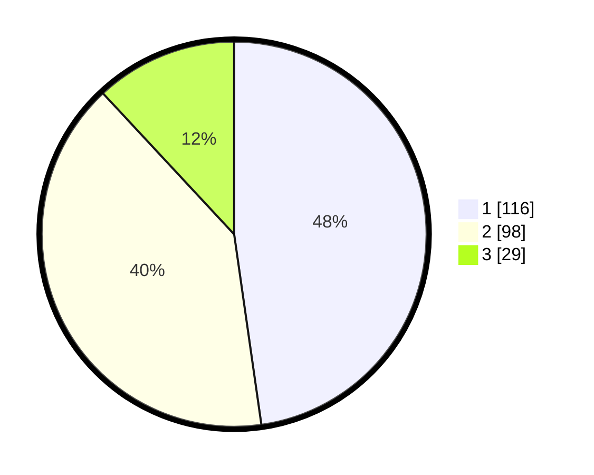

# Hasil

## Grafik

## Tabel

| No.    | Nama Paslon    | Suara | Suara (raw) | Persentase |
|:------ |:-------------- | -----:| -----------:| ----------:|
| 100025 | ANIES MUHAIMIN | 116   | [116][p-1]  | 47,74      |
| 100026 | PRABOWO GIBRAN | 98    | [98][p-2]   | 40,33      |
| 100027 | GANJAR MAHFUD  | 29    | [29][p-3]   | 11,93      |

[p-1]: https://github.com/gigit-pemilu/pemilu-2024/blob/main/pilpres/hitung-suara/sub/31-dki-jakarta/sub/74-jakarta-selatan/sub/09-jagakarsa/sub/1001-jagakarsa/sub/158-tps/sub/paslon-1.txt
[p-2]: https://github.com/gigit-pemilu/pemilu-2024/blob/main/pilpres/hitung-suara/sub/31-dki-jakarta/sub/74-jakarta-selatan/sub/09-jagakarsa/sub/1001-jagakarsa/sub/158-tps/sub/paslon-2.txt
[p-3]: https://github.com/gigit-pemilu/pemilu-2024/blob/main/pilpres/hitung-suara/sub/31-dki-jakarta/sub/74-jakarta-selatan/sub/09-jagakarsa/sub/1001-jagakarsa/sub/158-tps/sub/paslon-3.txt

## Foto C Plano

https://sirekap-obj-formc.kpu.go.id/28c1/pemilu/ppwp/31/74/09/10/01/3174091001158-20240216-070344--6849094a-493d-4e28-9787-56a57bae26a1.jpg

https://sirekap-obj-formc.kpu.go.id/28c1/pemilu/ppwp/31/74/09/10/01/3174091001158-20240216-070413--6211d83b-bbac-4a63-9290-c7e43c6b5191.jpg

https://sirekap-obj-formc.kpu.go.id/28c1/pemilu/ppwp/31/74/09/10/01/3174091001158-20240216-070430--5f66d1c8-e8d5-4208-9c8a-4bde2daf0918.jpg

## Metadata

| Key        | Value               |
| ---------- | ------------------- |
| Time Stamp | 2024-02-24 22:31:28 |

