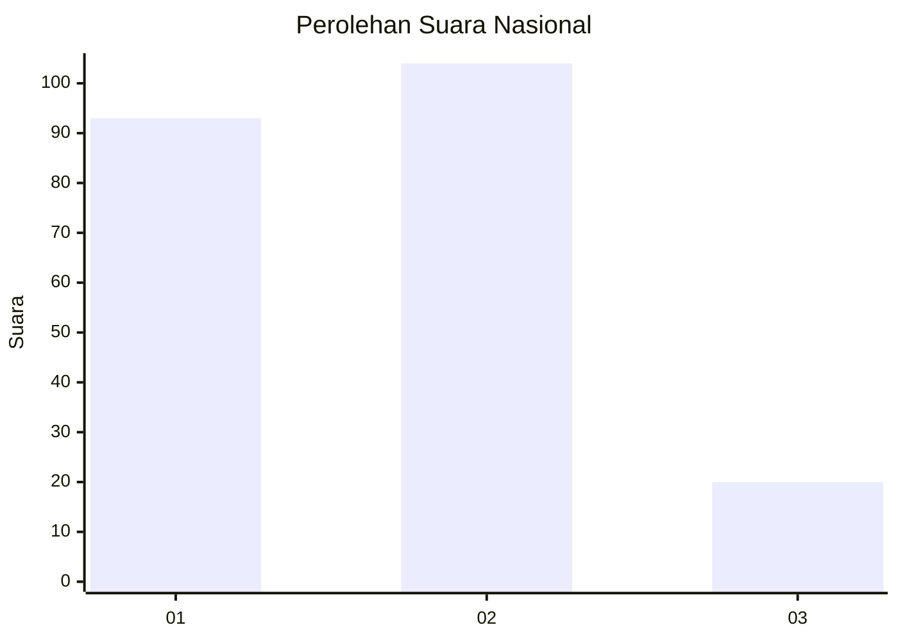
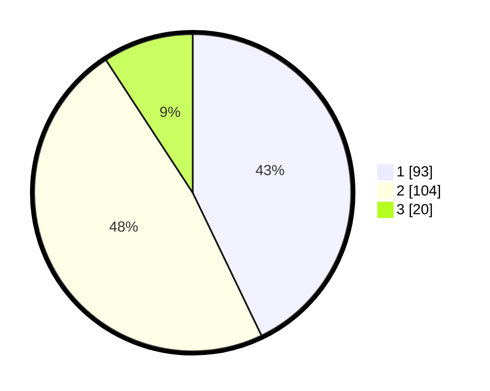

# Hasil

## Grafik

## Tabel

| No.    | Nama Paslon    | Suara | Suara (raw) | Persentase |
|:------ |:-------------- | -----:| -----------:| ----------:|
| 100025 | ANIES MUHAIMIN | 93    | [93][p-1]   | 42,86      |
| 100026 | PRABOWO GIBRAN | 104   | [104][p-2]  | 47,93      |
| 100027 | GANJAR MAHFUD  | 20    | [20][p-3]   | 9,22       |

[p-1]: https://github.com/gigit-pemilu/pemilu-2024/blob/main/pilpres/hitung-suara/sub/31-dki-jakarta/sub/74-jakarta-selatan/sub/09-jagakarsa/sub/1001-jagakarsa/sub/182-tps/sub/paslon-1.txt
[p-2]: https://github.com/gigit-pemilu/pemilu-2024/blob/main/pilpres/hitung-suara/sub/31-dki-jakarta/sub/74-jakarta-selatan/sub/09-jagakarsa/sub/1001-jagakarsa/sub/182-tps/sub/paslon-2.txt
[p-3]: https://github.com/gigit-pemilu/pemilu-2024/blob/main/pilpres/hitung-suara/sub/31-dki-jakarta/sub/74-jakarta-selatan/sub/09-jagakarsa/sub/1001-jagakarsa/sub/182-tps/sub/paslon-3.txt

## Foto C Plano

https://sirekap-obj-formc.kpu.go.id/0229/pemilu/ppwp/31/74/09/10/01/3174091001182-20240215-022627--1c85a650-bf87-4ac9-8b91-abb828b0ebc6.jpg

https://sirekap-obj-formc.kpu.go.id/0229/pemilu/ppwp/31/74/09/10/01/3174091001182-20240214-225759--8bb15025-9c84-4404-a846-f78430b07a42.jpg

https://sirekap-obj-formc.kpu.go.id/0229/pemilu/ppwp/31/74/09/10/01/3174091001182-20240214-225920--aec0f0ed-34b5-4eaa-83ba-9fe3588157a5.jpg

## Metadata

| Key        | Value               |
| ---------- | ------------------- |
| Time Stamp | 2024-02-15 18:30:25 |

