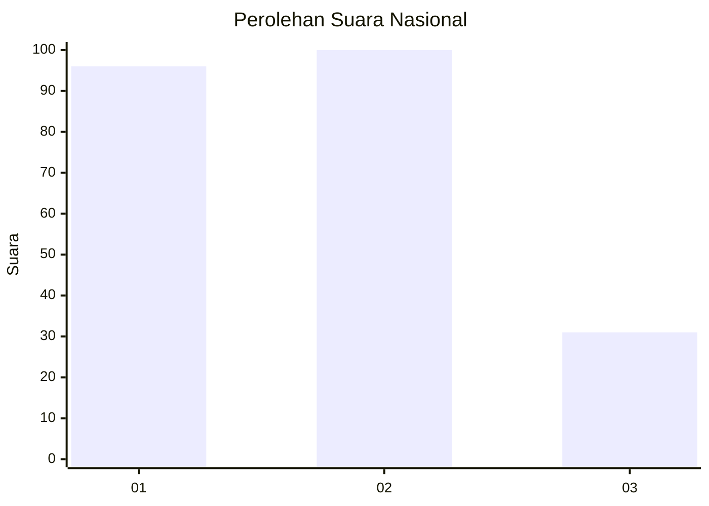
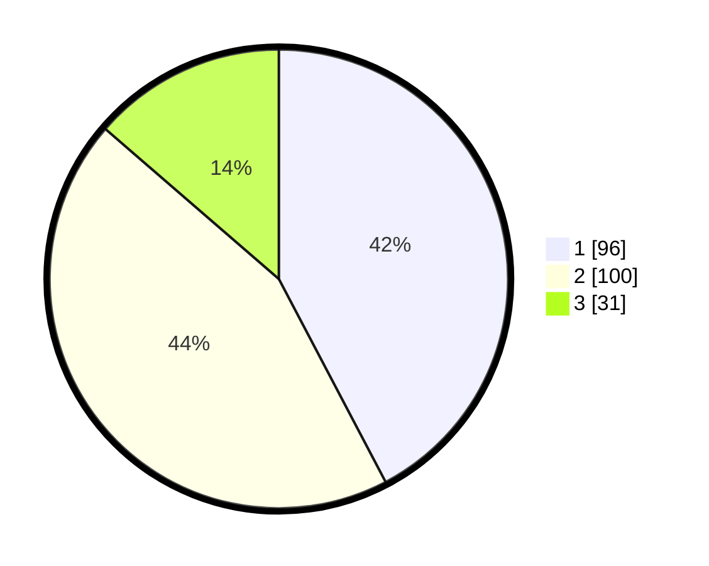

# Hasil

## Grafik

## Tabel

| No.    | Nama Paslon    | Suara | Suara (raw) | Persentase |
|:------ |:-------------- | -----:| -----------:| ----------:|
| 100025 | ANIES MUHAIMIN | 96    | [96][p-1]   | 42,29      |
| 100026 | PRABOWO GIBRAN | 100   | [100][p-2]  | 44,05      |
| 100027 | GANJAR MAHFUD  | 31    | [31][p-3]   | 13,66      |

[p-1]: https://github.com/gigit-pemilu/pemilu-2024/blob/main/pilpres/hitung-suara/sub/31-dki-jakarta/sub/74-jakarta-selatan/sub/09-jagakarsa/sub/1001-jagakarsa/sub/184-tps/sub/paslon-1.txt
[p-2]: https://github.com/gigit-pemilu/pemilu-2024/blob/main/pilpres/hitung-suara/sub/31-dki-jakarta/sub/74-jakarta-selatan/sub/09-jagakarsa/sub/1001-jagakarsa/sub/184-tps/sub/paslon-2.txt
[p-3]: https://github.com/gigit-pemilu/pemilu-2024/blob/main/pilpres/hitung-suara/sub/31-dki-jakarta/sub/74-jakarta-selatan/sub/09-jagakarsa/sub/1001-jagakarsa/sub/184-tps/sub/paslon-3.txt

## Foto C Plano

https://sirekap-obj-formc.kpu.go.id/aec1/pemilu/ppwp/31/74/09/10/01/3174091001184-20240214-225327--1155be7d-5f79-477c-b737-3d4dd8c0c5fa.jpg

https://sirekap-obj-formc.kpu.go.id/aec1/pemilu/ppwp/31/74/09/10/01/3174091001184-20240214-225501--6c9188fa-683e-4f24-8e09-918e5d595712.jpg

https://sirekap-obj-formc.kpu.go.id/aec1/pemilu/ppwp/31/74/09/10/01/3174091001184-20240214-225551--7d1f13ff-d152-4b24-aad7-525230932e8a.jpg

## Metadata

| Key        | Value               |
| ---------- | ------------------- |
| Time Stamp | 2024-02-15 19:30:26 |

