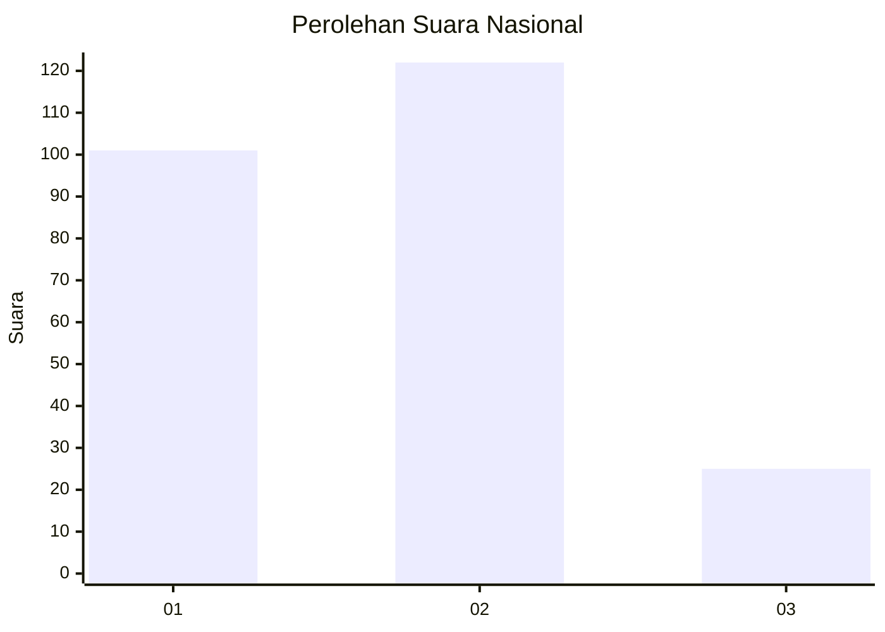
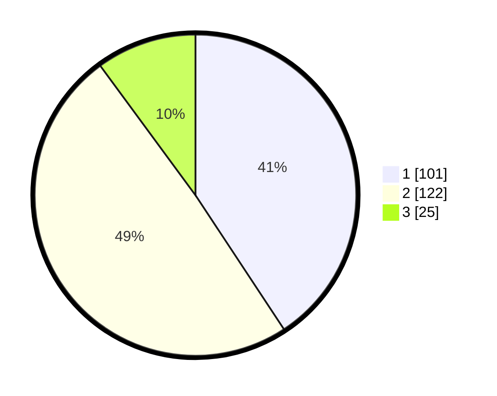

# Hasil

## Grafik

## Tabel

| No.    | Nama Paslon    | Suara | Suara (raw) | Persentase |
|:------ |:-------------- | -----:| -----------:| ----------:|
| 100025 | ANIES MUHAIMIN | 101   | [101][p-1]  | 40,73      |
| 100026 | PRABOWO GIBRAN | 122   | [122][p-2]  | 49,19      |
| 100027 | GANJAR MAHFUD  | 25    | [25][p-3]   | 10,08      |

[p-1]: https://github.com/gigit-pemilu/pemilu-2024/blob/main/pilpres/hitung-suara/sub/31-dki-jakarta/sub/74-jakarta-selatan/sub/09-jagakarsa/sub/1001-jagakarsa/sub/188-tps/sub/paslon-1.txt
[p-2]: https://github.com/gigit-pemilu/pemilu-2024/blob/main/pilpres/hitung-suara/sub/31-dki-jakarta/sub/74-jakarta-selatan/sub/09-jagakarsa/sub/1001-jagakarsa/sub/188-tps/sub/paslon-2.txt
[p-3]: https://github.com/gigit-pemilu/pemilu-2024/blob/main/pilpres/hitung-suara/sub/31-dki-jakarta/sub/74-jakarta-selatan/sub/09-jagakarsa/sub/1001-jagakarsa/sub/188-tps/sub/paslon-3.txt

## Foto C Plano

https://sirekap-obj-formc.kpu.go.id/869a/pemilu/ppwp/31/74/09/10/01/3174091001188-20240214-232842--cac5ec6a-bd37-41f5-9cb5-9372df03d895.jpg

https://sirekap-obj-formc.kpu.go.id/869a/pemilu/ppwp/31/74/09/10/01/3174091001188-20240214-233113--be84f131-05e1-4922-9126-8c6f2179f779.jpg

https://sirekap-obj-formc.kpu.go.id/869a/pemilu/ppwp/31/74/09/10/01/3174091001188-20240214-233305--42456e7f-c98d-409a-85a2-31f388311ffd.jpg

## Metadata

| Key        | Value               |
| ---------- | ------------------- |
| Time Stamp | 2024-02-25 18:00:00 |

