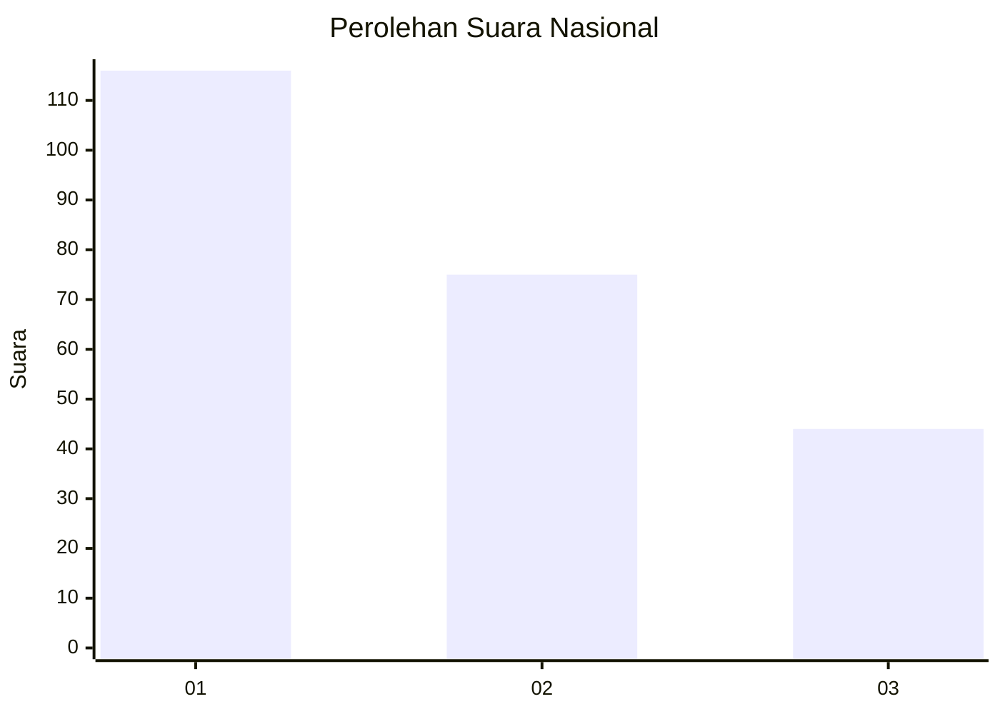
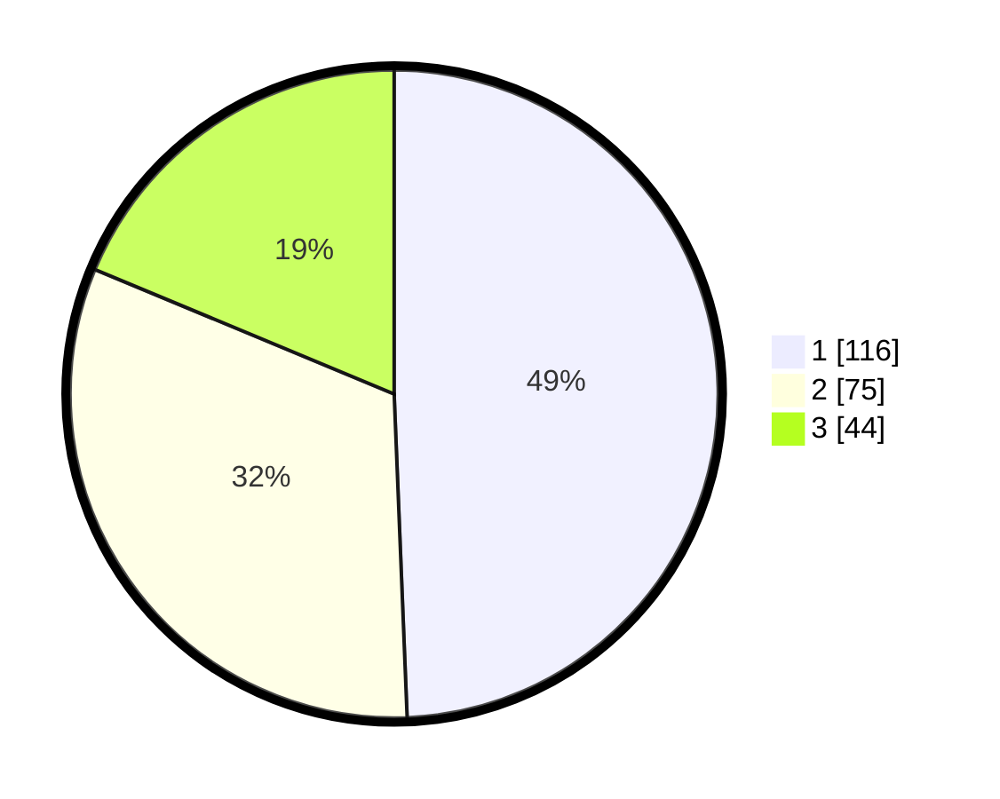

# Hasil

## Grafik

## Tabel

| No.    | Nama Paslon    | Suara | Suara (raw) | Persentase |
|:------ |:-------------- | -----:| -----------:| ----------:|
| 100025 | ANIES MUHAIMIN | 116   | [116][p-1]  | 49,36      |
| 100026 | PRABOWO GIBRAN | 75    | [75][p-2]   | 31,91      |
| 100027 | GANJAR MAHFUD  | 44    | [44][p-3]   | 18,72      |

[p-1]: https://github.com/gigit-pemilu/pemilu-2024/blob/main/pilpres/hitung-suara/sub/31-dki-jakarta/sub/74-jakarta-selatan/sub/09-jagakarsa/sub/1001-jagakarsa/sub/196-tps/sub/paslon-1.txt
[p-2]: https://github.com/gigit-pemilu/pemilu-2024/blob/main/pilpres/hitung-suara/sub/31-dki-jakarta/sub/74-jakarta-selatan/sub/09-jagakarsa/sub/1001-jagakarsa/sub/196-tps/sub/paslon-2.txt
[p-3]: https://github.com/gigit-pemilu/pemilu-2024/blob/main/pilpres/hitung-suara/sub/31-dki-jakarta/sub/74-jakarta-selatan/sub/09-jagakarsa/sub/1001-jagakarsa/sub/196-tps/sub/paslon-3.txt

## Foto C Plano

https://sirekap-obj-formc.kpu.go.id/b223/pemilu/ppwp/31/74/09/10/01/3174091001196-20240214-233852--320919e6-0787-429d-9b33-2a073d4862f4.jpg

https://sirekap-obj-formc.kpu.go.id/b223/pemilu/ppwp/31/74/09/10/01/3174091001196-20240214-232120--490b1ce7-80d9-4c4b-97ef-4ad3bdae2d85.jpg

https://sirekap-obj-formc.kpu.go.id/b223/pemilu/ppwp/31/74/09/10/01/3174091001196-20240214-232213--9118a281-98f9-4f0e-b3f4-f4dfb17401b4.jpg

## Metadata

| Key        | Value               |
| ---------- | ------------------- |
| Time Stamp | 2024-02-24 22:31:28 |

