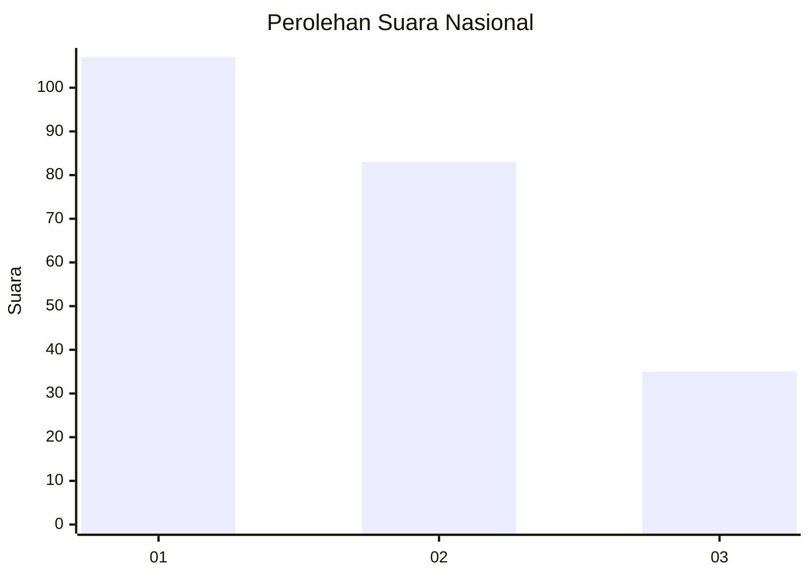
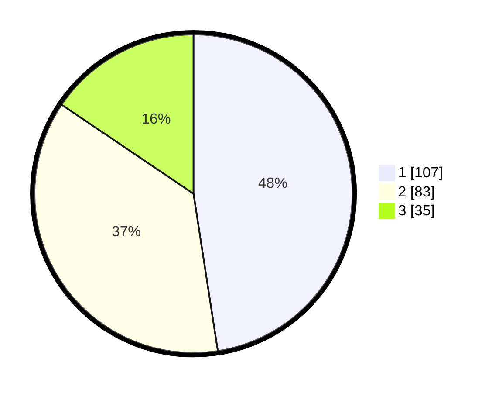

# Hasil

## Grafik

## Tabel

| No.    | Nama Paslon    | Suara | Suara (raw) | Persentase |
|:------ |:-------------- | -----:| -----------:| ----------:|
| 100025 | ANIES MUHAIMIN | 107   | [107][p-1]  | 47,56      |
| 100026 | PRABOWO GIBRAN | 83    | [83][p-2]   | 36,89      |
| 100027 | GANJAR MAHFUD  | 35    | [35][p-3]   | 15,56      |

[p-1]: https://github.com/gigit-pemilu/pemilu-2024/blob/main/pilpres/hitung-suara/sub/31-dki-jakarta/sub/74-jakarta-selatan/sub/09-jagakarsa/sub/1001-jagakarsa/sub/208-tps/sub/paslon-1.txt
[p-2]: https://github.com/gigit-pemilu/pemilu-2024/blob/main/pilpres/hitung-suara/sub/31-dki-jakarta/sub/74-jakarta-selatan/sub/09-jagakarsa/sub/1001-jagakarsa/sub/208-tps/sub/paslon-2.txt
[p-3]: https://github.com/gigit-pemilu/pemilu-2024/blob/main/pilpres/hitung-suara/sub/31-dki-jakarta/sub/74-jakarta-selatan/sub/09-jagakarsa/sub/1001-jagakarsa/sub/208-tps/sub/paslon-3.txt

## Foto C Plano

https://sirekap-obj-formc.kpu.go.id/5df3/pemilu/ppwp/31/74/09/10/01/3174091001208-20240215-152819--604bfa14-b37b-410f-9087-a9e979200e7a.jpg

https://sirekap-obj-formc.kpu.go.id/5df3/pemilu/ppwp/31/74/09/10/01/3174091001208-20240215-152837--73019b51-f530-4979-b89a-75004649fcc3.jpg

https://sirekap-obj-formc.kpu.go.id/5df3/pemilu/ppwp/31/74/09/10/01/3174091001208-20240215-152851--15d3c57a-cfa7-488f-ad8b-94e7dcddd0e0.jpg

## Metadata

| Key        | Value               |
| ---------- | ------------------- |
| Time Stamp | 2024-02-24 22:31:28 |

