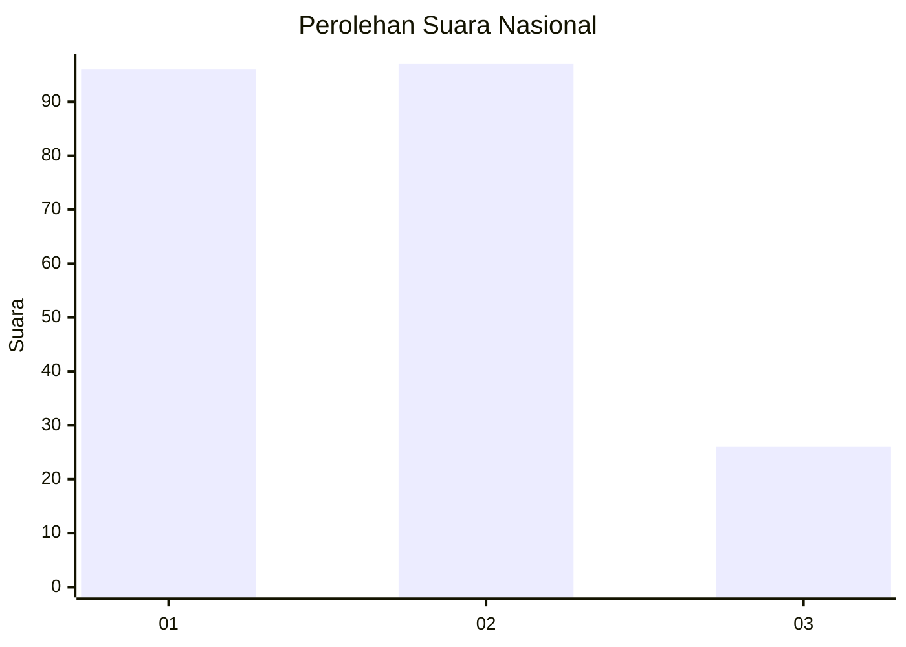
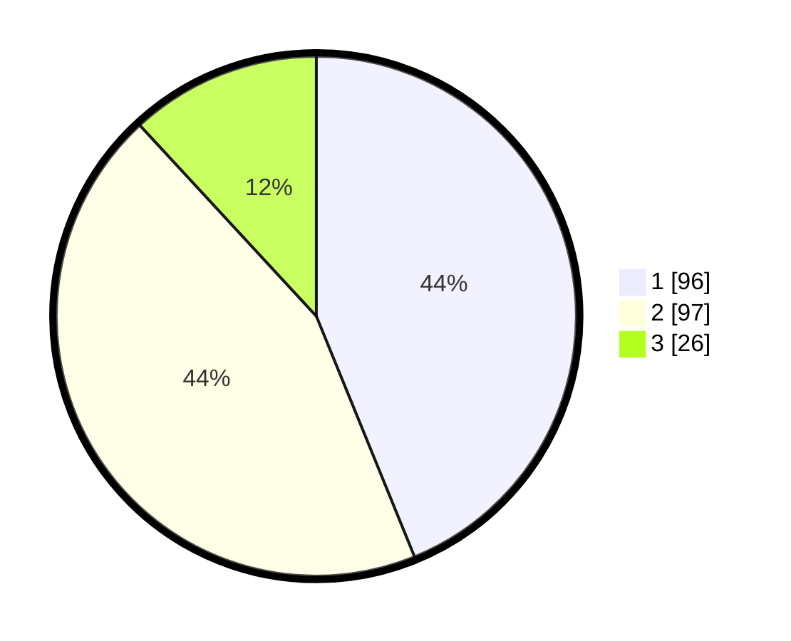

# Hasil

## Grafik

## Tabel

| No.    | Nama Paslon    | Suara | Suara (raw) | Persentase |
|:------ |:-------------- | -----:| -----------:| ----------:|
| 100025 | ANIES MUHAIMIN | 96    | [96][p-1]   | 43,84      |
| 100026 | PRABOWO GIBRAN | 97    | [97][p-2]   | 44,29      |
| 100027 | GANJAR MAHFUD  | 26    | [26][p-3]   | 11,87      |

[p-1]: https://github.com/gigit-pemilu/pemilu-2024/blob/main/pilpres/hitung-suara/sub/31-dki-jakarta/sub/74-jakarta-selatan/sub/09-jagakarsa/sub/1001-jagakarsa/sub/215-tps/sub/paslon-1.txt
[p-2]: https://github.com/gigit-pemilu/pemilu-2024/blob/main/pilpres/hitung-suara/sub/31-dki-jakarta/sub/74-jakarta-selatan/sub/09-jagakarsa/sub/1001-jagakarsa/sub/215-tps/sub/paslon-2.txt
[p-3]: https://github.com/gigit-pemilu/pemilu-2024/blob/main/pilpres/hitung-suara/sub/31-dki-jakarta/sub/74-jakarta-selatan/sub/09-jagakarsa/sub/1001-jagakarsa/sub/215-tps/sub/paslon-3.txt

## Foto C Plano

https://sirekap-obj-formc.kpu.go.id/623c/pemilu/ppwp/31/74/09/10/01/3174091001215-20240214-222410--84778502-3db3-4241-b742-64db78029cee.jpg

https://sirekap-obj-formc.kpu.go.id/623c/pemilu/ppwp/31/74/09/10/01/3174091001215-20240214-222538--a05b3755-c537-4b90-a4a3-52c357f84394.jpg

https://sirekap-obj-formc.kpu.go.id/623c/pemilu/ppwp/31/74/09/10/01/3174091001215-20240214-193309--4f487cac-e2fa-47b3-b19c-e8bca6871c77.jpg

## Metadata

| Key        | Value               |
| ---------- | ------------------- |
| Time Stamp | 2024-02-24 22:31:28 |

