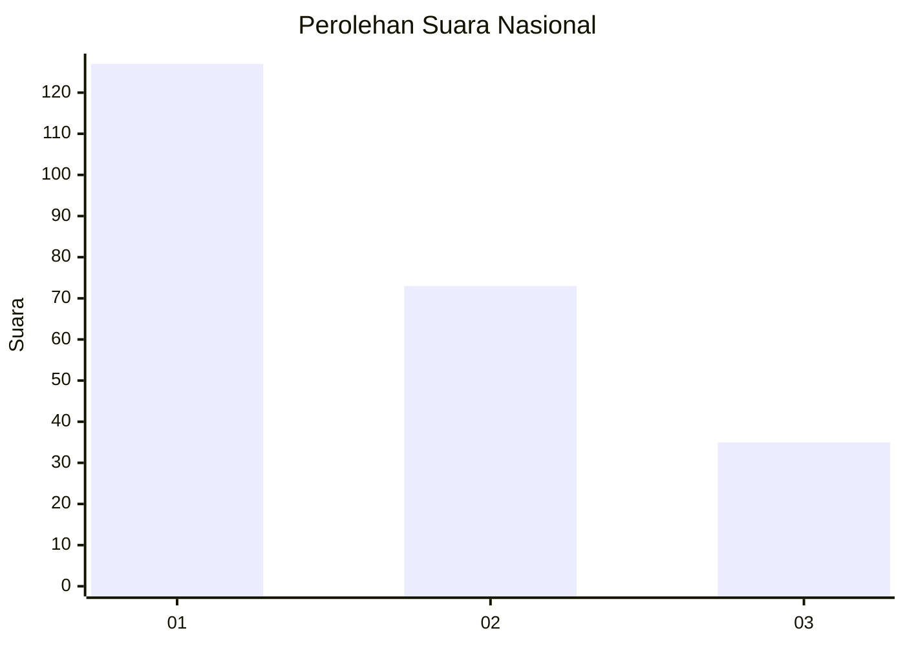
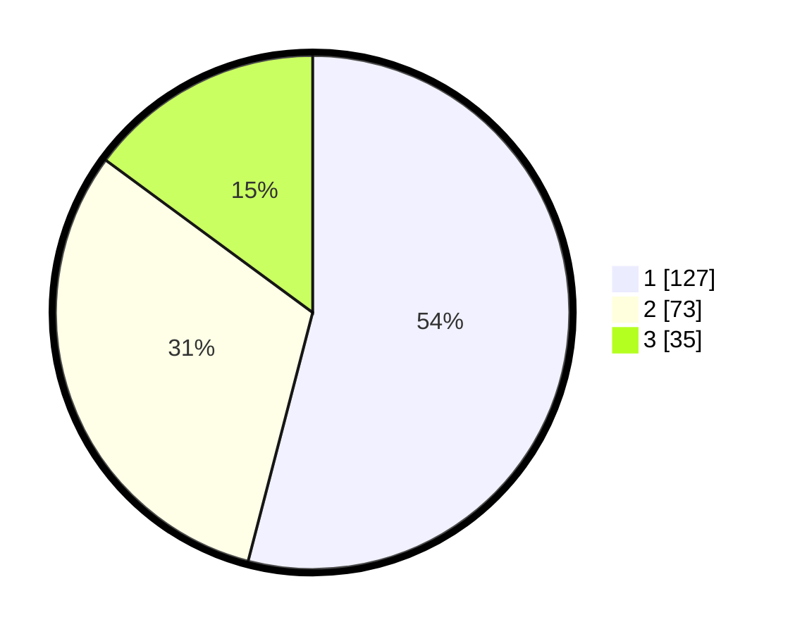

# Hasil

## Grafik

## Tabel

| No.    | Nama Paslon    | Suara | Suara (raw) | Persentase |
|:------ |:-------------- | -----:| -----------:| ----------:|
| 100025 | ANIES MUHAIMIN | 127   | [127][p-1]  | 54,04      |
| 100026 | PRABOWO GIBRAN | 73    | [73][p-2]   | 31,06      |
| 100027 | GANJAR MAHFUD  | 35    | [35][p-3]   | 14,89      |

[p-1]: https://github.com/gigit-pemilu/pemilu-2024/blob/main/pilpres/hitung-suara/sub/31-dki-jakarta/sub/74-jakarta-selatan/sub/09-jagakarsa/sub/1002-srengseng-sawah/sub/007-tps/sub/paslon-1.txt
[p-2]: https://github.com/gigit-pemilu/pemilu-2024/blob/main/pilpres/hitung-suara/sub/31-dki-jakarta/sub/74-jakarta-selatan/sub/09-jagakarsa/sub/1002-srengseng-sawah/sub/007-tps/sub/paslon-2.txt
[p-3]: https://github.com/gigit-pemilu/pemilu-2024/blob/main/pilpres/hitung-suara/sub/31-dki-jakarta/sub/74-jakarta-selatan/sub/09-jagakarsa/sub/1002-srengseng-sawah/sub/007-tps/sub/paslon-3.txt

## Foto C Plano

https://sirekap-obj-formc.kpu.go.id/8e92/pemilu/ppwp/31/74/09/10/02/3174091002007-20240214-235636--f4ee1217-b89b-4751-bdaa-65d3a4eb5ae3.jpg

https://sirekap-obj-formc.kpu.go.id/8e92/pemilu/ppwp/31/74/09/10/02/3174091002007-20240214-235826--27db6575-987c-4974-b439-6746fad8c1ca.jpg

https://sirekap-obj-formc.kpu.go.id/8e92/pemilu/ppwp/31/74/09/10/02/3174091002007-20240215-000009--beecd479-59b1-4246-b8ea-9d803aea2346.jpg

## Metadata

| Key        | Value               |
| ---------- | ------------------- |
| Time Stamp | 2024-02-24 22:31:28 |

