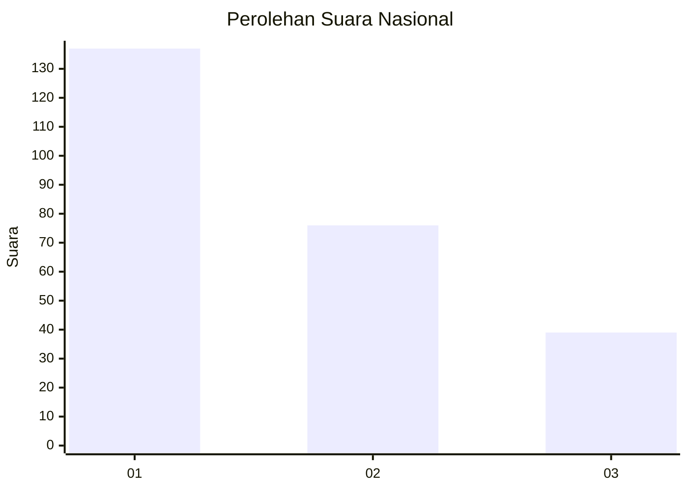
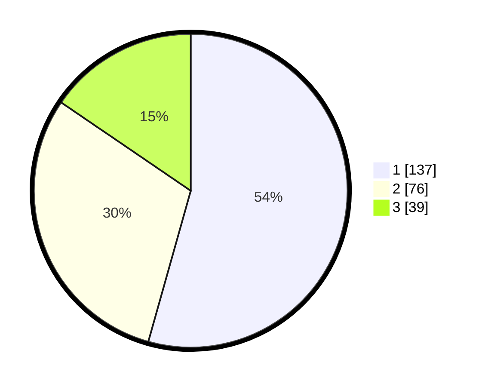

# Hasil

## Grafik

## Tabel

| No.    | Nama Paslon    | Suara | Suara (raw) | Persentase |
|:------ |:-------------- | -----:| -----------:| ----------:|
| 100025 | ANIES MUHAIMIN | 137   | [137][p-1]  | 54,37      |
| 100026 | PRABOWO GIBRAN | 76    | [76][p-2]   | 30,16      |
| 100027 | GANJAR MAHFUD  | 39    | [39][p-3]   | 15,48      |

[p-1]: https://github.com/gigit-pemilu/pemilu-2024/blob/main/pilpres/hitung-suara/sub/31-dki-jakarta/sub/74-jakarta-selatan/sub/09-jagakarsa/sub/1002-srengseng-sawah/sub/013-tps/sub/paslon-1.txt
[p-2]: https://github.com/gigit-pemilu/pemilu-2024/blob/main/pilpres/hitung-suara/sub/31-dki-jakarta/sub/74-jakarta-selatan/sub/09-jagakarsa/sub/1002-srengseng-sawah/sub/013-tps/sub/paslon-2.txt
[p-3]: https://github.com/gigit-pemilu/pemilu-2024/blob/main/pilpres/hitung-suara/sub/31-dki-jakarta/sub/74-jakarta-selatan/sub/09-jagakarsa/sub/1002-srengseng-sawah/sub/013-tps/sub/paslon-3.txt

## Foto C Plano

https://sirekap-obj-formc.kpu.go.id/41b3/pemilu/ppwp/31/74/09/10/02/3174091002013-20240214-224052--5915b922-4b21-47b2-97e6-d4fbd974d83f.jpg

https://sirekap-obj-formc.kpu.go.id/41b3/pemilu/ppwp/31/74/09/10/02/3174091002013-20240214-224207--075b9965-9a88-43e4-94e4-1b142db51556.jpg

https://sirekap-obj-formc.kpu.go.id/41b3/pemilu/ppwp/31/74/09/10/02/3174091002013-20240214-224312--0afac1c1-16cd-4a6d-a843-efc68eed98ed.jpg

## Metadata

| Key        | Value               |
| ---------- | ------------------- |
| Time Stamp | 2024-02-24 22:31:28 |

