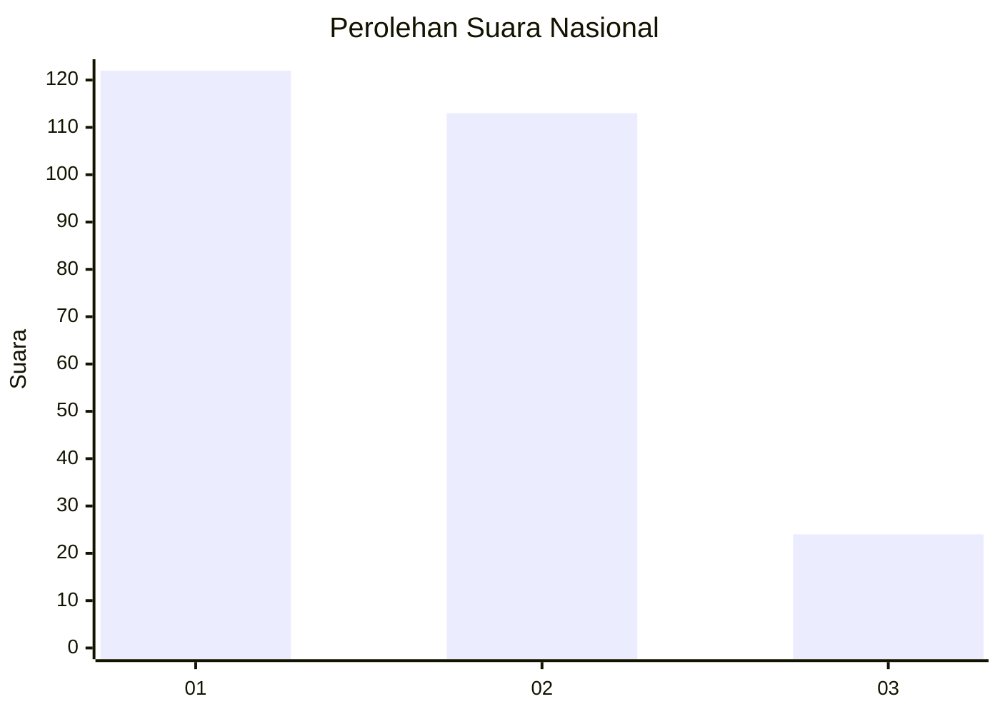
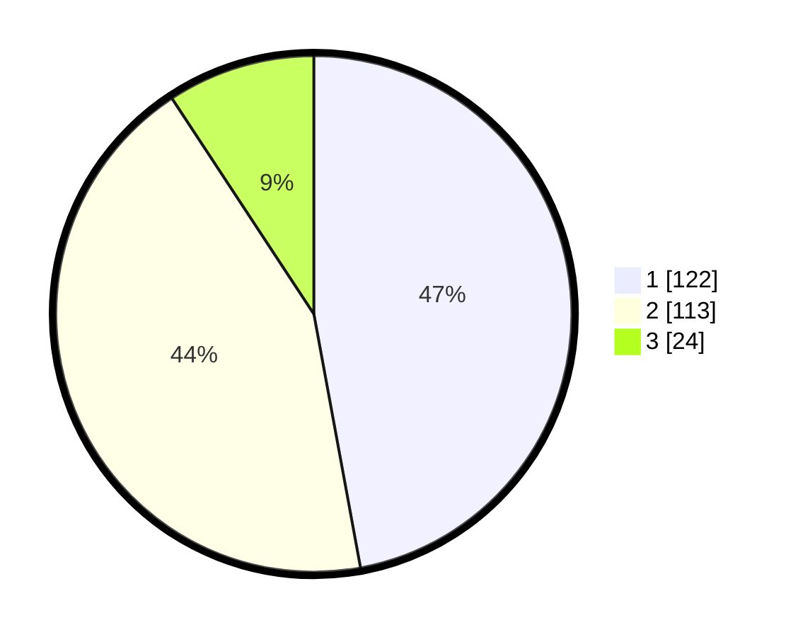

# Hasil

## Grafik

## Tabel

| No. | Nama Paslon    | Suara | Suara (raw) | Persentase |
|:--- |:-------------- | -----:| -----------:| ----------:|
| 1   | ANIES MUHAIMIN | 122   | [122][p-1]  | 47,10      |
| 2   | PRABOWO GIBRAN | 113   | [113][p-2]  | 43,63      |
| 3   | GANJAR MAHFUD  | 24    | [24][p-3]   | 9,27       |

[p-1]: https://github.com/gigit-pemilu/pemilu-2024/blob/main/pilpres/hitung-suara/sub/31-dki-jakarta/sub/74-jakarta-selatan/sub/09-jagakarsa/sub/1002-srengseng-sawah/sub/022-tps/sub/paslon-1.txt
[p-2]: https://github.com/gigit-pemilu/pemilu-2024/blob/main/pilpres/hitung-suara/sub/31-dki-jakarta/sub/74-jakarta-selatan/sub/09-jagakarsa/sub/1002-srengseng-sawah/sub/022-tps/sub/paslon-2.txt
[p-3]: https://github.com/gigit-pemilu/pemilu-2024/blob/main/pilpres/hitung-suara/sub/31-dki-jakarta/sub/74-jakarta-selatan/sub/09-jagakarsa/sub/1002-srengseng-sawah/sub/022-tps/sub/paslon-3.txt

## Foto C Plano

https://sirekap-obj-formc.kpu.go.id/9d4f/pemilu/ppwp/31/74/09/10/02/3174091002022-20240214-212010--a6426c51-79ee-459d-a782-c877fe96913b.jpg

https://sirekap-obj-formc.kpu.go.id/9d4f/pemilu/ppwp/31/74/09/10/02/3174091002022-20240214-212109--adfd3195-14ca-4e01-bf51-b3857a52b7f1.jpg

https://sirekap-obj-formc.kpu.go.id/9d4f/pemilu/ppwp/31/74/09/10/02/3174091002022-20240214-212206--55baf7bc-3d9b-4262-8804-371fcf4e0121.jpg

## Metadata

| Key        | Value               |
| ---------- | ------------------- |
| Time Stamp | 2024-02-24 22:31:28 |

