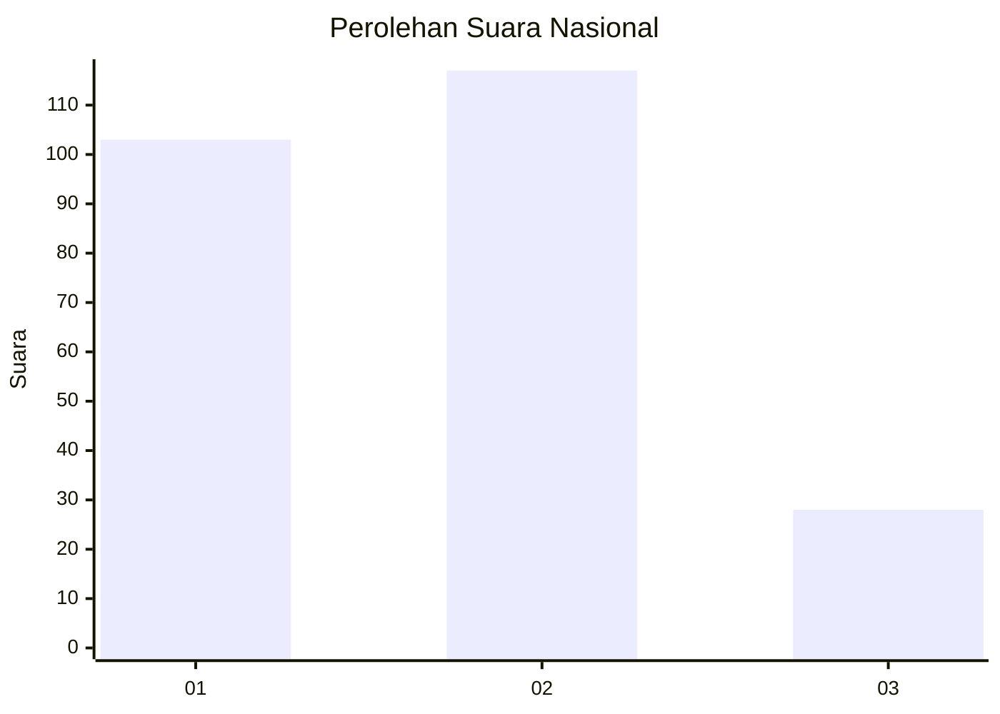
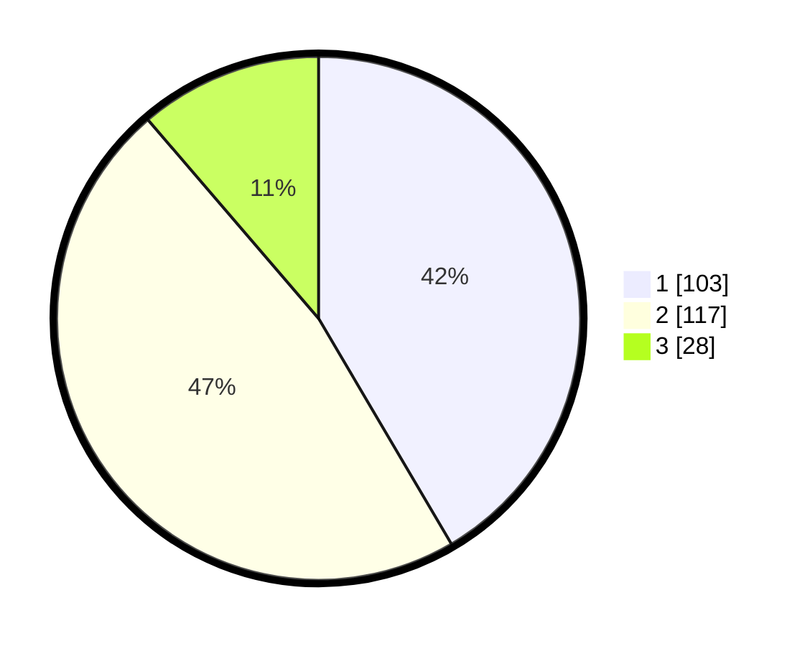

# Hasil

## Grafik

## Tabel

| No.    | Nama Paslon    | Suara | Suara (raw) | Persentase |
|:------ |:-------------- | -----:| -----------:| ----------:|
| 100025 | ANIES MUHAIMIN | 103   | [103][p-1]  | 41,53      |
| 100026 | PRABOWO GIBRAN | 117   | [117][p-2]  | 47,18      |
| 100027 | GANJAR MAHFUD  | 28    | [28][p-3]   | 11,29      |

[p-1]: https://github.com/gigit-pemilu/pemilu-2024/blob/main/pilpres/hitung-suara/sub/31-dki-jakarta/sub/74-jakarta-selatan/sub/09-jagakarsa/sub/1002-srengseng-sawah/sub/031-tps/sub/paslon-1.txt
[p-2]: https://github.com/gigit-pemilu/pemilu-2024/blob/main/pilpres/hitung-suara/sub/31-dki-jakarta/sub/74-jakarta-selatan/sub/09-jagakarsa/sub/1002-srengseng-sawah/sub/031-tps/sub/paslon-2.txt
[p-3]: https://github.com/gigit-pemilu/pemilu-2024/blob/main/pilpres/hitung-suara/sub/31-dki-jakarta/sub/74-jakarta-selatan/sub/09-jagakarsa/sub/1002-srengseng-sawah/sub/031-tps/sub/paslon-3.txt

## Foto C Plano

https://sirekap-obj-formc.kpu.go.id/66b7/pemilu/ppwp/31/74/09/10/02/3174091002031-20240214-192640--5ea6d4bd-309e-4d28-ae4c-296b17e699c6.jpg

https://sirekap-obj-formc.kpu.go.id/66b7/pemilu/ppwp/31/74/09/10/02/3174091002031-20240214-191430--964bd643-dce9-4969-934f-c9c6a7f621ab.jpg

https://sirekap-obj-formc.kpu.go.id/66b7/pemilu/ppwp/31/74/09/10/02/3174091002031-20240215-210526--a7854d36-d03b-4a7d-9ef3-f9069df5cc0c.jpg

## Metadata

| Key        | Value               |
| ---------- | ------------------- |
| Time Stamp | 2024-02-15 21:30:27 |

