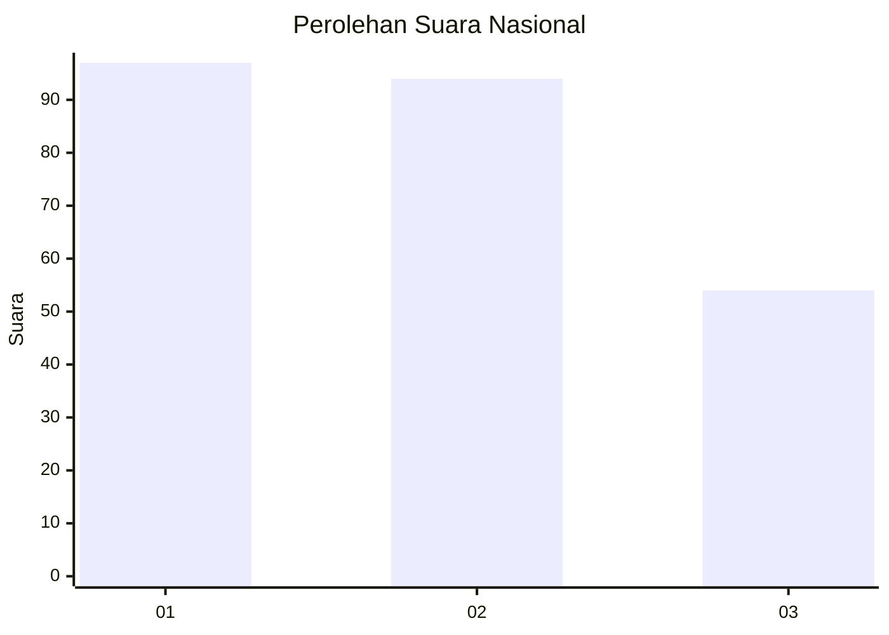
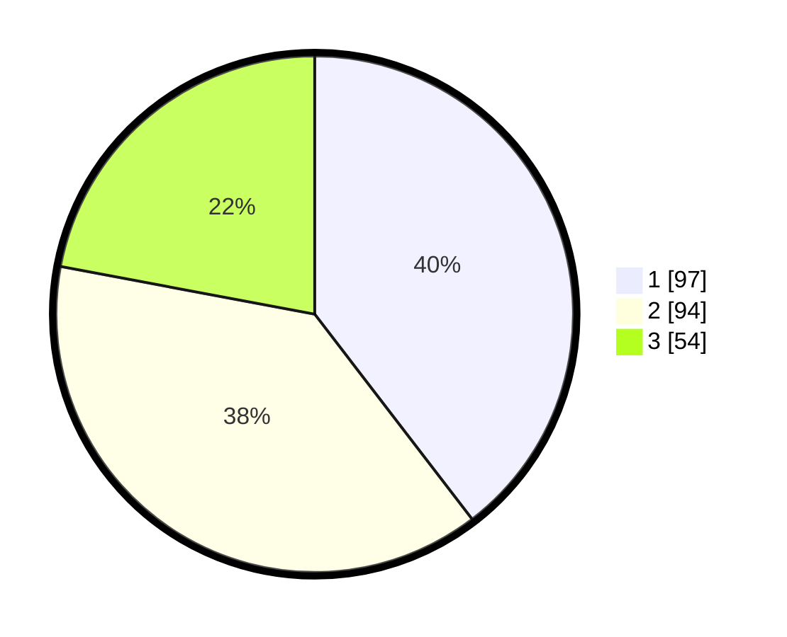

# Hasil

## Grafik

## Tabel

| No.    | Nama Paslon    | Suara | Suara (raw) | Persentase |
|:------ |:-------------- | -----:| -----------:| ----------:|
| 100025 | ANIES MUHAIMIN | 97    | [97][p-1]   | 39,59      |
| 100026 | PRABOWO GIBRAN | 94    | [94][p-2]   | 38,37      |
| 100027 | GANJAR MAHFUD  | 54    | [54][p-3]   | 22,04      |

[p-1]: https://github.com/gigit-pemilu/pemilu-2024/blob/main/pilpres/hitung-suara/sub/31-dki-jakarta/sub/74-jakarta-selatan/sub/09-jagakarsa/sub/1002-srengseng-sawah/sub/035-tps/sub/paslon-1.txt
[p-2]: https://github.com/gigit-pemilu/pemilu-2024/blob/main/pilpres/hitung-suara/sub/31-dki-jakarta/sub/74-jakarta-selatan/sub/09-jagakarsa/sub/1002-srengseng-sawah/sub/035-tps/sub/paslon-2.txt
[p-3]: https://github.com/gigit-pemilu/pemilu-2024/blob/main/pilpres/hitung-suara/sub/31-dki-jakarta/sub/74-jakarta-selatan/sub/09-jagakarsa/sub/1002-srengseng-sawah/sub/035-tps/sub/paslon-3.txt

## Foto C Plano

https://sirekap-obj-formc.kpu.go.id/1c98/pemilu/ppwp/31/74/09/10/02/3174091002035-20240215-230604--26aa441a-549f-4c0f-b176-4ee603d5ce92.jpg

https://sirekap-obj-formc.kpu.go.id/1c98/pemilu/ppwp/31/74/09/10/02/3174091002035-20240215-230730--9b709263-e7e6-4d9a-8fed-113d3be2b692.jpg

https://sirekap-obj-formc.kpu.go.id/1c98/pemilu/ppwp/31/74/09/10/02/3174091002035-20240215-010548--a9758369-1e00-4241-8ba3-18796d1b47ac.jpg

## Metadata

| Key        | Value               |
| ---------- | ------------------- |
| Time Stamp | 2024-02-25 12:00:00 |

