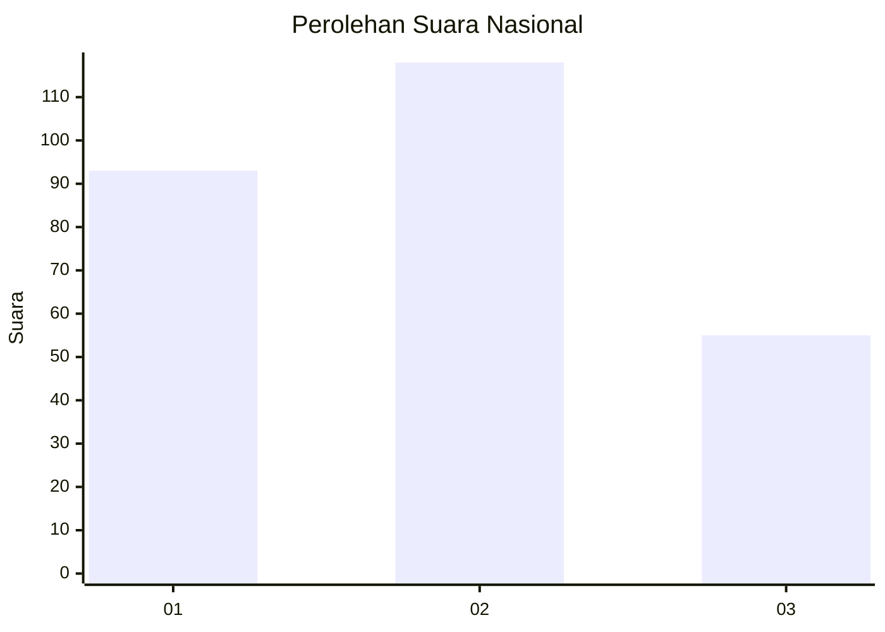
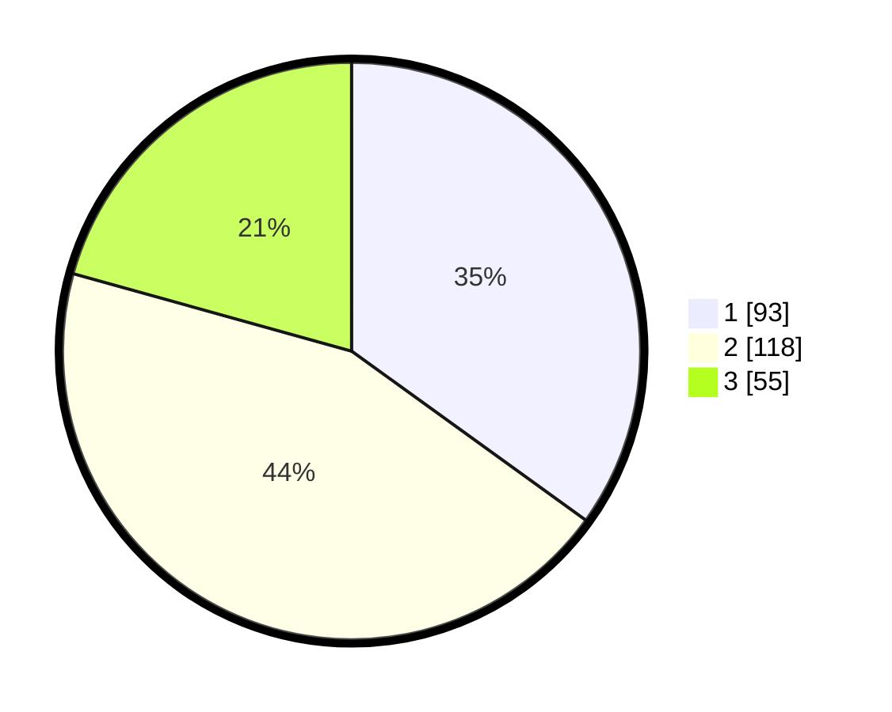

# Hasil

## Grafik

## Tabel

| No.    | Nama Paslon    | Suara | Suara (raw) | Persentase |
|:------ |:-------------- | -----:| -----------:| ----------:|
| 100025 | ANIES MUHAIMIN | 93    | [93][p-1]   | 34,96      |
| 100026 | PRABOWO GIBRAN | 118   | [118][p-2]  | 44,36      |
| 100027 | GANJAR MAHFUD  | 55    | [55][p-3]   | 20,68      |

[p-1]: https://github.com/gigit-pemilu/pemilu-2024/blob/main/pilpres/hitung-suara/sub/31-dki-jakarta/sub/74-jakarta-selatan/sub/09-jagakarsa/sub/1002-srengseng-sawah/sub/036-tps/sub/paslon-1.txt
[p-2]: https://github.com/gigit-pemilu/pemilu-2024/blob/main/pilpres/hitung-suara/sub/31-dki-jakarta/sub/74-jakarta-selatan/sub/09-jagakarsa/sub/1002-srengseng-sawah/sub/036-tps/sub/paslon-2.txt
[p-3]: https://github.com/gigit-pemilu/pemilu-2024/blob/main/pilpres/hitung-suara/sub/31-dki-jakarta/sub/74-jakarta-selatan/sub/09-jagakarsa/sub/1002-srengseng-sawah/sub/036-tps/sub/paslon-3.txt

## Foto C Plano

https://sirekap-obj-formc.kpu.go.id/44df/pemilu/ppwp/31/74/09/10/02/3174091002036-20240214-192655--c1552835-600f-4e81-b696-7aa2948a252c.jpg

https://sirekap-obj-formc.kpu.go.id/44df/pemilu/ppwp/31/74/09/10/02/3174091002036-20240214-192845--27d85197-f9ca-47c2-920b-715842b8a1fd.jpg

https://sirekap-obj-formc.kpu.go.id/44df/pemilu/ppwp/31/74/09/10/02/3174091002036-20240214-193045--ad8d781b-c97f-474f-8e91-b8de7915beff.jpg

## Metadata

| Key        | Value               |
| ---------- | ------------------- |
| Time Stamp | 2024-02-25 10:00:00 |

