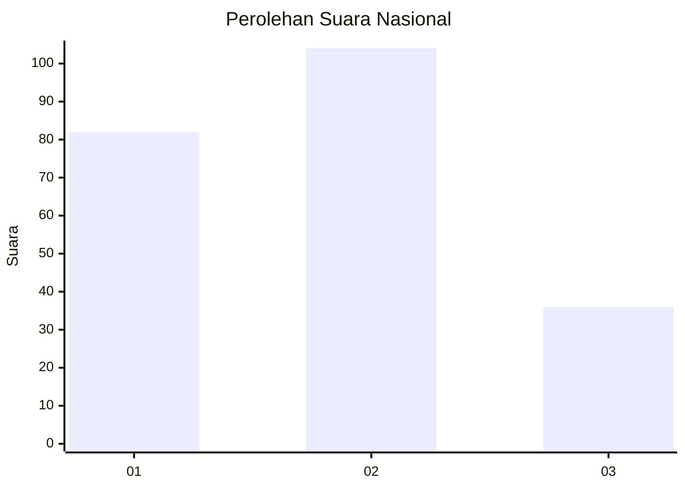
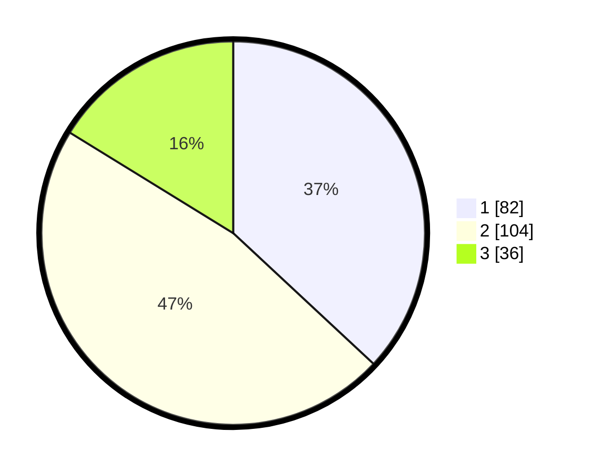

# Hasil

## Grafik

## Tabel

| No.    | Nama Paslon    | Suara | Suara (raw) | Persentase |
|:------ |:-------------- | -----:| -----------:| ----------:|
| 100025 | ANIES MUHAIMIN | 82    | [82][p-1]   | 36,94      |
| 100026 | PRABOWO GIBRAN | 104   | [104][p-2]  | 46,85      |
| 100027 | GANJAR MAHFUD  | 36    | [36][p-3]   | 16,22      |

[p-1]: https://github.com/gigit-pemilu/pemilu-2024/blob/main/pilpres/hitung-suara/sub/31-dki-jakarta/sub/74-jakarta-selatan/sub/09-jagakarsa/sub/1002-srengseng-sawah/sub/043-tps/sub/paslon-1.txt
[p-2]: https://github.com/gigit-pemilu/pemilu-2024/blob/main/pilpres/hitung-suara/sub/31-dki-jakarta/sub/74-jakarta-selatan/sub/09-jagakarsa/sub/1002-srengseng-sawah/sub/043-tps/sub/paslon-2.txt
[p-3]: https://github.com/gigit-pemilu/pemilu-2024/blob/main/pilpres/hitung-suara/sub/31-dki-jakarta/sub/74-jakarta-selatan/sub/09-jagakarsa/sub/1002-srengseng-sawah/sub/043-tps/sub/paslon-3.txt

## Foto C Plano

https://sirekap-obj-formc.kpu.go.id/36db/pemilu/ppwp/31/74/09/10/02/3174091002043-20240214-225544--9e762600-8621-4e75-b6aa-dc626837414a.jpg

https://sirekap-obj-formc.kpu.go.id/36db/pemilu/ppwp/31/74/09/10/02/3174091002043-20240214-225631--03e3dcaa-9752-456b-bed7-f7c66ff1e59e.jpg

https://sirekap-obj-formc.kpu.go.id/36db/pemilu/ppwp/31/74/09/10/02/3174091002043-20240214-225712--d661f85e-455e-4534-b9cd-eb3bf62c913b.jpg

## Metadata

| Key        | Value               |
| ---------- | ------------------- |
| Time Stamp | 2024-02-24 22:31:28 |

