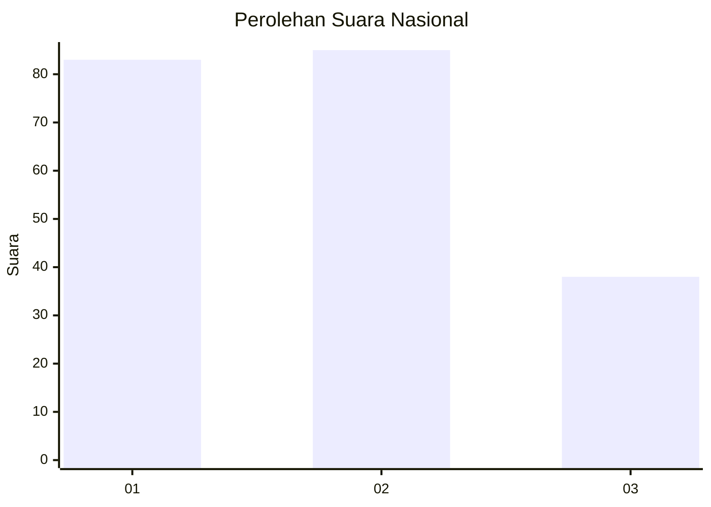
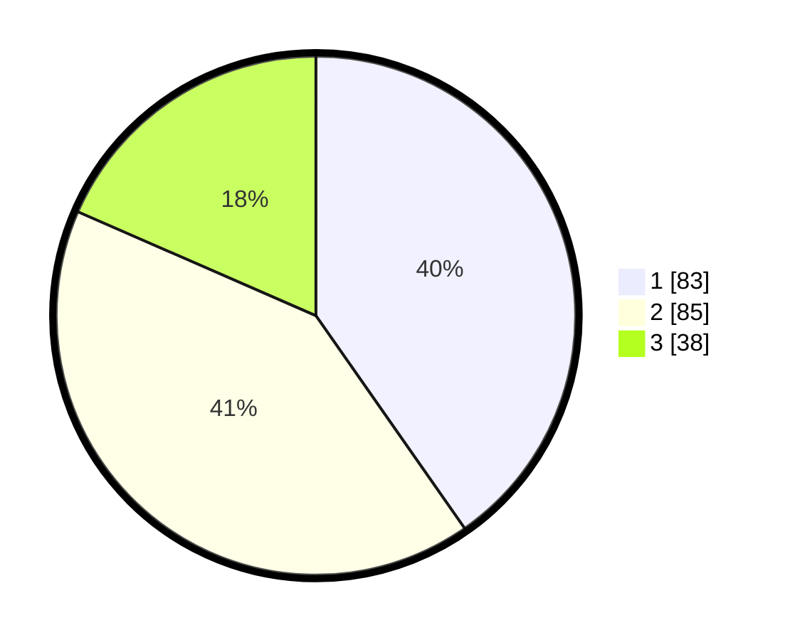

# Hasil

## Grafik

## Tabel

| No.    | Nama Paslon    | Suara | Suara (raw) | Persentase |
|:------ |:-------------- | -----:| -----------:| ----------:|
| 100025 | ANIES MUHAIMIN | 83    | [83][p-1]   | 40,29      |
| 100026 | PRABOWO GIBRAN | 85    | [85][p-2]   | 41,26      |
| 100027 | GANJAR MAHFUD  | 38    | [38][p-3]   | 18,45      |

[p-1]: https://github.com/gigit-pemilu/pemilu-2024/blob/main/pilpres/hitung-suara/sub/31-dki-jakarta/sub/74-jakarta-selatan/sub/09-jagakarsa/sub/1002-srengseng-sawah/sub/047-tps/sub/paslon-1.txt
[p-2]: https://github.com/gigit-pemilu/pemilu-2024/blob/main/pilpres/hitung-suara/sub/31-dki-jakarta/sub/74-jakarta-selatan/sub/09-jagakarsa/sub/1002-srengseng-sawah/sub/047-tps/sub/paslon-2.txt
[p-3]: https://github.com/gigit-pemilu/pemilu-2024/blob/main/pilpres/hitung-suara/sub/31-dki-jakarta/sub/74-jakarta-selatan/sub/09-jagakarsa/sub/1002-srengseng-sawah/sub/047-tps/sub/paslon-3.txt

## Foto C Plano

https://sirekap-obj-formc.kpu.go.id/05c4/pemilu/ppwp/31/74/09/10/02/3174091002047-20240216-161442--9dff4b02-70d6-4396-bf41-376f3da9d2db.jpg

https://sirekap-obj-formc.kpu.go.id/05c4/pemilu/ppwp/31/74/09/10/02/3174091002047-20240214-225035--4ece01bc-5e4e-4098-a006-db0d48961270.jpg

https://sirekap-obj-formc.kpu.go.id/05c4/pemilu/ppwp/31/74/09/10/02/3174091002047-20240216-161343--7448c9c7-18e7-4126-ab40-28ef0a9a3e07.jpg

## Metadata

| Key        | Value               |
| ---------- | ------------------- |
| Time Stamp | 2024-02-16 21:01:00 |

