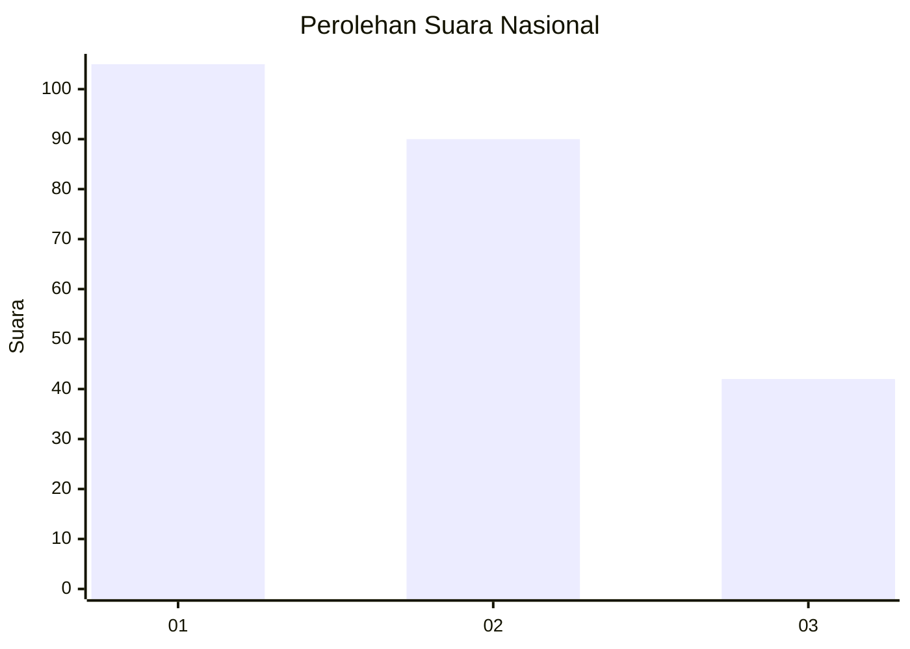
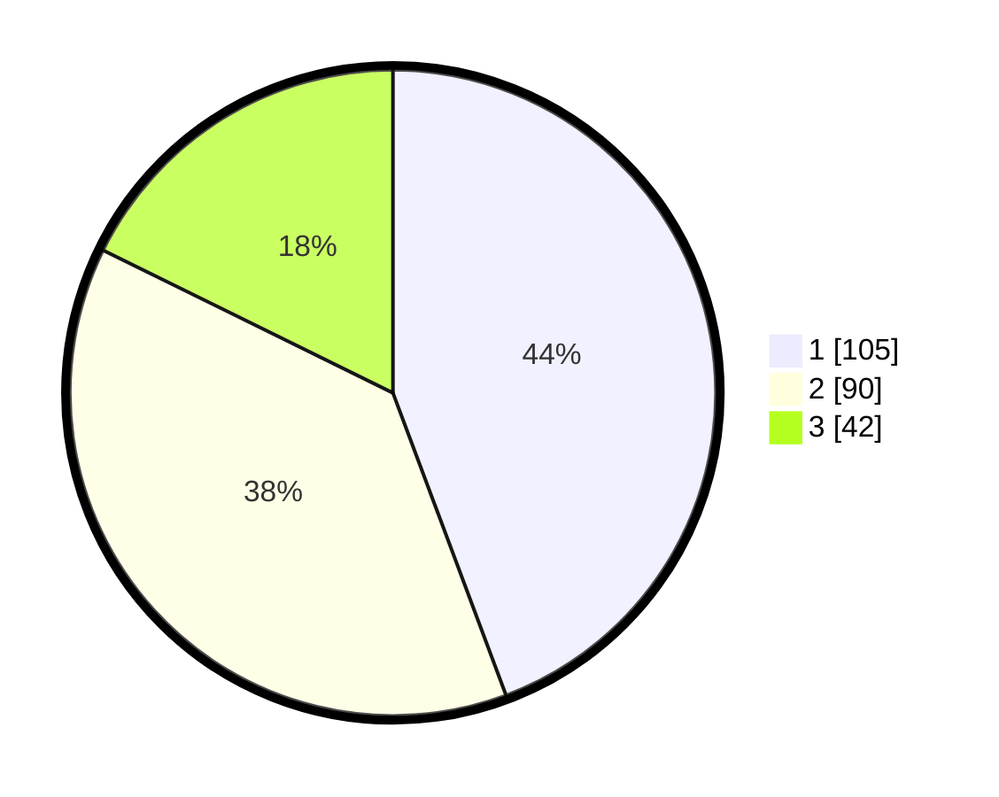

# Hasil

## Grafik

## Tabel

| No.    | Nama Paslon    | Suara | Suara (raw) | Persentase |
|:------ |:-------------- | -----:| -----------:| ----------:|
| 100025 | ANIES MUHAIMIN | 105   | [105][p-1]  | 44,30      |
| 100026 | PRABOWO GIBRAN | 90    | [90][p-2]   | 37,97      |
| 100027 | GANJAR MAHFUD  | 42    | [42][p-3]   | 17,72      |

[p-1]: https://github.com/gigit-pemilu/pemilu-2024/blob/main/pilpres/hitung-suara/sub/31-dki-jakarta/sub/74-jakarta-selatan/sub/09-jagakarsa/sub/1002-srengseng-sawah/sub/062-tps/sub/paslon-1.txt
[p-2]: https://github.com/gigit-pemilu/pemilu-2024/blob/main/pilpres/hitung-suara/sub/31-dki-jakarta/sub/74-jakarta-selatan/sub/09-jagakarsa/sub/1002-srengseng-sawah/sub/062-tps/sub/paslon-2.txt
[p-3]: https://github.com/gigit-pemilu/pemilu-2024/blob/main/pilpres/hitung-suara/sub/31-dki-jakarta/sub/74-jakarta-selatan/sub/09-jagakarsa/sub/1002-srengseng-sawah/sub/062-tps/sub/paslon-3.txt

## Foto C Plano

https://sirekap-obj-formc.kpu.go.id/bfad/pemilu/ppwp/31/74/09/10/02/3174091002062-20240214-203314--f6952415-fae0-48e6-b5eb-a02943ea0de8.jpg

https://sirekap-obj-formc.kpu.go.id/bfad/pemilu/ppwp/31/74/09/10/02/3174091002062-20240214-202125--30169015-6ef0-49af-be18-52a2c29ff7e1.jpg

https://sirekap-obj-formc.kpu.go.id/bfad/pemilu/ppwp/31/74/09/10/02/3174091002062-20240214-205738--cb32481b-462c-446c-8368-c8c94e10a502.jpg

## Metadata

| Key        | Value               |
| ---------- | ------------------- |
| Time Stamp | 2024-02-24 22:31:28 |

