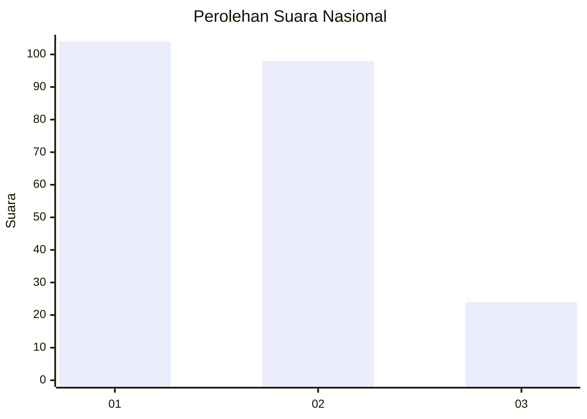
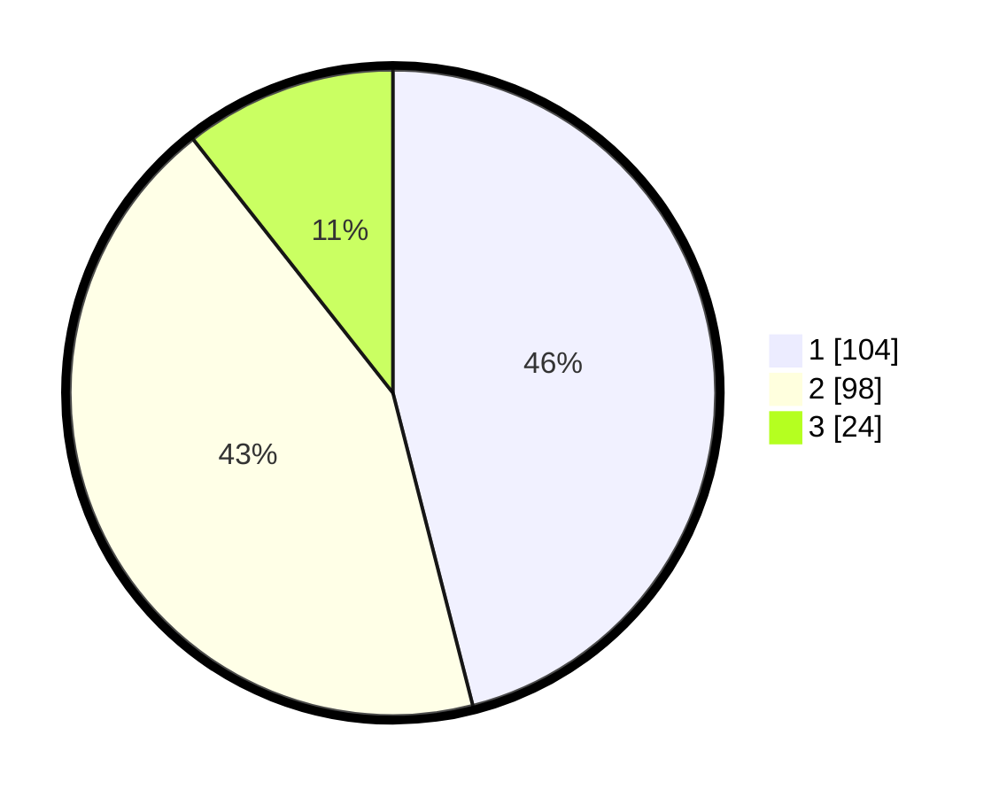

# Hasil

## Grafik

## Tabel

| No.    | Nama Paslon    | Suara | Suara (raw) | Persentase |
|:------ |:-------------- | -----:| -----------:| ----------:|
| 100025 | ANIES MUHAIMIN | 104   | [104][p-1]  | 46,02      |
| 100026 | PRABOWO GIBRAN | 98    | [98][p-2]   | 43,36      |
| 100027 | GANJAR MAHFUD  | 24    | [24][p-3]   | 10,62      |

[p-1]: https://github.com/gigit-pemilu/pemilu-2024/blob/main/pilpres/hitung-suara/sub/31-dki-jakarta/sub/74-jakarta-selatan/sub/09-jagakarsa/sub/1002-srengseng-sawah/sub/070-tps/sub/paslon-1.txt
[p-2]: https://github.com/gigit-pemilu/pemilu-2024/blob/main/pilpres/hitung-suara/sub/31-dki-jakarta/sub/74-jakarta-selatan/sub/09-jagakarsa/sub/1002-srengseng-sawah/sub/070-tps/sub/paslon-2.txt
[p-3]: https://github.com/gigit-pemilu/pemilu-2024/blob/main/pilpres/hitung-suara/sub/31-dki-jakarta/sub/74-jakarta-selatan/sub/09-jagakarsa/sub/1002-srengseng-sawah/sub/070-tps/sub/paslon-3.txt

## Foto C Plano

https://sirekap-obj-formc.kpu.go.id/f279/pemilu/ppwp/31/74/09/10/02/3174091002070-20240214-195906--3cfe8edf-c832-4f33-a04b-d1033856f01a.jpg

https://sirekap-obj-formc.kpu.go.id/f279/pemilu/ppwp/31/74/09/10/02/3174091002070-20240214-220338--a84eeaf1-69fb-4bfe-b0f5-02636587d6e1.jpg

https://sirekap-obj-formc.kpu.go.id/f279/pemilu/ppwp/31/74/09/10/02/3174091002070-20240214-220531--475e6dc8-0430-4176-b135-ffd3f01e3cde.jpg

## Metadata

| Key        | Value               |
| ---------- | ------------------- |
| Time Stamp | 2024-02-24 22:31:28 |

