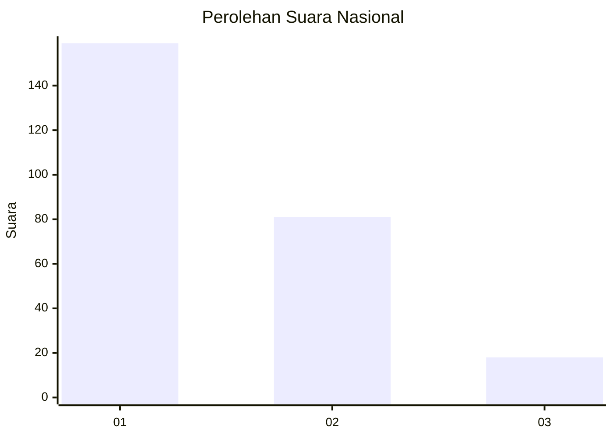
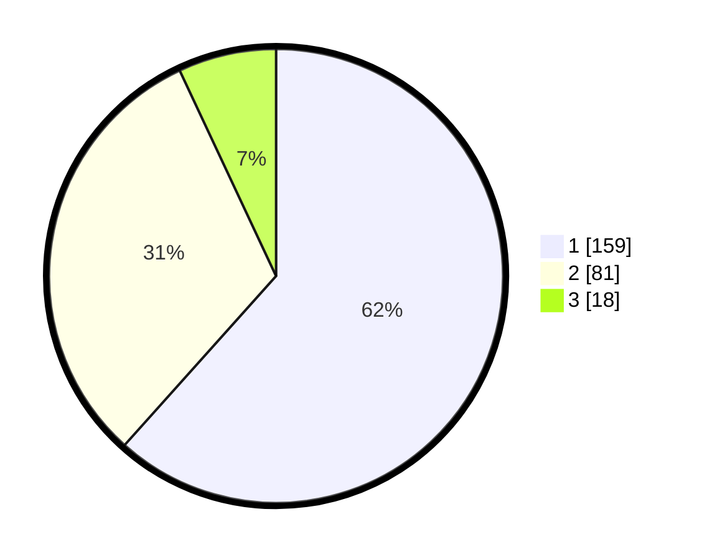

# Hasil

## Grafik

## Tabel

| No. | Nama Paslon    | Suara | Suara (raw) | Persentase |
|:--- |:-------------- | -----:| -----------:| ----------:|
| 1   | ANIES MUHAIMIN | 159   | [159][p-1]  | 61,63      |
| 2   | PRABOWO GIBRAN | 81    | [81][p-2]   | 31,40      |
| 3   | GANJAR MAHFUD  | 18    | [18][p-3]   | 6,98       |

[p-1]: https://github.com/gigit-pemilu/pemilu-2024/blob/main/pilpres/hitung-suara/sub/31-dki-jakarta/sub/74-jakarta-selatan/sub/09-jagakarsa/sub/1002-srengseng-sawah/sub/081-tps/sub/paslon-1.txt
[p-2]: https://github.com/gigit-pemilu/pemilu-2024/blob/main/pilpres/hitung-suara/sub/31-dki-jakarta/sub/74-jakarta-selatan/sub/09-jagakarsa/sub/1002-srengseng-sawah/sub/081-tps/sub/paslon-2.txt
[p-3]: https://github.com/gigit-pemilu/pemilu-2024/blob/main/pilpres/hitung-suara/sub/31-dki-jakarta/sub/74-jakarta-selatan/sub/09-jagakarsa/sub/1002-srengseng-sawah/sub/081-tps/sub/paslon-3.txt

## Foto C Plano

https://sirekap-obj-formc.kpu.go.id/c13e/pemilu/ppwp/31/74/09/10/02/3174091002081-20240214-202607--05a417fd-c8fd-44a4-9db8-704b70525bbf.jpg

https://sirekap-obj-formc.kpu.go.id/c13e/pemilu/ppwp/31/74/09/10/02/3174091002081-20240214-202403--45378384-ab77-4df3-9d44-32da3a8110ff.jpg

https://sirekap-obj-formc.kpu.go.id/c13e/pemilu/ppwp/31/74/09/10/02/3174091002081-20240214-195608--5bd8023d-6a9a-4b50-a94d-7084cd75226d.jpg

## Metadata

| Key        | Value               |
| ---------- | ------------------- |
| Time Stamp | 2024-02-24 22:31:28 |

