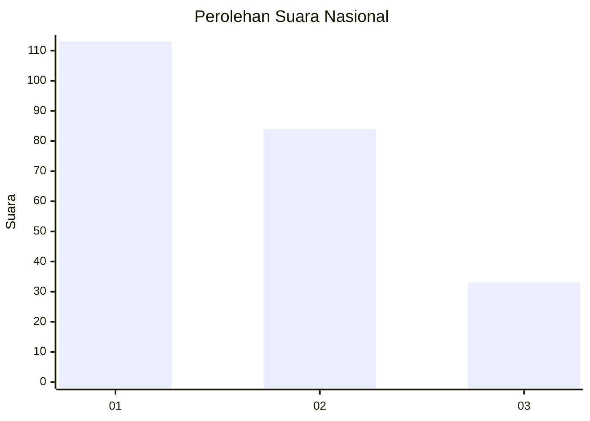
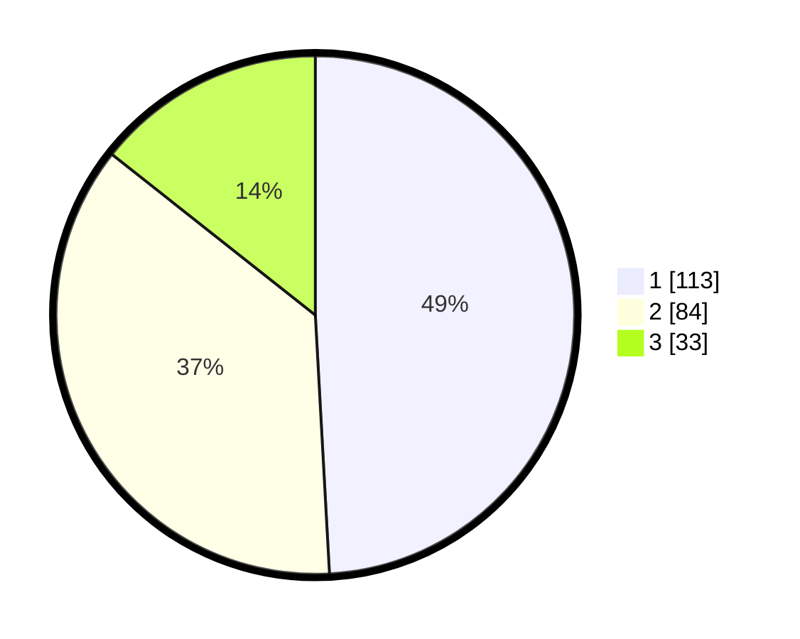

# Hasil

## Grafik

## Tabel

| No.    | Nama Paslon    | Suara | Suara (raw) | Persentase |
|:------ |:-------------- | -----:| -----------:| ----------:|
| 100025 | ANIES MUHAIMIN | 113   | [113][p-1]  | 49,13      |
| 100026 | PRABOWO GIBRAN | 84    | [84][p-2]   | 36,52      |
| 100027 | GANJAR MAHFUD  | 33    | [33][p-3]   | 14,35      |

[p-1]: https://github.com/gigit-pemilu/pemilu-2024/blob/main/pilpres/hitung-suara/sub/31-dki-jakarta/sub/74-jakarta-selatan/sub/09-jagakarsa/sub/1002-srengseng-sawah/sub/097-tps/sub/paslon-1.txt
[p-2]: https://github.com/gigit-pemilu/pemilu-2024/blob/main/pilpres/hitung-suara/sub/31-dki-jakarta/sub/74-jakarta-selatan/sub/09-jagakarsa/sub/1002-srengseng-sawah/sub/097-tps/sub/paslon-2.txt
[p-3]: https://github.com/gigit-pemilu/pemilu-2024/blob/main/pilpres/hitung-suara/sub/31-dki-jakarta/sub/74-jakarta-selatan/sub/09-jagakarsa/sub/1002-srengseng-sawah/sub/097-tps/sub/paslon-3.txt

## Foto C Plano

https://sirekap-obj-formc.kpu.go.id/dbcc/pemilu/ppwp/31/74/09/10/02/3174091002097-20240215-000913--d7ccdc4f-99f3-47c4-89ff-0b91ee6d2fa1.jpg

https://sirekap-obj-formc.kpu.go.id/dbcc/pemilu/ppwp/31/74/09/10/02/3174091002097-20240215-001040--d448697c-8efa-41c7-806c-96f82b105b0d.jpg

https://sirekap-obj-formc.kpu.go.id/dbcc/pemilu/ppwp/31/74/09/10/02/3174091002097-20240215-001203--b3ea0a46-bf02-4d1a-8fea-d54fad3a2080.jpg

## Metadata

| Key        | Value               |
| ---------- | ------------------- |
| Time Stamp | 2024-02-25 12:00:00 |

