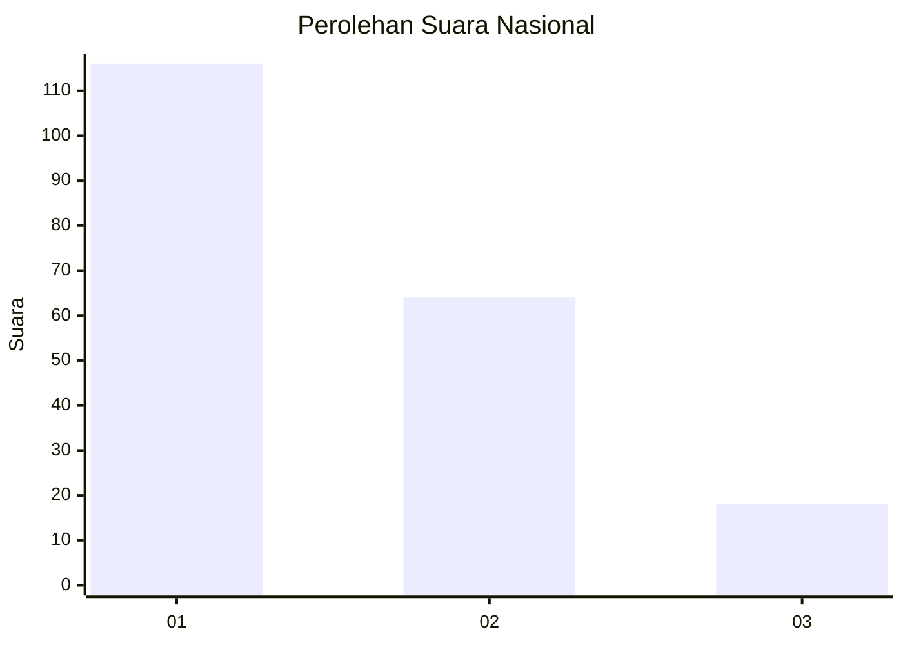
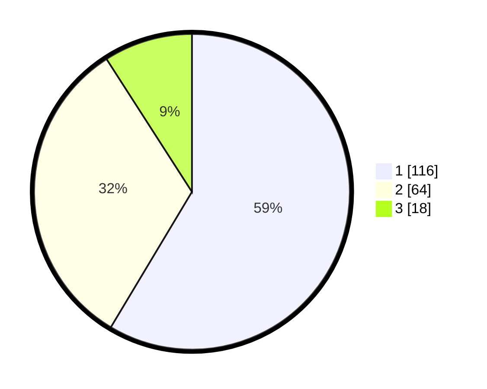

# Hasil

## Grafik

## Tabel

| No.    | Nama Paslon    | Suara | Suara (raw) | Persentase |
|:------ |:-------------- | -----:| -----------:| ----------:|
| 100025 | ANIES MUHAIMIN | 116   | [116][p-1]  | 58,59      |
| 100026 | PRABOWO GIBRAN | 64    | [64][p-2]   | 32,32      |
| 100027 | GANJAR MAHFUD  | 18    | [18][p-3]   | 9,09       |

[p-1]: https://github.com/gigit-pemilu/pemilu-2024/blob/main/pilpres/hitung-suara/sub/31-dki-jakarta/sub/74-jakarta-selatan/sub/09-jagakarsa/sub/1002-srengseng-sawah/sub/143-tps/sub/paslon-1.txt
[p-2]: https://github.com/gigit-pemilu/pemilu-2024/blob/main/pilpres/hitung-suara/sub/31-dki-jakarta/sub/74-jakarta-selatan/sub/09-jagakarsa/sub/1002-srengseng-sawah/sub/143-tps/sub/paslon-2.txt
[p-3]: https://github.com/gigit-pemilu/pemilu-2024/blob/main/pilpres/hitung-suara/sub/31-dki-jakarta/sub/74-jakarta-selatan/sub/09-jagakarsa/sub/1002-srengseng-sawah/sub/143-tps/sub/paslon-3.txt

## Foto C Plano

https://sirekap-obj-formc.kpu.go.id/06ea/pemilu/ppwp/31/74/09/10/02/3174091002143-20240214-225945--2bad5f8d-3d41-4edb-bdfc-06442c2fcc0c.jpg

https://sirekap-obj-formc.kpu.go.id/06ea/pemilu/ppwp/31/74/09/10/02/3174091002143-20240214-230138--19ab4159-3908-44b1-a622-48835adaf7e1.jpg

https://sirekap-obj-formc.kpu.go.id/06ea/pemilu/ppwp/31/74/09/10/02/3174091002143-20240214-230302--cf3d203f-fad6-480f-b466-6cc55d053c24.jpg

## Metadata

| Key        | Value               |
| ---------- | ------------------- |
| Time Stamp | 2024-02-15 23:29:50 |

