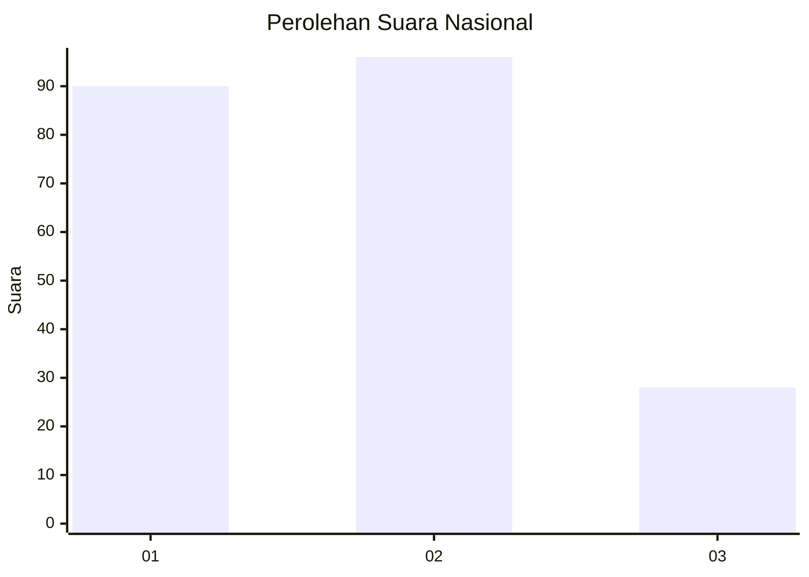
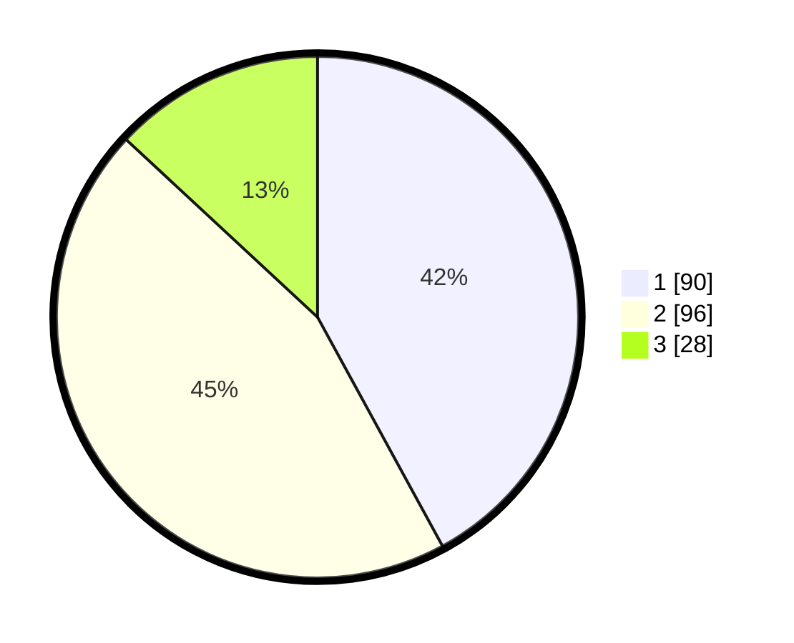

# Hasil

## Grafik

## Tabel

| No.    | Nama Paslon    | Suara | Suara (raw) | Persentase |
|:------ |:-------------- | -----:| -----------:| ----------:|
| 100025 | ANIES MUHAIMIN | 90    | [90][p-1]   | 42,06      |
| 100026 | PRABOWO GIBRAN | 96    | [96][p-2]   | 44,86      |
| 100027 | GANJAR MAHFUD  | 28    | [28][p-3]   | 13,08      |

[p-1]: https://github.com/gigit-pemilu/pemilu-2024/blob/main/pilpres/hitung-suara/sub/31-dki-jakarta/sub/74-jakarta-selatan/sub/09-jagakarsa/sub/1002-srengseng-sawah/sub/149-tps/sub/paslon-1.txt
[p-2]: https://github.com/gigit-pemilu/pemilu-2024/blob/main/pilpres/hitung-suara/sub/31-dki-jakarta/sub/74-jakarta-selatan/sub/09-jagakarsa/sub/1002-srengseng-sawah/sub/149-tps/sub/paslon-2.txt
[p-3]: https://github.com/gigit-pemilu/pemilu-2024/blob/main/pilpres/hitung-suara/sub/31-dki-jakarta/sub/74-jakarta-selatan/sub/09-jagakarsa/sub/1002-srengseng-sawah/sub/149-tps/sub/paslon-3.txt

## Foto C Plano

https://sirekap-obj-formc.kpu.go.id/9d6d/pemilu/ppwp/31/74/09/10/02/3174091002149-20240214-224235--75e4d4e9-873e-4b38-a13e-e9f7509dce18.jpg

https://sirekap-obj-formc.kpu.go.id/9d6d/pemilu/ppwp/31/74/09/10/02/3174091002149-20240214-224328--bdc801c1-410f-410b-8571-69c292e3fcb3.jpg

https://sirekap-obj-formc.kpu.go.id/9d6d/pemilu/ppwp/31/74/09/10/02/3174091002149-20240214-224452--3d9fb20f-90ea-4853-ac7b-fddfb2861e0f.jpg

## Metadata

| Key        | Value               |
| ---------- | ------------------- |
| Time Stamp | 2024-02-25 23:00:00 |

