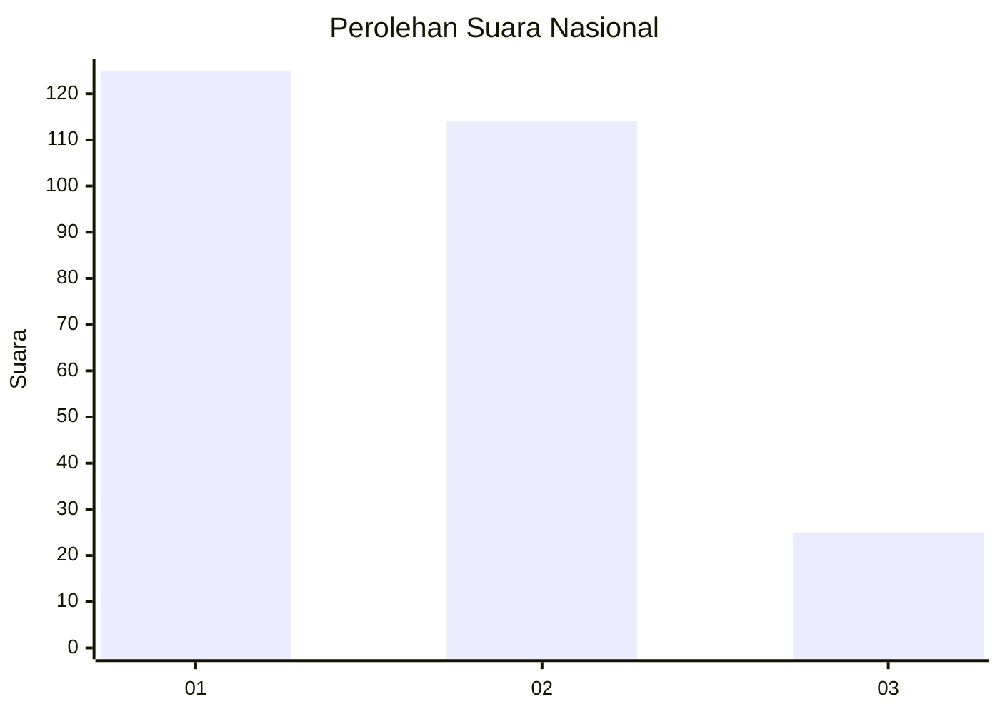
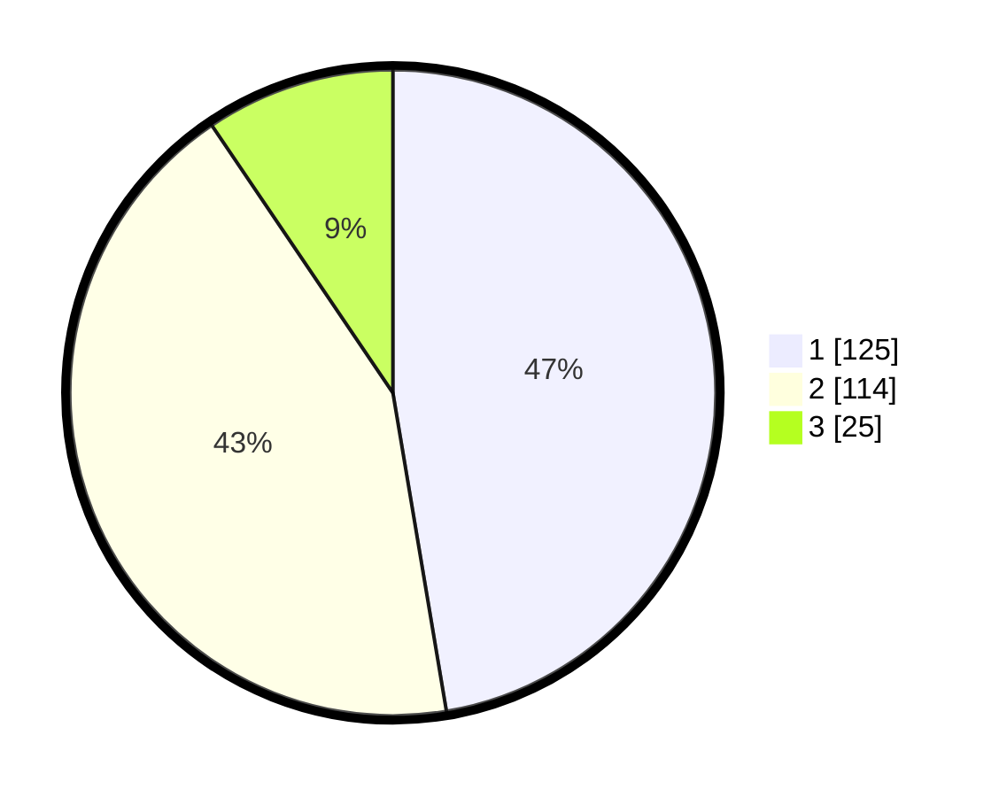

# Hasil

## Grafik

## Tabel

| No.    | Nama Paslon    | Suara | Suara (raw) | Persentase |
|:------ |:-------------- | -----:| -----------:| ----------:|
| 100025 | ANIES MUHAIMIN | 125   | [125][p-1]  | 47,35      |
| 100026 | PRABOWO GIBRAN | 114   | [114][p-2]  | 43,18      |
| 100027 | GANJAR MAHFUD  | 25    | [25][p-3]   | 9,47       |

[p-1]: https://github.com/gigit-pemilu/pemilu-2024/blob/main/pilpres/hitung-suara/sub/31-dki-jakarta/sub/74-jakarta-selatan/sub/09-jagakarsa/sub/1002-srengseng-sawah/sub/154-tps/sub/paslon-1.txt
[p-2]: https://github.com/gigit-pemilu/pemilu-2024/blob/main/pilpres/hitung-suara/sub/31-dki-jakarta/sub/74-jakarta-selatan/sub/09-jagakarsa/sub/1002-srengseng-sawah/sub/154-tps/sub/paslon-2.txt
[p-3]: https://github.com/gigit-pemilu/pemilu-2024/blob/main/pilpres/hitung-suara/sub/31-dki-jakarta/sub/74-jakarta-selatan/sub/09-jagakarsa/sub/1002-srengseng-sawah/sub/154-tps/sub/paslon-3.txt

## Foto C Plano

https://sirekap-obj-formc.kpu.go.id/c73d/pemilu/ppwp/31/74/09/10/02/3174091002154-20240214-221639--9f46ee8e-c51e-41c0-9a0d-a0e8c9387ed5.jpg

https://sirekap-obj-formc.kpu.go.id/c73d/pemilu/ppwp/31/74/09/10/02/3174091002154-20240214-221739--60ec3342-fb4a-4885-b565-8895c6c85c13.jpg

https://sirekap-obj-formc.kpu.go.id/c73d/pemilu/ppwp/31/74/09/10/02/3174091002154-20240214-221805--c983cd63-6658-4948-8ae7-0d5e12e765c8.jpg

## Metadata

| Key        | Value               |
| ---------- | ------------------- |
| Time Stamp | 2024-02-15 15:00:29 |

