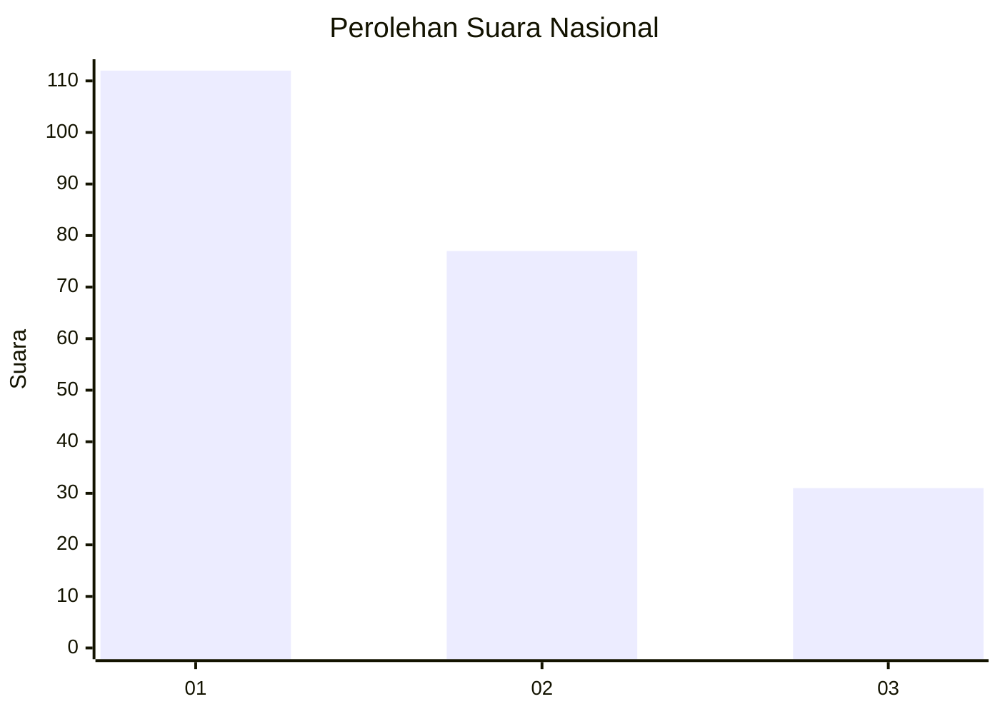
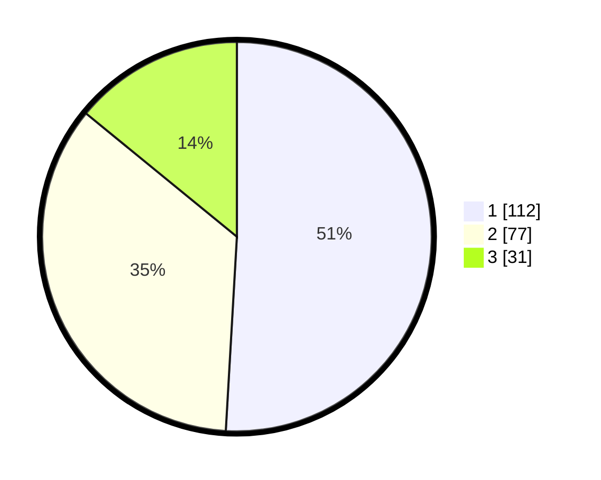

# Hasil

## Grafik

## Tabel

| No.    | Nama Paslon    | Suara | Suara (raw) | Persentase |
|:------ |:-------------- | -----:| -----------:| ----------:|
| 100025 | ANIES MUHAIMIN | 112   | [112][p-1]  | 50,91      |
| 100026 | PRABOWO GIBRAN | 77    | [77][p-2]   | 35,00      |
| 100027 | GANJAR MAHFUD  | 31    | [31][p-3]   | 14,09      |

[p-1]: https://github.com/gigit-pemilu/pemilu-2024/blob/main/pilpres/hitung-suara/sub/31-dki-jakarta/sub/74-jakarta-selatan/sub/09-jagakarsa/sub/1002-srengseng-sawah/sub/155-tps/sub/paslon-1.txt
[p-2]: https://github.com/gigit-pemilu/pemilu-2024/blob/main/pilpres/hitung-suara/sub/31-dki-jakarta/sub/74-jakarta-selatan/sub/09-jagakarsa/sub/1002-srengseng-sawah/sub/155-tps/sub/paslon-2.txt
[p-3]: https://github.com/gigit-pemilu/pemilu-2024/blob/main/pilpres/hitung-suara/sub/31-dki-jakarta/sub/74-jakarta-selatan/sub/09-jagakarsa/sub/1002-srengseng-sawah/sub/155-tps/sub/paslon-3.txt

## Foto C Plano

https://sirekap-obj-formc.kpu.go.id/ebc7/pemilu/ppwp/31/74/09/10/02/3174091002155-20240214-215423--a1fb54c8-d671-49a7-b439-539e67c21f19.jpg

https://sirekap-obj-formc.kpu.go.id/ebc7/pemilu/ppwp/31/74/09/10/02/3174091002155-20240214-215624--e1fd29ab-00e8-4372-9520-4f24cfb0465e.jpg

https://sirekap-obj-formc.kpu.go.id/ebc7/pemilu/ppwp/31/74/09/10/02/3174091002155-20240214-215708--eb00bd42-3afb-42dc-91a2-3454076cbe67.jpg

## Metadata

| Key        | Value               |
| ---------- | ------------------- |
| Time Stamp | 2024-02-24 22:31:28 |

