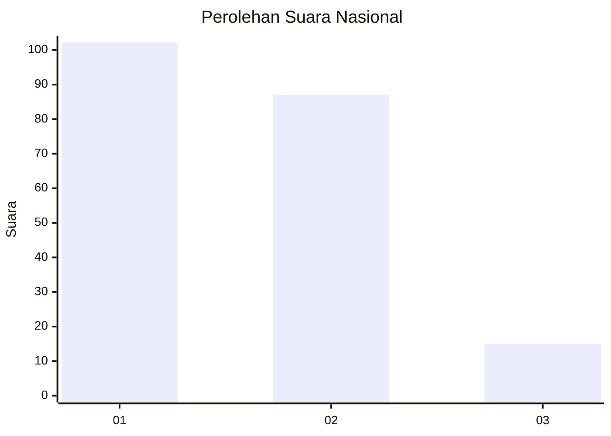
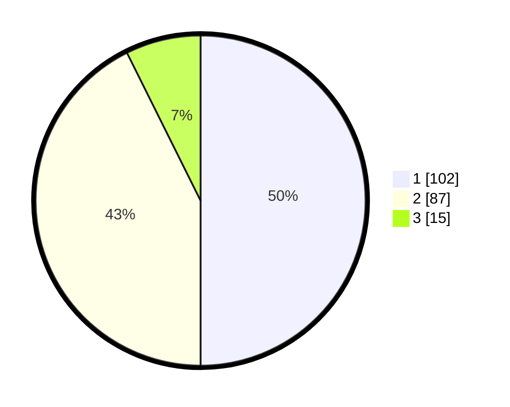

# Hasil

## Grafik

## Tabel

| No.    | Nama Paslon    | Suara | Suara (raw) | Persentase |
|:------ |:-------------- | -----:| -----------:| ----------:|
| 100025 | ANIES MUHAIMIN | 102   | [102][p-1]  | 50,00      |
| 100026 | PRABOWO GIBRAN | 87    | [87][p-2]   | 42,65      |
| 100027 | GANJAR MAHFUD  | 15    | [15][p-3]   | 7,35       |

[p-1]: https://github.com/gigit-pemilu/pemilu-2024/blob/main/pilpres/hitung-suara/sub/31-dki-jakarta/sub/74-jakarta-selatan/sub/09-jagakarsa/sub/1002-srengseng-sawah/sub/157-tps/sub/paslon-1.txt
[p-2]: https://github.com/gigit-pemilu/pemilu-2024/blob/main/pilpres/hitung-suara/sub/31-dki-jakarta/sub/74-jakarta-selatan/sub/09-jagakarsa/sub/1002-srengseng-sawah/sub/157-tps/sub/paslon-2.txt
[p-3]: https://github.com/gigit-pemilu/pemilu-2024/blob/main/pilpres/hitung-suara/sub/31-dki-jakarta/sub/74-jakarta-selatan/sub/09-jagakarsa/sub/1002-srengseng-sawah/sub/157-tps/sub/paslon-3.txt

## Foto C Plano

https://sirekap-obj-formc.kpu.go.id/3783/pemilu/ppwp/31/74/09/10/02/3174091002157-20240215-001415--5de2ee29-a234-4516-8aff-8bfb06444d2e.jpg

https://sirekap-obj-formc.kpu.go.id/3783/pemilu/ppwp/31/74/09/10/02/3174091002157-20240215-001613--f08afd11-701b-4652-bfda-742a7a284696.jpg

https://sirekap-obj-formc.kpu.go.id/3783/pemilu/ppwp/31/74/09/10/02/3174091002157-20240215-001730--f4e0aac9-52d2-4ae8-8f2d-190815d250cc.jpg

## Metadata

| Key        | Value               |
| ---------- | ------------------- |
| Time Stamp | 2024-02-24 22:31:28 |

