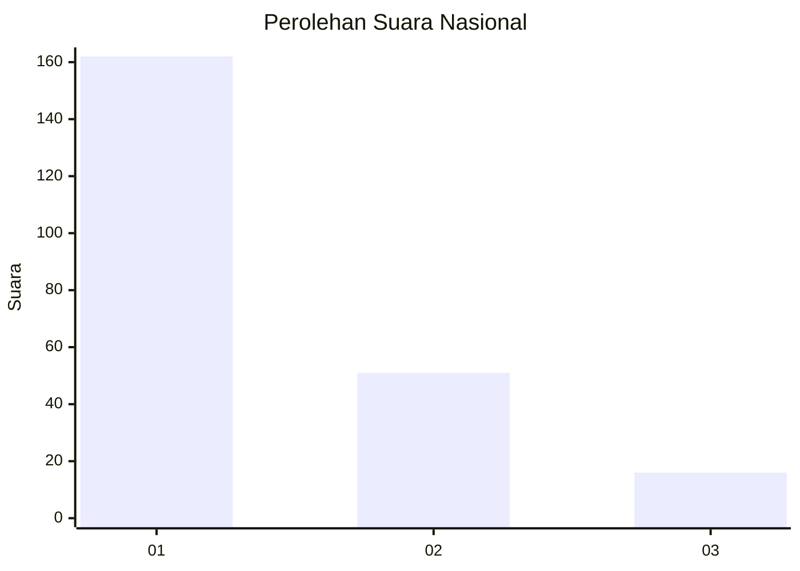
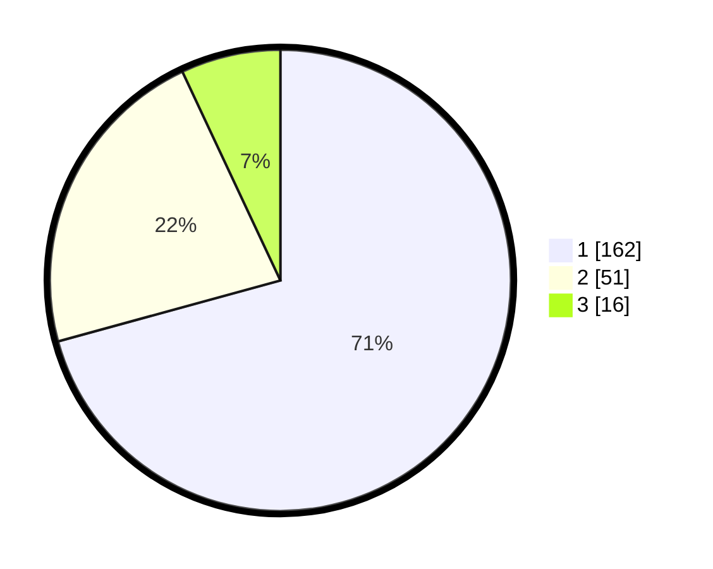

# Hasil

## Grafik

## Tabel

| No.    | Nama Paslon    | Suara | Suara (raw) | Persentase |
|:------ |:-------------- | -----:| -----------:| ----------:|
| 100025 | ANIES MUHAIMIN | 162   | [162][p-1]  | 70,74      |
| 100026 | PRABOWO GIBRAN | 51    | [51][p-2]   | 22,27      |
| 100027 | GANJAR MAHFUD  | 16    | [16][p-3]   | 6,99       |

[p-1]: https://github.com/gigit-pemilu/pemilu-2024/blob/main/pilpres/hitung-suara/sub/31-dki-jakarta/sub/74-jakarta-selatan/sub/09-jagakarsa/sub/1002-srengseng-sawah/sub/163-tps/sub/paslon-1.txt
[p-2]: https://github.com/gigit-pemilu/pemilu-2024/blob/main/pilpres/hitung-suara/sub/31-dki-jakarta/sub/74-jakarta-selatan/sub/09-jagakarsa/sub/1002-srengseng-sawah/sub/163-tps/sub/paslon-2.txt
[p-3]: https://github.com/gigit-pemilu/pemilu-2024/blob/main/pilpres/hitung-suara/sub/31-dki-jakarta/sub/74-jakarta-selatan/sub/09-jagakarsa/sub/1002-srengseng-sawah/sub/163-tps/sub/paslon-3.txt

## Foto C Plano

https://sirekap-obj-formc.kpu.go.id/ce58/pemilu/ppwp/31/74/09/10/02/3174091002163-20240214-220736--1fd9b584-f3f8-4d34-8e1c-3a72bd06bba2.jpg

https://sirekap-obj-formc.kpu.go.id/ce58/pemilu/ppwp/31/74/09/10/02/3174091002163-20240214-221131--707a3d36-0b64-4360-a067-e19c7fc9cfa2.jpg

https://sirekap-obj-formc.kpu.go.id/ce58/pemilu/ppwp/31/74/09/10/02/3174091002163-20240214-221242--b02e4eba-87da-400b-a84e-687cac897863.jpg

## Metadata

| Key        | Value               |
| ---------- | ------------------- |
| Time Stamp | 2024-02-25 11:00:00 |

