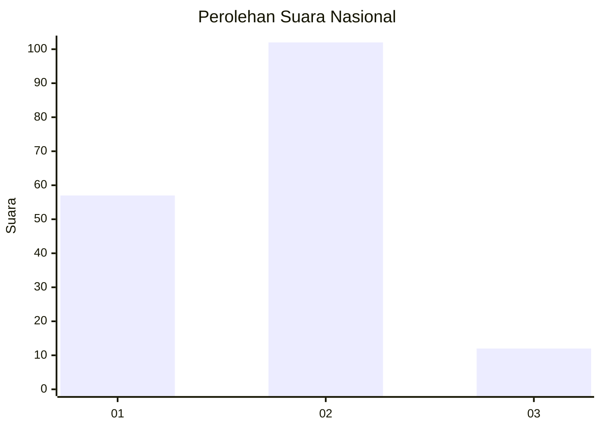
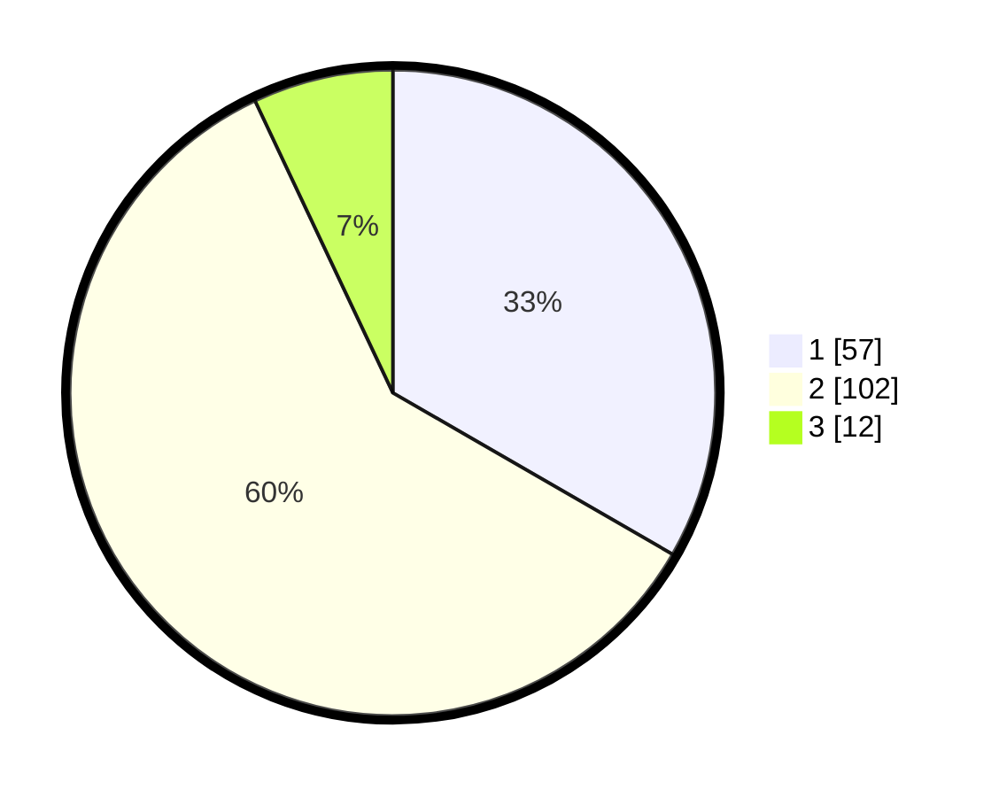

# Hasil

## Grafik

## Tabel

| No.    | Nama Paslon    | Suara | Suara (raw) | Persentase |
|:------ |:-------------- | -----:| -----------:| ----------:|
| 100025 | ANIES MUHAIMIN | 57    | [57][p-1]   | 33,33      |
| 100026 | PRABOWO GIBRAN | 102   | [102][p-2]  | 59,65      |
| 100027 | GANJAR MAHFUD  | 12    | [12][p-3]   | 7,02       |

[p-1]: https://github.com/gigit-pemilu/pemilu-2024/blob/main/pilpres/hitung-suara/sub/31-dki-jakarta/sub/74-jakarta-selatan/sub/09-jagakarsa/sub/1002-srengseng-sawah/sub/170-tps/sub/paslon-1.txt
[p-2]: https://github.com/gigit-pemilu/pemilu-2024/blob/main/pilpres/hitung-suara/sub/31-dki-jakarta/sub/74-jakarta-selatan/sub/09-jagakarsa/sub/1002-srengseng-sawah/sub/170-tps/sub/paslon-2.txt
[p-3]: https://github.com/gigit-pemilu/pemilu-2024/blob/main/pilpres/hitung-suara/sub/31-dki-jakarta/sub/74-jakarta-selatan/sub/09-jagakarsa/sub/1002-srengseng-sawah/sub/170-tps/sub/paslon-3.txt

## Foto C Plano

https://sirekap-obj-formc.kpu.go.id/2cb7/pemilu/ppwp/31/74/09/10/02/3174091002170-20240215-040246--3367ca67-1931-499c-a0d5-2854b5ecd095.jpg

https://sirekap-obj-formc.kpu.go.id/2cb7/pemilu/ppwp/31/74/09/10/02/3174091002170-20240215-041249--121c2e95-0745-40e2-9f40-97e59713ef88.jpg

https://sirekap-obj-formc.kpu.go.id/2cb7/pemilu/ppwp/31/74/09/10/02/3174091002170-20240215-040756--af15b251-c02c-46db-9bfa-fd2815a58a81.jpg

## Metadata

| Key        | Value               |
| ---------- | ------------------- |
| Time Stamp | 2024-02-24 22:31:28 |

