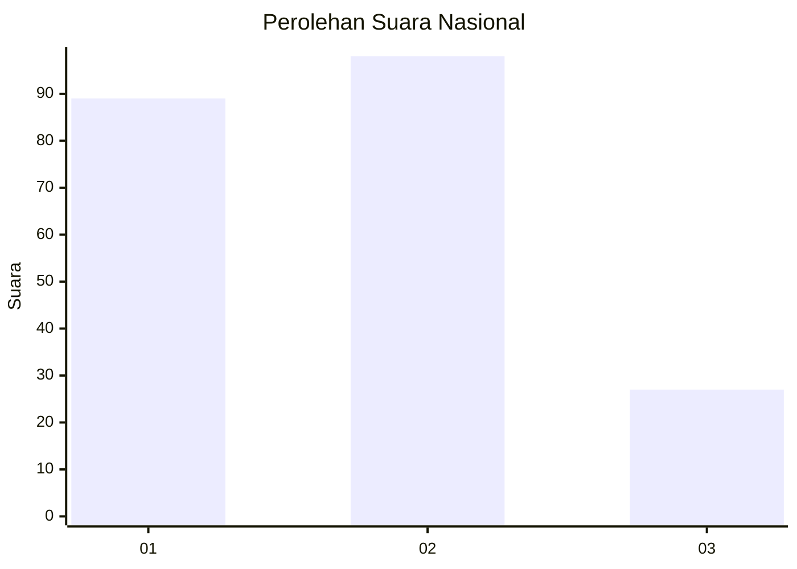
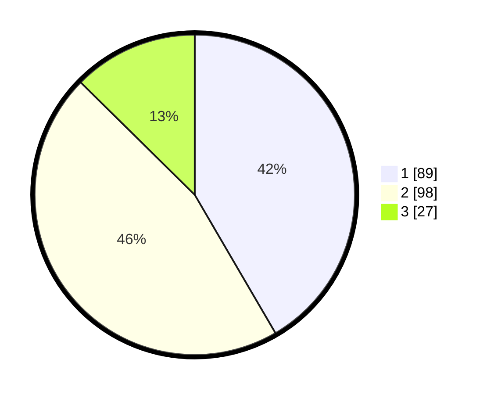

# Hasil

## Grafik

## Tabel

| No.    | Nama Paslon    | Suara | Suara (raw) | Persentase |
|:------ |:-------------- | -----:| -----------:| ----------:|
| 100025 | ANIES MUHAIMIN | 89    | [89][p-1]   | 41,59      |
| 100026 | PRABOWO GIBRAN | 98    | [98][p-2]   | 45,79      |
| 100027 | GANJAR MAHFUD  | 27    | [27][p-3]   | 12,62      |

[p-1]: https://github.com/gigit-pemilu/pemilu-2024/blob/main/pilpres/hitung-suara/sub/31-dki-jakarta/sub/74-jakarta-selatan/sub/09-jagakarsa/sub/1002-srengseng-sawah/sub/171-tps/sub/paslon-1.txt
[p-2]: https://github.com/gigit-pemilu/pemilu-2024/blob/main/pilpres/hitung-suara/sub/31-dki-jakarta/sub/74-jakarta-selatan/sub/09-jagakarsa/sub/1002-srengseng-sawah/sub/171-tps/sub/paslon-2.txt
[p-3]: https://github.com/gigit-pemilu/pemilu-2024/blob/main/pilpres/hitung-suara/sub/31-dki-jakarta/sub/74-jakarta-selatan/sub/09-jagakarsa/sub/1002-srengseng-sawah/sub/171-tps/sub/paslon-3.txt

## Foto C Plano

https://sirekap-obj-formc.kpu.go.id/43a5/pemilu/ppwp/31/74/09/10/02/3174091002171-20240215-022335--f83b9881-fa94-4e8b-a100-a8c8fa50cb74.jpg

https://sirekap-obj-formc.kpu.go.id/43a5/pemilu/ppwp/31/74/09/10/02/3174091002171-20240215-022552--19db7b61-3c01-44bb-8073-8880b1f45a2c.jpg

https://sirekap-obj-formc.kpu.go.id/43a5/pemilu/ppwp/31/74/09/10/02/3174091002171-20240215-022752--7851fd70-9de4-4d23-8a38-c2e3073ad8d2.jpg

## Metadata

| Key        | Value               |
| ---------- | ------------------- |
| Time Stamp | 2024-02-24 22:31:28 |

