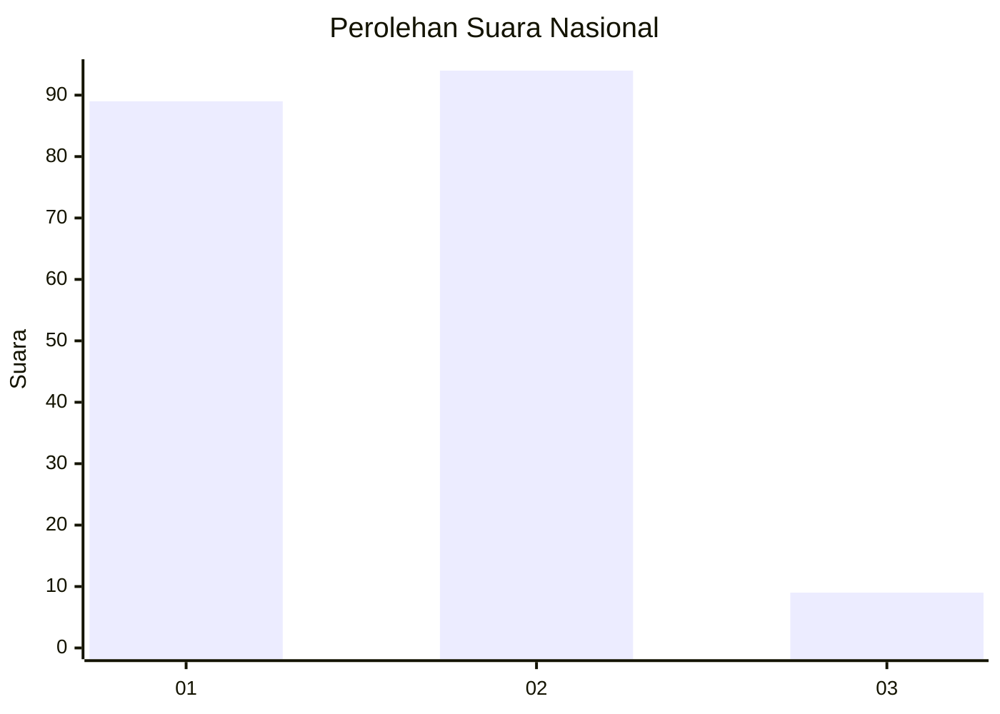
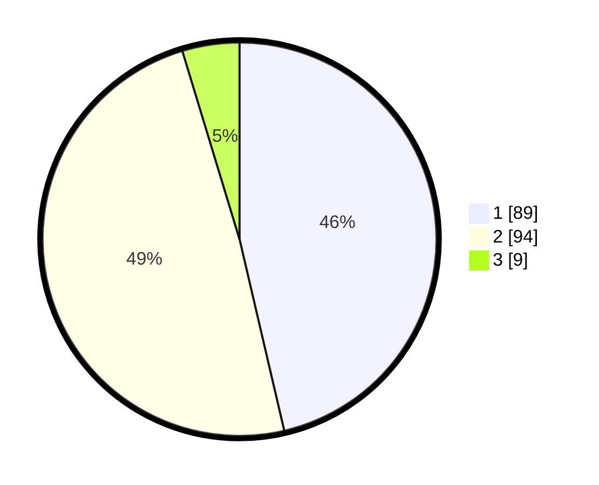

# Hasil

## Grafik

## Tabel

| No.    | Nama Paslon    | Suara | Suara (raw) | Persentase |
|:------ |:-------------- | -----:| -----------:| ----------:|
| 100025 | ANIES MUHAIMIN | 89    | [89][p-1]   | 46,35      |
| 100026 | PRABOWO GIBRAN | 94    | [94][p-2]   | 48,96      |
| 100027 | GANJAR MAHFUD  | 9     | [9][p-3]    | 4,69       |

[p-1]: https://github.com/gigit-pemilu/pemilu-2024/blob/main/pilpres/hitung-suara/sub/31-dki-jakarta/sub/74-jakarta-selatan/sub/09-jagakarsa/sub/1002-srengseng-sawah/sub/192-tps/sub/paslon-1.txt
[p-2]: https://github.com/gigit-pemilu/pemilu-2024/blob/main/pilpres/hitung-suara/sub/31-dki-jakarta/sub/74-jakarta-selatan/sub/09-jagakarsa/sub/1002-srengseng-sawah/sub/192-tps/sub/paslon-2.txt
[p-3]: https://github.com/gigit-pemilu/pemilu-2024/blob/main/pilpres/hitung-suara/sub/31-dki-jakarta/sub/74-jakarta-selatan/sub/09-jagakarsa/sub/1002-srengseng-sawah/sub/192-tps/sub/paslon-3.txt

## Foto C Plano

https://sirekap-obj-formc.kpu.go.id/b2b3/pemilu/ppwp/31/74/09/10/02/3174091002192-20240214-155857--97ffad2e-4292-402d-a7e6-a5defe135651.jpg

https://sirekap-obj-formc.kpu.go.id/b2b3/pemilu/ppwp/31/74/09/10/02/3174091002192-20240214-155620--770961c8-8b1b-479b-bb80-bfe4b81aee38.jpg

https://sirekap-obj-formc.kpu.go.id/b2b3/pemilu/ppwp/31/74/09/10/02/3174091002192-20240214-160135--f7c7fd48-5082-44cb-b3c6-9bf50e217385.jpg

## Metadata

| Key        | Value               |
| ---------- | ------------------- |
| Time Stamp | 2024-02-25 11:00:00 |

